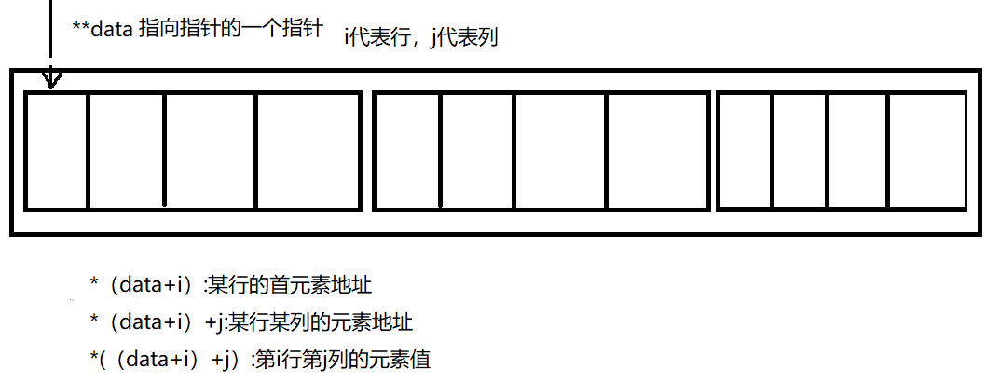
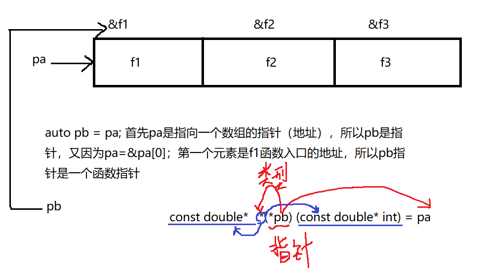

# C++函数编程模块
## 函数的要求
* 提供函数的定义
* 提供函数的原型
* 调用函数
```cpp
#include<iostream>
using namespace std;
// 声明函数，函数的定义
void function(int num); // 1.函数的定义
int main()
{
    int b = 200;
    function(b); // 3.调用函数
}

// 2.提供函数的原型
void function(int num)
{
    cout << "test number: "<< num <<endl;
}
```
```cpp
// 函数的定义方法
typeName 函数名 （参数列表）
{
    函数体
    return value; // value的类型与typeName相同
}
```
## 函数的参数
### 参数传递值
传入函数的参数称为形参，函数外部的参数为实参。实参和形参只有复制关系，改变形参的值不会影响实参的值。

### 参数传递地址（指针）
* 传递数组
```cpp
const int Size = 8;
// 声明函数
int addArry(int arr[],int size); // 数组作为形参
int main()
{
    int arr[Size] = {1,2,3,4,5,6,7,8};
    int result = 0;
    // 调用函数
    result = addArry(arr,Size); // 本质上传递的是一个地址 arr表示&arr[0]首地址
}
// 定义函数
int addArry(int arr[],int size) 
{
    int temp = 0;
    for(int i = 0; i < size; i++)
    {
        temp += arr[i];
    }
    return temp; // 返回值
}
```
* 对于传递地址到函数里面，可以直接修改原始数据。只进行可读权限，可以在传递参数时使用const关键字防止内容被修改。
```cpp
int addArry(const int arr[],int size); // 此时在函数体内不能对arr数组内的元素修改
```
* 对于数组的一些函数操作，需要传递数组首地址和元素个数。我们也可以指定数组范围传递参数，利用头指针和尾指针记录数组的范围。
```cpp
int addArry(const int* hand,const int* end)
{
    int totol; // 用于记录总和
    int* pt; // 用于检测循环条件
    for(pt = hand; pt != end; pt++) // 类似链表的思想了
    {
        totol += *pt; // 获取pt指针所指处的值，累加
    }
    return total;
}
```
* 传递二维数组</br>
```cpp
// 定义一个二维数组
int data[3][4] = {{1,2,3,4},{5,6,7,8},{9,10,11,12}} // 三行四列的数组
// 将二维数组定义成指针的形式
int (*pt)[4]; // 指向的数组有3个元素，每个元素由4个int类型组成
//ps:没有括号表达的意思是，指向4个int的指针组成的数组
int* pt[4]; // 存放四个指向int的地址

// 作为参数传递时
int sum(int (*pt)[4],int size); // size是二维数组的行数
int sun(int data[][4],int size);

// 在函数定义时使用二维数组的元素
int sum(int data[][4],int size)
{
    int totol = 0;
    for(int i = 0;i < size;i++) // i表示行
        for(int j = 0;j < 4;j++) // j表示列
            total += data[i][j];
            
    return total;
}
```

* 传递c风格字符串</br>
```cpp
// 传递字符串参数一般是传递第一个字符的地址
// 统计某字符的数量
unsigned int c_in_str(const char *chars, char flag)
{
    unsigned int count = 0;
    for (int i = 0; chars[i] != '\0'; i++)
    {
        if (chars[i] == flag)
            count++;
    }

    return count;
}
void test24()
{
    const char *name = "LiLy Mary";
    const char *statement = "Hello,I want to buy a babi toy.Could you buy for me?";
    unsigned int num_L = c_in_str(name, 'L');      // 统计字符L的数量
    unsigned int num_u = c_in_str(statement, 'u'); // 统计字符u的数量

    cout << num_L << " L characters in " << name << endl;
    cout << num_u << " u characters in " << statement << endl;
}
```
## 函数的返回值
### 返回c风格类型的字符串
```cpp
// 在返回c风格字符串的数组时，可以返回其首地址
char* build_chars(char c,int n)
{
    char* temp = new char[n+1]; //考虑到空字符的存在
    temp[n]='\0'; // 将末尾设置空字符
    while(n>0)
    {
        temp[n-1]=c;
        n--;
    }
    return temp;
}
void test()
{
    int times = 20;
    char ch = 'z';
    char* ptr = build_chars(ch,times);
    cout << ptr;
    delete[] ptr; // 删除new出来的内存
}
```
## 函数与结构
### 值传递结构
这样做可以很好的保护好数据，在函数体内拷贝一份，适用于结构体体量较小的情况.形参和实参都有自己的空间。
```cpp
class Person
{
private:
    int m_age;
    string m_name;

public:
    Person(string name,int age):m_name(name),m_age(age)
    {

    };
    void setName(string name);
    int getAge();
    void findPerson(Person p); // 直接传递结构体
};
```
### 传递结构地址
传递结构的地址，节省内存开支。利用&进行取址
```cpp
void findPerson(const Person* p); // 传递Person类型的指针，就是传递地址，用const修饰防止内部被修改

int main()
{
    Person p1 = Person("Xiaodong",16);
    Person p2 = Person("Xiaohong",23);

    p1.findPerson(&p2); // 将p2的地址传递进去
}
```
## 函数的指针
函数也有地址
```cpp
// 1.获取函数的地址
void think(); // 这是一个函数，则函数名think是一个函数的地址

// 2.声明函数指针
// 函数返回类型 (*指针名) (参数列表的类型)
void (*pf) (); 

// 3.进行赋值，此时返回值类型、参数列表要一一对应
pf = think; // 将函数的地址赋值给指向函数的指针

// 4.调用函数
(*pf)(); // 可以把*pf理解成函数名think

// 对于下列函数的原型
// 以下三个函数的参数列表相同：数组名可以用指针代替，函数原型也可以省略标识符。
const double* f1(const double ar[],int n);
const double* f2(const double [],int);
const double* f3(const double *,int );

void testPointFunction2()
{
    const double ar[3] = {1.11,2.22,3.33};
    // 创建函数指针
    const double* (*pt1)(const double*,int)=f1;
    //const double* (*pt2)(const double*,int)=f2;
    auto pt2=f2;// 利用auto自动匹配p2的类型，p2是函数指针
    auto pt3=f3;
    cout<<"Address      values\n";
    cout<<(*pt1)(ar,3)<<":\t\t"<<*((*pt1)(ar,3))<<endl; // 地址：f1(ar,3) 值：*(f1(ar,3))
    cout<<pt2(ar,3)<<":\t\t"<<*pt2(ar,3)<<endl; // 对于函数指针，pt2与*pt2等价
    cout<<pt3(ar,3)<<":\t\t"<<*pt3(ar,3)<<endl;
    // const double* (*pt3)(const double*,int)=f3;

    // pt是具有三个元素的数组，前面有一个*代表每一个元素都是指针，指针指向函数
    const double* (*pa[3])(const double *,int)={f1,f2,f3};
    auto pb = pa; // pa是数组名——地址，第一个元素的地址,所以pb是一个指针，第一个元素是f1——函数入口的地址，pb指向指针（指针的指针）
    // pb的类型：const double* (*(*pb))(const double*,int)=pa;
    for(int i =0;i<3;i++)
    {
        cout<<pa[i](ar,3)<<":\t"<<*(pa[i](ar,3))<<endl;
        cout<<(*pa[i])(ar,3)<<"\t"<<*(*(pa[i]))(ar,3)<<endl;
    }

}


// 更好的简化定义指针函数 利用typedef
typedef const double* (*p_fun)(const double*,int);
p_fun pt1 = f1;
```


## 内联函数
内联函数可以提高程序运行速度，在常规函数中，使用时需要跳转到对应的定义处。而内联函数不用跳转，在调用的位置使用函数代码代替。但消耗空间内存比使用常规函数大。
```cpp
// 使用inline关键字定义函数，内联函数不能进行递归
// 往往内联函数可以在原型中进行定义好
inline double squart(double x)
{
    return x*x;
}
int main()
{
    double x = 2.5;
    double y = 4.5;
    x = squart(x);
    y = squart(y);
}
```
## const与函数
const关键字可以修饰函数，有两种不同的修饰方法
```cpp
// 函数后面加上const，通常运用在成员函数后面
void print() const { } // 保证了内部不会修改成员变量

// 在函数前面加const，表示返回值是const修饰的数据类型
const int addNum() { }
```
## 引用变量
### 创建引用变量
引用可以进行别名创建,&声明引用
```cpp
// 起别名
int rant;
int & rates = rant; // rates是rant的一个引用，共用同一个内存空间

void testYingYong()
{
    int rates = 101;
    int& rodents = rates; // 一定要在初始化时绑定引用，rodents只能是rates的引用，不能更改
    cout<<"rates = "<<rates;
    cout<<", rodents = "<< rodents<<endl;
    rodents++;
    cout<<"Now,rates = "<<rates;
    cout<<", roents = "<< rodents<<endl;
    // & 取址
    cout<<"rate address = "<<&rates;
    cout<<", rodents address = "<< &rodents<<endl;
}
```
### 将引用作为函数参数
利用引用变量传递参数，函数可以利用引用进行访问传入的变量，相比于值传递，无需创建拷贝空间。
```cpp
struct free_throws
{
    std::string name;
    int made;
    int attempts;
    float percent;
};
void set_pc(free_throws& ft); // 引用结构体
void display(const free_throws& ft); // 引用结构体，但是不能修改结构体
free_throws & accmulate(free_throws& ftk,const free_throws& ftr); // 引用返回类型

// 常见错误
free_throws& clone(free_throws& ft)
{
    free_throws newguy;
    newguy = ft;
    return newguy; // newguy是一个临时变量，在函数结束的时候会销毁，这段内存块没有东西
}
```
* 什么时候使用引用参数呢？</br>
1.需要更改传入参数的值
2.提高运行速度
* 使用值传递、引用还是指针？

情况|使用方案|备注
---|---|---|
小型数据对象|值传递|拷贝的时间不需要很多
数组|指针|通过传递数组首地址作为参数
大型结构|指针或引用|直接使用引用，在函数体中无需进行拷贝赋值，减少时间
类对象|引用||
