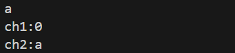
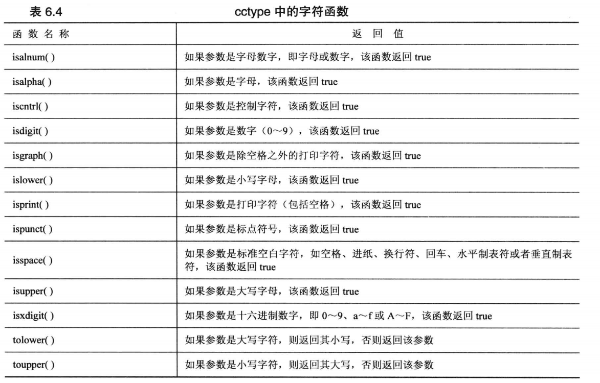

# 循环语句
## for循环
```cpp
// 利用for循环访问数组
int arry[5] = {10,20,30,40,50};
for(int i = 0; i < 5; i++)
{
    cout << arry[i] << endl;
}
```
## 基于范围的for循环
一般用于容器类，对每个元素进行相同的处理会很方便
```cpp
double prices[5] = {2.24,3.67,4.90,6.54,1.22};
// 对数组类型使用范围for循环
// 遍历
for(double x : prices) // x代表prices数组中的第一个元素
{
    cout << x << endl;
}
//修改值
for(double& x : prices) // &x代表x是引用变量，这样才能修改里面的值,x只是局部变量，prices数组的元素副本，修改x的值对数组元素的值毫无影响
{
    x *= 0.8;
}
```
## while循环
```cpp
// while循环访问数组
// 在while循环中只有测试条件和循环体
int i = 0; // 需要在while循环之前定义
    while (name[i] != '\0')
    {
        cout << name[i] << ":" << (int)name[i] << endl;
        i++;
    }
```
* while循环和for循环的相互转换
```cpp
// while循环
int i = 0; // 需要在while循环之前定义
while (name[i] != '\0')
{
    cout << name[i] << ":" << (int)name[i] << endl;
    i++;
}

// for循环
for(;name[i]!='\0';i++) // for循环内有三个表达式语句，没有语句时也要写分号
{
    cout << name[i] << ":" << (int)name[i] << endl;

}
```
## do-while循环
do-while循环先执行循环体，最后执行条件检测
```cpp
int n;
cout << "Please enter your favorite number between 0-10"
do
{
    cin >> n;
}while(n! = 5); // 注意这里要加分号
cout << "your favorite number is " << n << endl;
```
## 用循环处理输入输出
```cpp
// 用循环处理输入和输出
void test16()
{
    char ch;
    int count = 0; // 记录字符数
    cout << "Enter char ; enter # to quit" << endl;
    //cin >> ch;
    cin.get(ch);
    // 进行循环
    // 先判断第一个字符是不是#
    while (ch != '#')
    {
        cout << ch;
        count++;
        //cin >> ch; // 读取下一个字符 这种方式不能读取空格 可以利用cin.get(ch)获取空格字符
        cin.get(ch);
    }
    cout << endl
         << count << " characters read." << endl;
}
```
* 文件尾条件</br>
cin.eof()与cin.fail()
```cpp
// 文件尾处理
void test17()
{
    char ch;
    int count = 0;
    // cin.get(ch);
    //  模拟eof
    // while (cin.fail() == false) // 一般考虑eof位，让文件读到eof位 用fail判断是否已经设置，检测到eof设置时，就会把fail设置为真，cin不在读取
    // while(!cin.fail())
    while (cin.get(ch)) // 读进来就可以判断，当都到eof位时，cin返回false
    {
        cout << ch;
        count++;
        // cin.get(ch);
        //  在windows系统下，ctrl+z+Enter模拟eof位
        //  设置eof位时，cin.eof()为真 则设置cin.fail()为真
    }
    cout << endl
         << count << "chars count\n";
}
```
cin.get(ch)和ch=cin.get()区别
属性|cin.get(ch)|ch=cin.get()
---|---|---
传输方式|赋给参数ch|将函数的返回值赋给ch
用于字符输入时的函数返回值|返回istream对象(执行bool后为true)|int类型的字符编码
检测到eof时函数返回值|返回istream对象(执行bool后为false)|返回EOF(-1)
## 用循环处理二维数组
```cpp
void test18()
{
    const int Cities = 5;
    const int Years = 4;
    const char *cities[Cities] =
        {
            "HangZhou",
            "WuZhou",
            "GuangZhou",
            "ShangHai",
            "BeiJing"}; // 定义一维数组

    int maxtemps[Years][Cities] =
        {
            {96, 100, 33, 44, 24},
            {396, 14, 309, 54, 23},
            {496, 16, 36, 49, 239},
            {296, 19, 338, 64, 231}
        };
    cout << "The usage of 2 dimension arry" << endl;
    // 需要嵌套2层for循环访问2维数组
    for (int city = 0; city < Cities; city++)
    {
        cout << cities[city] << "\t";
        for (int year = 0; year < Years; year++)
        {
            cout << maxtemps[year][city] << "\t";
        }
        cout << endl;
    }
}
```
## 循环解决cin失效问题
cin输入时遇到不匹配类型时：</br>
1.不匹配的值留在输入队列 </br>
2.cin设置fail位（失效位fail=1），丧失捕获功能 </br>
3.在条件判断语句时，cin返回false值</br>
<b>当cin功能关闭时，可以使用cin.clear()重置错误</b>

```cpp
// 对于如输入时，输入类型不同的值,类型不匹配
// 1.不匹配的值留在输入队列
// 2.cin设置fail位，丧失铺货功能
// 3.在条件判断语句时，cin返回false值
int ch1;
char ch2;
cin >> ch1; // ch1是int类型，输入a,此时cin失效，返回false
cin.clear(); // 重置失效位，能够正常捕获
cin >> ch2; // char类型的ch2捕获留在输入队列里类型匹配char型的a
cout << "ch1:" << ch1 << endl;
cout << "ch2:" << ch2 << endl;
```

```cpp
// 案例，计算5条鱼的平均重量
// 用户可能会输错类型的值，需要及时判断恢复cin的失效位
// 清楚错误的值
// 提示用户输入新的值
void test20()
{
    const int Max = 5;
    double fish[Max];
    cout << "Please enter the weights of your fish." << endl;
    cout << "you may enter up to " << Max << "fish ('x' to quit)" << endl; // 利用类型不匹配伪退出
    int i ;
  
    //真正解决用户误输入的值
    for( i = 0 ;i<Max;i++)
    {
        cout << "fish #" << i+1 <<" : ";
        while(!(cin>>fish[i])) // 每次输入判断是否类型不匹配
        {
            // 不匹配
            cin.clear(); // 恢复失效位
            while(cin.get()!='\n') // 读取一个个字符，捕获清楚回车换行符前的字符
                continue;
            cout<<"please enter right number! number:";
        }
    } 
    double total = 0.0;
    for (int j = 0; j < Max; j++)
    {
        total += fish[j];
    }
    if (i == 0) // 说明一条鱼都没加入，类型不匹配
        cout << "No fish!" << endl;
    else
    {
        cout << total / i << "= average weight of " << i << " fish" << endl;
    }
}
```

# 逻辑表达式
## if、if-else语句
判断范围时，使用if-else语句更好
## switch语句
一般枚举类型会与switch一起使用，利用枚举值进行不同的逻辑。
对于case的值是常量。选择项是常量时，使用switch语句更好
```cpp
switch(Index_value)
{
    case: value1 // 当 Index_value=value1 时执行
        //执行逻辑代码

        break;
    case: value2 //当 Index_value=value2 时执行
        //执行逻辑代码

        break;
    case: value3 //当 Index_value=value3 时执行
        //执行逻辑代码

        break;
    // 更多的情况........
    default:
        //执行逻辑代码
}
```
## continue和break
continue可以跳过循环体剩余的部分，进行新的循环。
break可以直接跳出循环，进行下一条语句。
```cpp
// continue和break语句
void test19()
{
    const int Num = 80;
    char line[Num];
    int spaces = 0;
    cout << "Enter a line of text:" << endl;
    cin.get(line, Num); // 读取字符串，指定读80个字符
    cout << "Complete line:" << line << endl;
    cout << "Line through first period:" << endl;
    for (int i = 0; line[i] != '\0'; i++) // 遍历访问整个字符串，遇到空字符时停下
    {
        cout << line[i];
        if (line[i] == '.') // 字符是'.'就跳出循环
            break;
        if (line[i] != ' ') // 字符是空格就继续执行
            continue;
        spaces++;
    }
    cout << "\n"
         << spaces << " spaces" << endl;
}
```
## 逻辑运输符or: ||
当条件至少满足一个成立时，整个表达式的bool为true，否则为false
## 逻辑运算符and: &&
条件需要全部满足成立时，整个表达式的bool为true,否则为false
## 逻辑运算符not: !
bool值取反
## ？: 条件运算符
可以用条件运算符代替if-else语句
```cpp
// 格式：表达式1 ? 表达式2 : 表达式3
// 如果表达式的值为真，将整个表达式的值被赋予表达式2的值，否则被赋予表达式3的值

// 条件运算符表示
int c = a > b ? a : b;
// 转换成if-else
if(a > b)
{
    c = a;
}
else
{
    c = b;
}
```
## 字符函数库
```cpp
#include <cctype> // ccytype函数库拥有很多关于字符的操作判断
```
