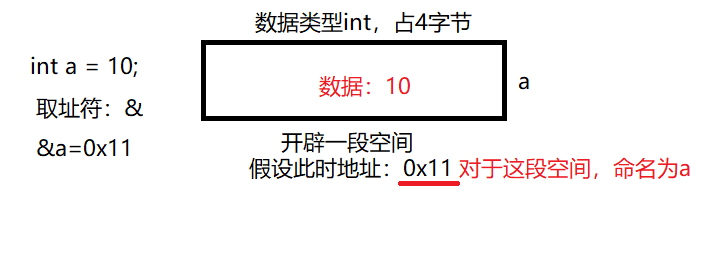
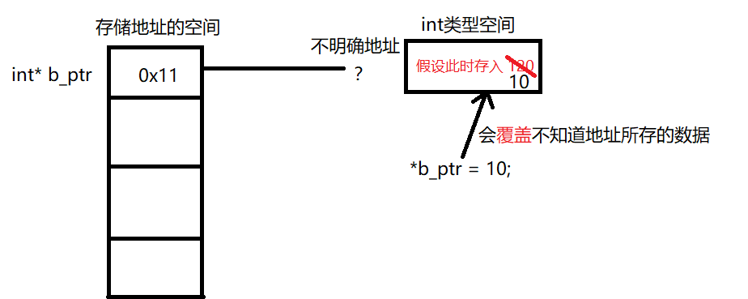

# 指针
## 为何需要指针？</br>
开辟一个空间储存数据，关注3点：</br>
(1) 数据存储在何处？</br>
(2) 存储的值是多少？</br>
(3) 存储的信息是什么数据类型？</br>

## 定义指针
```cpp
//定义一个变量
int a = 10;

// 定义指针的时候要把地址明确好
int a = 10;
int* a_ptr;
a_ptr = &a; // 把整型int，存放10的地址赋给a_ptr，这样a_ptr所指的空间就会明确。

// 以下的初始化方法不正确
// 因为在在C++中创建指针时，计算机将分配用来存储地址的内存，但不会分配用来存储指针所指向的数据的内存
int* b_ptr; // 定义一个指向int的指针，此时计算机开辟了一段空间存储指针，并没有开辟存储数据的空间
*b_ptr = 10; //此时把这段内存存入数据10，但是我们不清楚10到底存入哪段空间
```
指针就是存储地址的变量</br>

不正确赋值出现的后果：</br>


## 动态new分配空间与delete释放内存
* new:在运行阶段分配内存空间
```cpp
int* p = new int; // 声明一个指向int的指针

// 通用开辟数据对象
typeName* ptr = new typeName; // 这样就可以动态开辟各种数据对象指针
```
* new创建动态数组
```cpp
//创建动态数组
int* arry = new int [元素数量]; // 在arry中存放开辟空间的首地址

//释放空间
delete[] arry; // 要加上[],告诉编译器，释放整个元素的空间

//通用开辟数据对象动态数组
typeName* arryName = new typeName [elements_num];
```

* delete:手动分配内存空间需要手动释放new出来的内存
```cpp
//1.delete只能与new配合使用
int* p = new int;
delete p;

//2.delete不能多次释放同一空间
int* p = new int;
int* q = new int;
q = p; // 此时p、q存放同一地址
delete p; // 释放第一次
delete q; // 释放第二次内存，出现错误

//3.不能释放声明变量获得的内存
int a = 10;
int* ptr = &a;
delete ptr; // 错误
```

