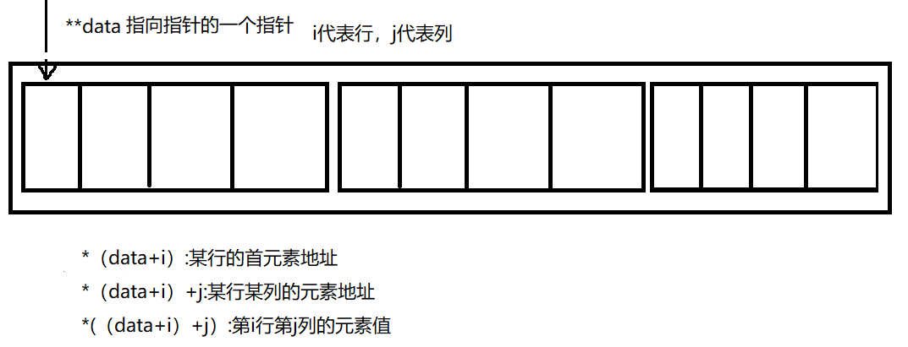

# 指针
## 为何需要指针？</br>
开辟一个空间储存数据，关注3点：</br>
(1) 数据存储在何处？</br>
(2) 存储的值是多少？</br>
(3) 存储的信息是什么数据类型？</br>

## 定义指针
```cpp
//定义一个变量
int a = 10;

// 定义指针的时候要把地址明确好
int a = 10;
int* a_ptr;
a_ptr = &a; // 把整型int，存放10的地址赋给a_ptr，这样a_ptr所指的空间就会明确。

// 以下的初始化方法不正确
// 因为在在C++中创建指针时，计算机将分配用来存储地址的内存，但不会分配用来存储指针所指向的数据的内存
int* b_ptr; // 定义一个指向int的指针，此时计算机开辟了一段空间存储指针，并没有开辟存储数据的空间
*b_ptr = 10; //此时把这段内存存入数据10，但是我们不清楚10到底存入哪段空间
```
指针就是存储地址的变量</br>


不正确赋值出现的后果：</br>


## 动态new分配空间与delete释放内存
* new:在运行阶段分配内存空间
```cpp
int* p = new int; // 声明一个指向int的指针

// 通用开辟数据对象
typeName* ptr = new typeName; // 这样就可以动态开辟各种数据对象指针
```
* new创建动态数组
```cpp
//创建动态数组
int* arry = new int [元素数量]; // 在arry中存放开辟空间的首地址

//释放空间
delete[] arry; // 要加上[],告诉编译器，释放整个元素的空间

//通用开辟数据对象动态数组
typeName* arryName = new typeName [elements_num];
```

* delete:手动分配内存空间需要手动释放new出来的内存
```cpp
//1.delete只能与new配合使用
int* p = new int;
delete p;

//2.delete不能多次释放同一空间
int* p = new int;
int* q = new int;
q = p; // 此时p、q存放同一地址
delete p; // 释放第一次
delete q; // 释放第二次内存，出现错误

//3.不能释放声明变量获得的内存
int a = 10;
int* ptr = &a;
delete ptr; // 错误
```
* new创建动态结构
```cpp
struct Person
{
    string name;
    float height;
    float weight;
};
// 创建Person动态结构
Person* pt = new Person;
// 利用箭头运算进行访问结构内的成员
pt->name = "XiaoDongXi";
pt->height = 182.7;
pt->weight = 90.3;
// 最后记得delete
delete pt;
```

## 指针算数
在数组中，数组名表示的是数组第一个元素的地址，也就是数组首地址。</br>
对于指针，可以将数组首地址赋值给指针。</br>
C++允许将指针和整数相加。加1的结果等于原来的地址值加上指向的对象占用的总字节数。</br>
```cpp
double dArry[3] = {22.2, 33.3, 44.4};
short sArry[3] = {11, 22, 33};

// 定义两个指针
double *pd = dArry;    // 数组名是指向第一个元素的地址，也就是首地址
short *ps = &sArry[0]; // 第一个元素的地址赋值给指针

// 指针加法
pd += 1;
ps += 2;
// 此时pd指针移动到第二个元素的位置，则*pd=dArry[1]=33.3 ;对于ps指针移动到第三个元素的位置，则*ps=sArry[2]=33

// 整个数组的地址 &dArry与dArry表达的意思不同
// 存放整个数组的地址
double （*ptr）[3] = &dArry // 获取整个dArry数组的地址
```
## 指针和字符串的关系
```cpp
// 1.注意指针字符串的常量问题
char animal[20] = "Monkey";
char people[20] = "Jack";
const char *bird = "little bird"; // "little bird"是一个const char[12]字符串常量，后续不允许通过指针改变内部的值,但是可以改变指针的指向。所以要把指针定义成常量
bird = people; // 合法，改变bird指针的指向

// 2.未初始化指针接受字符串会出错
char* ptr;
ptr = animal;
cout << animal; // 不合法，因为ptr未被初始化，不明确现在所处的空间

// 3.获取char* 字符串的地址，因为cout遇到char数组名、char指针会认为是字符串第一个字符的首地址
cout << "animal address: " << (int *)animal << endl; // 通过int*强制转换输出地址

// 4.给未初始化的指针开辟新的内存空间，并且把字符串拷贝
ptr = int char[strlen(animal) + 1]; // 将animal的长度包括空字符开辟一个新的char类型空间，ptr可以指向这段新的空间
strcpy(ptr,animal); // 拷贝数据
//还可以用strncpy()防止出现溢出
strncpy(ptr,animal,strlen(aniaml)); // 控制赋值的字符数量
ptr[strlen(animal)+1] = '\0'; // 对于c风格字符串，要在最后面放入空字符
```
## Const和指针
const与指针的常用法
* 指针指向常量
可以使用指向const的指针
```cpp
// 1.普通变量赋值给const指针
int age = 17;
int weight = 20;
const int* p = &age; // 获取age地址
age = 20; // 可以实现
*p = 20; // 不能实现，定义的p指针是const，不能通过指针修改age的值
p = &weight; // 可以实现，可以修改指向的地址

// 2.const常量赋值const指针
// 不能通过age和*pt修改值
const int age = 10;
const int* pt = &age;

//ps:不能把const变量赋值给普通指针
// 这样会让编译器认为可以通过指针修改const值，出现矛盾报错
const int age = 12;
int* pt = &age;

// 超过两层指针关系时，把const和普通值混合赋值都会报错
```
* 防止指针的地址修改
可以使用const指针
```cpp
int age = 12;
int weight = 20;
int* const pt = &age; //定义一个const指针
*pt = 28; // 合法，可以更改指向的数据
pt = &weight; // 不合法，const指针不能修改地址
```
### 区分const指针和指向const的指针
int* cosnt pt|cosnt int* pt
---|---|
指向const的指针|cosnt指针
不能修改解引用后的值|不能修改指向的地址
可以修改指向的地址|可以修改解引用后的值

## 指针和二维数组
```cpp
// 定义一个二维数组
int data[3][4] = {{1,2,3,4},{5,6,7,8},{9,10,11,12}} // 三行四列的数组
// 将二维数组定义成指针的形式
int (*pt)[4]; // 指向的数组有3个元素，每个元素由4个int类型组成
//ps:没有括号表达的意思是，指向4个int的指针组成的数组
int* pt[4]; // 存放四个指向int的地址

// 作为参数传递时
int sum(int (*pt)[4],int size); // size是二维数组的行数
int sun(int data[][4],int size);

// 在函数定义时使用二维数组的元素
int sum(int data[][4],int size)
{
    int totol = 0;
    for(int i = 0;i < size;i++) // i表示行
        for(int j = 0;j < 4;j++) // j表示列
            total += data[i][j];
            
    return total;
}
```
