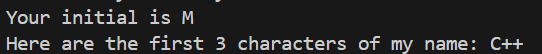

# 简单数据类型
## 1.制定变量名
规则：
* 名称中只能存在字母、数字和下划线
* 数字不能开头
* 不能用c++关键字进行命名

变量名的作用:
可以命名内存空间的一段地址，进行存放数据

## 2.常见的简单数据类型
### 短整型short
```cpp
short a = 1; // 进行短整型数据的初始化
```
### 整型int
```cpp
int a = 10; // 进行整型数据的初始化
```
### 长整型long
```cpp
long a = 10000; // 进行长整型数据的初始化
```
### 长长整型long long
```cpp
long long a =10000000; // 进行长长整型数据的初始化
```
### 字符类型char
```cpp
char a = 'A'; // 将大写字母A这个字符赋值给变量a
char a = 77; // 将数字字符赋值给变量a，但是通过cout输出会将77转化对应的ASCII码
```
### 宽字符类型wcha_t
用于处理一些超过8个字节的表示，例如：日文系统
```cpp
wcha_t word = L'p'; // 前缀L表示宽字符类型
wcout << word << endl; // 在iostream文件中，使用wcout输出
wcin >> word; //在iostream文件中，使用wcin输入
```
### 浮点数类型
数据类型 | 有效位数 
---|---|
float |32
double|64
### 无符号类型
通常可以通过在定义数据类型前加上unsigned表示无符号类型数据。往往无符号类型表达的数据可以更大。
```cpp
unsigned int a = 3245; // 定义无符号类型
```
可以通过引用c++内部头文件来探索每个数据类型的最大值
```cpp
#include<climits> //该头文件定义了符号常量来表示类型的限制

int max_int = INT_MAX; // 将int类型最大值赋值
```
#### 小提示：在c++中，# 代表预处理的意义。常用的方式如下两种
```cpp
#include<iostream> // 1.预处理头文件
#define ZERO 0 // 2.定义宏常量
```
## 3.数据转化
### 隐式转换
* 初始化和赋值的时候转换(两者之间可以转换)
```cpp
int a = 23;
short b =20;
b=a; // 将int类型赋值给short，把int类型转换为short
```
* 列表初始化的方法（此时转化非常严格）
```cpp
long x=65;
int y{x}; // 这是不允许的，因为不能用变量通过初始化列表赋值，编译器不清楚x的大小
```
* 表达式中的转换
```cpp
short s1=1;
short s2=2;
auto i=s1+s2;
cout << typeid(i).name() << endl; // i,所有小于int的整数类型在计算表达式时都会自动转换为int后再计算，叫做整型提升（算数类型相同也是如此），在算数类型不同的情况下则是小的转换为大的,级别相同(大小相同类型不同)则是无符号>有符号，在传统c语言中还会存在将float转换为double，包括类型相同时。
```
* 函数传参时的转换
### 强制转换
```cpp
//c语言方法
//(数据类型)变量的值 
(long)thirty;

//c++方法
//数据类型（变量的值） 
long(thirty);
```
## 4.c++ auto关键字声明
c++让编译器自动判断变量的类型
```cpp
auto n = 100; // 编译器判断n是int
auto x = 1.5; // 编译器判断x是float
```
auto用来处理复杂类型的，例如处理STL模块的数据
```cpp
std::vector<int> A; // 创建类型为int的vector容器A
auto a = A.begin(); // auto自动判断成vector的迭代器，实质上auto表示std::vector<int>::iterator类型
```

# 复杂数据类型
## 1.数组
```cpp
//创建数组：数据类型 数组名[元素数量]
int months[12];

//tips 在静态数组中，元素数量必须是常量或者是常量表达式定义
const int Months = 12;
int arr[Months]; // 这种方法可取，因为Months是常量

int a =10;
int arr[a]; // 这种声明数组就不正确，‘a’是一个普通的整型变量，不是编译时常量，所以不能用来定义数组的大小。

// 计算数组元素的个数
// 元素数量=整个数组的sizeof大小/数组数据类型的sizeof大小
int sum = sizeof(a)/sizeof(int);
```
使用实例：
```cpp
#include <iostream>
using namespace std;
int main()
{
    int a[3] = {10, 20, 30}; // 初始化列表初始数组里面的值
    auto sum = a[0] + a[1] + a[2]; // 进行累加
    cout << "The price is " << sum << endl;
    cout << "sizeof(a)= " << sizeof(a) << endl; // 每个int类型的占4个字节，现在有三个元素，一共是12个字节

    system("pause");

    return 0;
}
```
## 2.字符串
字符串存储在<b>一段连续字节</b>中的一系列<b>字符</b>。可以理解为char类型的数组。
```cpp
char dog[]={'H','e','l','a','\0'} //以'/0'(空字符)结尾是c风格的字符串

char cat[] = " hello,world "; // 字符串常量，自动含有'\0'
```
tips:</br>
1.空字符'\0'用于确定计算机读取结束的位置，在字符串中要包含'\0'字符。</br>
```cpp
const int size = 15;
char name[size] = "C++Cowboy";
//此时更改第四个元素，改成空字符
name[3]='\0';
cout<<name;
```
输出：</br>


2.字符串常量可以用双引号表示，但是字符常量只能用单引号，因为在c++中，双引号表示地址，是一种特殊的类型。
```cpp
char right = 'S'; //正确
char warning = "S" ; // 错误
```

3.在c++中，可以利用<b>头文件cstring</b>中的strlen方法进行字符串中字符数量的统计。
```cpp
#include<cstring>
const int size = 15;
char name[size] = "C++Cowboy";
strlen(name); // 进行统计name字符串里的字符数
```

4.cin输入字符的小陷阱</br>
在c++中，cin在读取用户输入到缓存区的字符时，会以空白（空格、制表符、换行符）确定结束位置，并且读取到的回车不会丢弃。

5.cin读取整行的方法get()和getline()</br>
方法|参数|区别特点
---|---|---|
cin.getline|cin.getline(数组名,读取的字符数)注意要算上空字符|遇到空字符或换行符停止，达到读取数量停止。读取结束后丢弃换行符，然后自动补上空字符'\0'。
cin.get|cin.get(数组名,读取的字符数)</br>cin.get()|遇到空字符或换行符停止，达到读取数量停止。但是<b>不会丢弃换行符</b>。可以利用空参数重载方法<b>cin.get()捕获遗留下的换行符，没有任何赋值</b>。
```cpp
// 整行获取
cin.getline(name,size);
cin.get(name,size);
cin.get();
```
```cpp
void test03()
{
    cout << "What year was your house built?\n";
    int year;
    cin >> year; // 留下的回车换行符会留下在缓存区中
    //加上cin.get()把回车换行符捕获
    cin.get();
    cout << "What is its street address?\n";
    char address[80];
    // 由于缓存区中存在回车换行符，cin.getline()会把回车换行符认为是一串空字符串，把空字符串存到address中，所有用户输入不了
    cin.getline(address, 80); //79个字符加上'\0'
    cout << "Year built:" << year << endl;
    cout << "Address:" << address << endl;
    cout << "Done!\n";
}
```
6.使用strcpy()赋值和strcat()拼接、字符数量统计</br>
```cpp
char charr1[]= "Zizi";
char charr2[] = "Hello";
char charr3[];
//strcpy()赋值
strcpy(charr3,charr1); // 将charr1赋值给charr3
//strcat()拼接

charr3 = strcat(charr1,charr2);

//strlen统计字符数量，strlen以 '/0'为停止提示
int len = 0;
len = strlen(str1); // strlen是一个常规的函数，以C风格字符串为参，不能是string类型的变量作为参数

```
## 3.新的字符串--string类型
1. string类型是一个类，应用string类型需要包含一个cstring的头文件，或者利用std命名空间引用。</br>
```cpp
#include<cstring>

string name1 = "XiaoMing";
std::string name2 = "XiaoHong"; // string的一个构造函数初始化字符串
string name3 = {"XiaoGang"};
```

2. string可以进行诸多操作，比char[]类型操作方便。
```cpp
// 1.string可以直接赋值
#include<cstring>
string str1;
string str2 = "XiaoDong";
str1 = str2; //将str2字符串直接赋值给str1，而char[]数组不可以直接传递,要通过strcpy()方法进行赋值

// 2.string可以直接用"+"拼接
string str3;
str3 = str1 + str2; // 直接拼接

// 进行统计字符数量
int len1 = 0;
// 统计str1
len1 = str1.size(); // size()属于string类里的一个成员方法
```
3. string的输入输出流
```cpp
#include<iostream>
#include<cstring>
string str = "OiOiOi";
// 1.简单的cin、cout和<<运算符
cout << str << endl;
cin >> str;
//2.使用getline函数输入string字符串
getline(cin,str); // getline是一个普通的函数，不是cin的类方法
```
4. 其他类型的字符串字面值</br>

类型|前缀|实例
---|---|---|
宽字符串类型wchar_t|L|wchar_t title[] = L"My life";
char16_t|u|char16_t name[] = u"Felonia Quene";
char32_t|U|char32_t charr[] = U"Humber Super Snipe";