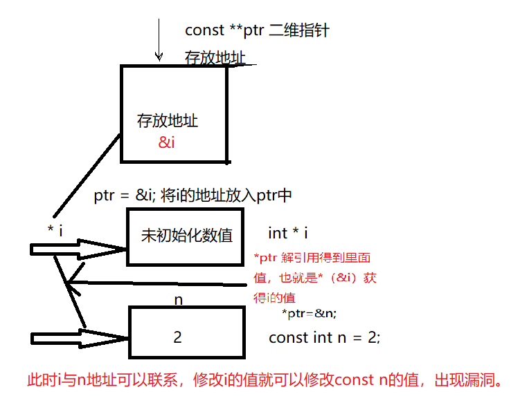

# C++ 限定符const
const用于修改变量成为常量，赋值工作一定要在初始化中完成，初始化后数据不可更改
```cpp
const int Months = 12 ; // 定义Months为常量12
```
好处：对于后续使用该具有意义的常量时可以直接写入常量名Months，修改值只需修改初始化时赋值，不需要改多行代码。他的链接性是内部的，只在本文件使用，所以放在头文件也不会冲突

#### 常见错误
*  const修饰的常量不能赋值给变量
```cpp
const int AppleNum = 24;
int bananaNum = AppleNum; // 错误 不能将const修饰的变量赋给不是const的变量，const只能const接收
```
* 初始化后进行赋值
```cpp
const int a ;
a = 12 ; // 错误，此时a不能赋值，赋值要在初始化内完成
```
* const修饰二维指针
```cpp
const int **ptr;
int *i;
const int n=2;
ptr = &i  
*ptr=&n; // 等同于i=&n;利用双层指针ptr做媒介，将const地址给了非const对象，出现了漏洞。
*i=10; // 此时可根据i任意更改n。
```
解释：
