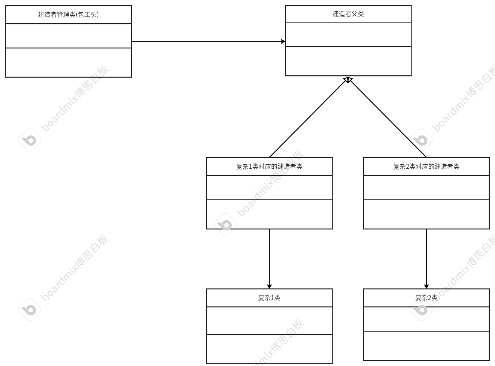

# 建造者模式
生产一个对象，比起工厂模式更关注细节。关注创建对象的步骤
## 例子
有两个需要建造的小区，分别是翻斗花园小区和南洋小区。这两个小区都有不同的房型，例如：经济型、标准型和豪华型。建造房子的步骤有：规划房型、制作排水系统、搭建电路、刷墙、铺地砖
房型|翻斗花园小区|南洋小区
---|---|---|
经济型|Y|Y
标准型|Y|Y
豪华型|Y|Y
## 代码框架
* 1.定义房子相关的类
```cpp
#ifndef FANDOUXIAOQU_H
#define FANDOUXIAOQU_H
#include <iostream>
#include <string>
#include <vector>
using namespace std;

class FanDouXiaoqu
{
public:
    void addHouses(string name);
    void showHouses();

private:
    vector<string> m_houses; // 用于存储好建造好的房型
};

#endif
```
```cpp
#ifndef NANYANGXIAOQU_H
#define NANYANGXIAOQU_H
#include <iostream>
#include <string>
#include <map>
using namespace std;

class NanYangXiaoqu
{
public:
    void assemble(string type_name,string house_name);
    void showHouses();

private:
    map<string,string> m_houses; // 用于存储好建造好的房型
};

#endif
```
* 2.定义建造者相关的类
```cpp
#ifndef HOUSEBUILDER_H
#define HOUSEBUILDER_H
#include <iostream>
#include <string>
using namespace std;
class HouseBuilder
{
public:
    virtual void reset() = 0;
    virtual void makeArea() = 0;
    virtual void makeWaterRoad() = 0;
    virtual void makeElectrRoad() = 0;
    virtual void makeWall() = 0;
    virtual void makeFloor() = 0;
    virtual ~HouseBuilder() {};
};
#endif
```
```cpp
#ifndef FANDOUBUILDER_H
#define FANDOUBUILDER_H
#include "HouseBuilder.h"
#include "FanDouXiaoqu.h"
#include <iostream>
#include <string>
using namespace std;
class FanDouBuilder : public HouseBuilder
{
public:
    void reset() override;
    void makeArea ()override;
    void makeWaterRoad()override;
    void makeElectrRoad()override;
    void makeWall()override;
    void makeFloor()override;
    FanDouBuilder();
    ~FanDouBuilder();
    FanDouXiaoqu* getXiaoqu();
private:
    // 存储房子
    FanDouXiaoqu* m_xiaoqu;
};

#endif
```
```cpp
#ifndef NANYANGBUILDER_H
#define NANYANGBUILDER_H
#include "HouseBuilder.h"
#include "NanYangXiaoqu.h"
#include <iostream>
#include <string>
class NanYangBuilder : public HouseBuilder
{
private:
    /* data */
    NanYangXiaoqu* m_xiaoqu;
public:
    void reset();
    void makeArea();
    void makeWaterRoad();
    void makeElectrRoad();
    void makeWall();
    void makeFloor();
    NanYangXiaoqu* getXiaoqu();
    NanYangBuilder(/* args */);
    ~NanYangBuilder();

};
#endif
```
* 3.利用管理者类（包工头）->建造不同的房子
```cpp
#ifndef DIRECTOR_H
#define DIRECTOR_H
#include<iostream>
#include"HouseBuilder.h"
// 包工头
class Director
{
public:
    void setBuilder(HouseBuilder* builder);
    // 创建不同的房型
    void buildJingjiXing();
    void buildBiaoZhunXing();
    void buildHaohuaXing();
private:
    HouseBuilder* m_builder;
};
#endif
```
* 4.编写测试代码
```cpp
#include"Director.h"
#include"FanDouXiaoqu.h"
#include"FanDouBuilder.h"
#include"NanYangXiaoqu.h"
#include"NanYangBuilder.h"
void buildFandou()
{
    // 创建包工头进行创建
    Director* director = new Director;

    FanDouBuilder* builder = new FanDouBuilder;
    // 绑定建造者
    director->setBuilder(builder);
    // 经济型房子
    director->buildJingjiXing();
    // 查看房型
    FanDouXiaoqu* houses = builder->getXiaoqu();
    houses->showHouses();
    delete houses;
    
    // 标准型房子
    builder->reset(); // 由于前面已经删除了，现在要重新创建一个FanDouXiaoqu指针
    director->buildBiaoZhunXing();
    houses = builder->getXiaoqu();
    houses->showHouses();
    delete houses;

    // 豪华型房子
    builder->reset();
    director->buildHaohuaXing();
    houses = builder->getXiaoqu();
    houses->showHouses();
    delete houses;

    delete director;
    delete builder;
}
void buildNanYang()
{
    // 创建包工头进行创建
    Director* director = new Director;

    NanYangBuilder* builder = new NanYangBuilder;
    // 绑定建造者
    director->setBuilder(builder);
    // 经济型房子
    director->buildJingjiXing();
    // 查看房型
    NanYangXiaoqu* houses = builder->getXiaoqu();
    houses->showHouses();
    delete houses;
    
    // 标准型房子
    builder->reset(); // 由于前面已经删除了，现在要重新创建一个FanDouXiaoqu指针
    director->buildBiaoZhunXing();
    houses = builder->getXiaoqu();
    houses->showHouses();
    delete houses;

    // 豪华型房子
    builder->reset();
    director->buildHaohuaXing();
    houses = builder->getXiaoqu();
    houses->showHouses();
    delete houses;
}
int main()
{
    buildFandou();
    cout<<"----------------------------------"<<endl;
    buildNanYang();
}
```
## 总结
什么时候使用建造者模式？当创建一个对象时，其内部创建方式复杂，就可以创建其对应的建造者。对应的建造者生产细节的子部件。
