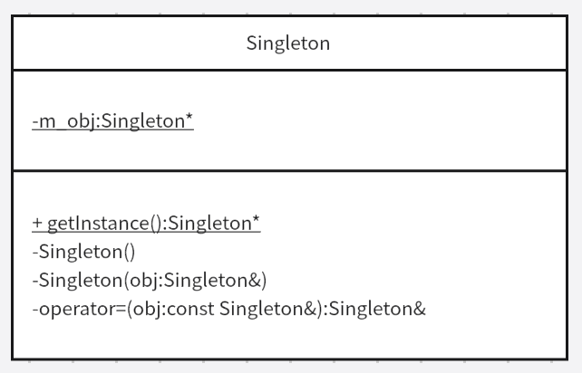

# 单例模式
单例模式是指有一个类。在整个项目中，全局范围内，通过这个唯一实例向其他模块提供数据的全局访问。这个类是有且仅有一个对象，这个类就会被称为单例类。
## 案例
有一个快递站，需要记录每天邮寄的包裹信息，需要送往什么地方。并且先下单就会先处理该包裹。
## 分析
可以把快递站看成一个唯一的实例，所以可以把快递站抽象成一个单例，通过不同的模块处理包裹（方法）。且处理包裹的方法属于队列模式，先进先出。
## 代码
```cpp
class TaskQuene
{
public:
    // 或者进行删除构造函数
    // TaskQuene() = delete;
    // TaskQuene(const TaskQuene& t) = delete;
    // TaskQuene& operater=(const TaskQuene& t)=delete; // 删除赋值运算重载符

    // 静态函数，提供给调用者访问静态方法
    static TaskQuene* getInstance()
    {
        return m_taskQ;
    }

    void test()
    {
        std::cout<<"test...."<<std::endl;
    }

private:
    // 将默认和拷贝构造函数进行私有声明，外部就不可进行生成更多的实例
    // default默认函数行为
    TaskQuene() = default; // 默认构造函数
    TaskQuene(const TaskQuene& t) = default; // 拷贝构造函数
    TaskQuene& operater=(const TaskQuene& t)=defualt; // 不能使用赋值运算重载符

    // 只能通过类名访问静态属性或方法
    static TaskQuene* m_taskQ; // 静态变量不能在类内进行初始化

};
// 创建实例，将taskQuene的静态属性进行赋值（前提是不能删除无参构造函数）
TaskQuene* TaskQuene::m_taskQ = new TaskQuene;
int main()
{
    TaskQuene* taskQ TaskQuene::getInstance(); // 获取单例对象
    taskQ->test();
    return 0;
}
```
## 总结
书写单例模式的代码需要注意以下几点：
* 保证不能让外部创建多个单例对象，所以只能删除拷贝构造函数、赋值重载运算符，将默认构造函数设置成默认行为。
* 创建静态属性存储自身实例。
* 自身静态属性需要在类外进行初始化。
* 书写外部调用接口getInstance()。

## 单例模式中的饿汉模式
定义类的时候就已经创建好单例对象了
## 单例模式中的懒汉模式
什么时候使用这个单例对象，在使用的时候再去创建对应的实例
```cpp
class TaskQuene
{
public:
    // 静态函数，提供给调用者访问静态方法
    static TaskQuene* getInstance()
    {
        // 懒汉模式需要在获取单例对象时进行实例化
        if(m_taskQ == nullptr)
        {
            m_taskQ = new TaskQuene;
        }
        return m_taskQ;
    }

    void test()
    {
        std::cout<<"test...."<<std::endl;
    }

private:
    // 将默认和拷贝构造函数进行私有声明，外部就不可进行生成更多的实例
    // default默认函数行为
    TaskQuene() = default; // 默认构造函数
    TaskQuene(const TaskQuene& t) = default; // 拷贝构造函数
    TaskQuene& operater=(const TaskQuene& t)=defualt; // 不能使用赋值运算重载符

    // 只能通过类名访问静态属性或方法
    static TaskQuene* m_taskQ; // 静态变量不能在类内进行初始化

};
// 懒汉模式：单例对象不进行外部初始化
TaskQuene* TaskQuene::m_taskQ = nullptr;
```
## 懒汉模式与饿汉模式比较
比较点|懒汉模式|饿汉模式
---|---|---|
内存|需要时才创建实例，充分利用内存|在类外就已经初始化实例，占用一定的内存
线程（多个线程访问单例对象）|存在线程安全问题，多个线程同时访问单例会创建多个实例，代码需要加互斥锁，依次访问单例对象|多线程的情况下，无多线程访问安全问题
## 局部静态变量解决懒汉模式的多线程问题
前提要求编译器支持c++11。静态变量存放在全局数据区，默认值为0。如果一个指令逻辑进入未被初始化的声明变量，所有并发执行应当等待该变量完成初始化
```cpp
class TaskQuene
{
public:
    // 静态函数，提供给调用者访问静态方法
    static TaskQuene* getInstance()
    {
        static TaskQuene task; // 创建局部静态对象，没有初始化的变量
        return &task; // 必须是静态的，不然函数结束后，task就会被释放内存
    }

    void test()
    {
        std::cout<<"test...."<<std::endl;
    }

private:
    TaskQuene() = default; 
    TaskQuene(const TaskQuene& t) = default;
    TaskQuene& operater=(const TaskQuene& t)=defualt;

};
```
## 双重检查互斥锁解决懒汉模式的多线程问题
```cpp
#include<mutex> // 互斥锁头文件
class TaskQuene
{
public:
    // 静态函数，提供给调用者访问静态方法
    static TaskQuene* getInstance()
    {
        // 双重检查锁定，只有第一次访问时顺序访问，但后面就会很快，不会再进行锁与解锁
        if(m_taskQ == nullptr)
        {
            m_mutex.lock(); // 先进行锁住，其他线程会进行阻塞
            if(m_taskQ == nullptr)
            {
                m_taskQ = new TaskQuene;
            }
            m_mutex.unlock(); // 解锁操作
        }
        return m_taskQ;
    }

    void test()
    {
        std::cout<<"test...."<<std::endl;
    }

private:
    TaskQuene() = default; 
    TaskQuene(const TaskQuene& t) = default;
    TaskQuene& operater=(const TaskQuene& t)=defualt;

    static TaskQuene* m_taskQ; 
    static mutex m_mutex; // 互斥锁，已经实例化了，需要在外部进行再一次声明

};
// 懒汉模式：单例对象不进行外部初始化
TaskQuene* TaskQuene::m_taskQ = nullptr;
mutex TaskQuene::m_mutex;
```

## 原子变量解决双重检查锁定出现的bug
双重检查锁问题：在执行机器指令中，语句的赋值执行顺序可能会进行重新排列。
```cpp
if(m_taskQ == nullptr)
{
    m_mutex.lock(); // 先进行锁住，其他线程会进行阻塞
    if(m_taskQ == nullptr)
    {
        m_taskQ = new TaskQuene;
    }
    m_mutex.unlock(); // 解锁操作
}
return m_taskQ;

// 对于m_taskQ = new TaskQuene;
// 希望的执行顺序：
// 1.分配内存用于保存TaskQuene对象
// 2.在分配的内存中构造TaskQuene对象（初始化内存）
// 3.使用m_taskQ指针指向分配的内存

// 在进行计算机指令重新排序后：
// 1.分配内存用于保存TaskQuene对象
// 2.使用m_taskQ指针指向分配的内存（指针不是空指针）
// 3.在分配的内存中构造TaskQuene对象（初始化内存）
// 当某个线程执行拿到指针却内部无值的情况下就会出错
```
所以可以使用c++原子变量atomic，可以控制机器指令的执行顺序。默认的执行顺序：memory_order_seq_cst</br>
存储数据store()，取出数据load()

```cpp
#include<mutex> // 互斥锁头文件
#include<atomic> // 原子变量头文件
class TaskQuene
{
public:
    // 静态函数，提供给调用者访问静态方法
    static TaskQuene* getInstance()
    {
        // 加载m_taskQ数据
        TaskQuene* task = m_taskQ.load();
        // 判断加载的数据是否为空
        if(task == nullptr)
        {
            m_mutex.lock(); // 先进行锁住，其他线程会进行阻塞
            task = m_taskQ.load();
            if(task == nullptr)
            {
                task = new TaskQuene;
                m_taskQ.store(task); // 保存到原子变量
            }
            m_mutex.unlock(); // 解锁操作
        }
        return task;
    }

    void test()
    {
        std::cout<<"test...."<<std::endl;
    }

private:
    TaskQuene() = default; 
    TaskQuene(const TaskQuene& t) = default;
    TaskQuene& operater=(const TaskQuene& t)=defualt;

    static mutex m_mutex; // 互斥锁，已经实例化了，需要在外部进行再一次声明
    static atomic<TaskQuene*> m_taskQ; // 将m_taskQ存储到atmoic中

};
// 初始化
atomic<TaskQuene*> TaskQuene::m_taskQ;
mutex TaskQuene::m_mutex;
```

## UML类图

示例代码：
```cpp
class Singleton
{
public:
    Singleton(const Singleton& obj) = delete;
    Singleton& operator=(Singleton& obj)=delete;
    static Singleton* getInstance();
private:
    Singleton()=default;
    static Singleton* m_obj;
};
```