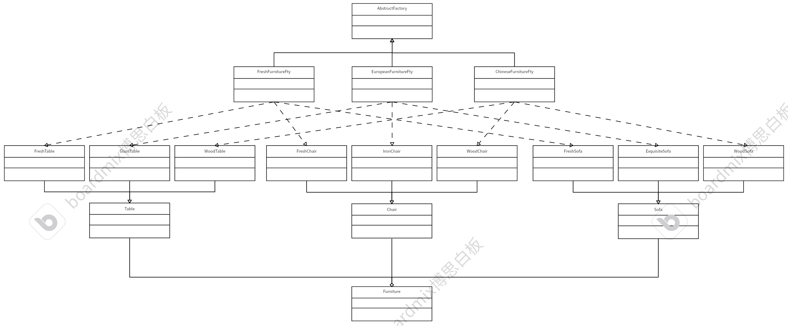

# 创建型模式—抽象工厂模式
## 特征
抽象工厂模式允许可变因素，可以生产一些复杂的对象。可变指的是对象不同的风格、不同的情况。所以会存在一个工厂的抽象类，若干个要创建对象的抽象类（抽象成一类事物），还有若干个对应的工厂子类。</br>
## 举例
比如：家具可以看成一类抽象事物，家具包括茶几、沙发、桌子等。每套家具有会出现不同的风格：田园风、欧式风、中式风等。</br>
所以会有一个抽象工厂类派生不同产生不同风格的工厂类，以及不同的家具类。</br>
### 家具风格装修清单
<b>|田园风|欧式风|中国风
---|---|---|---|
桌子|清新圆桌|精致玻璃桌|复古木桌
椅子|清新木凳|精致椅子|复古木椅
沙发|清新软皮沙发|精致皮革沙发|复古木沙发

明确生产的东西：不同的风格家具套装

```cpp
// 确定需要生产物品的父类（基类）以及不同风格的子类
// 桌子
#include<iostream>
#include<string>
using namespace std;
class Table
{
public:
    virtual string getTable() = 0;
    virtual ~Table(){};
};
class FreshTable:public Table
{
public:
    string getTable() override
    {
        return string("This is a freshTable.");
    }
};
class GlassTable:public Table
{
public:
    string getTable() override
    {
        return string("This is a glassTable.");
    }
};
class WoodTable:public Table
{
public:
    string getTable() override
    {
        return string("This is a woodTable.");
    }
};
// 椅子
class Chair
{
public:
    virtual string getChair() = 0;
    virtual ~Chair(){}
};
class FreshChair:public Chair
{
public:
    string getChair()
    {
        return string("This is a freshChair.");
    }
};
class IronChair:public Chair
{
public:
    string getChair()
    {
       return string("This is a ironChair.");
    }
};
class WoodChair:public Chair
{
public:
    string getChair()
    {
        return string("This is a woodChair.");
    }
};
// 沙发
class Sofa
{
public:
    virtual string getSofa() = 0;
    virtual ~Sofa(){}
};
class FreshSofa:public Sofa
{
public:
    void getSofa()
    {
        return string("This is a freshSofa.");
    }
};
class ExquisiteSofa:public Sofa
{
public:
    string getSofa()
    {
        return string("This is a exquisiteSofa.");
    }
};
class WoodSofa:public Sofa
{
    string getSofa()
    {
        return string("This is a woodSofa.");
    }
};
// 整合成一个家具类
class Furniture
{
public:
    // 初始化参数列表
    Furniture(Table* table,Chair* chair,Sofa* sofa)：
    m_table(table),m_chair(chair),m_sofa(sofa){}
    // 体现组合关系，析构全部
    ~Furniture()
    {
        delete m_table;
        delete m_chair;
        delete m_sofa;
    }
    string getDisposition()
    {
        return string(m_table->getTable()+m_chair->getChair()+m_sofa->getSofa());
    }
private:
    Table* m_table;
    Chair* m_chair;
    Sofa* m_sofa;
};

// 工厂类
class AbstructFactory
{
public:
    virtual Furniture* createFurniture() = 0;
    virtual ~AbstructFactory(){}
};
// 生产田园风格家具的工厂
class FreshFurnitureFty：public AbstructFactory
{
public:
    Furniture* createFurniture()
    {
        Furniture* furniture = new Furniture(new FreshTable(),new FreshChair(),new FreshSofa());
        cout << "田园风格的家具生产完毕。" << endl;
        return furniture;
    }
};
// 生产欧式风格家具的工厂
class EuropeanFurnitureFty：public AbstructFactory
{
public:
    Furniture* createFurniture()
    {
        Furniture* furniture = new Furniture(new GlassTable(),new IronChair(),new ExquisiteSofa());
        cout << "欧式风格的家具生产完毕。" << endl;
        return furniture;
    }
};
// 生产中式风格家具的工厂
class ChineseFurnitureFty：public AbstructFactory
{
public:
    Furniture* createFurniture()
    {
        Furniture* furniture = new Furniture(new WoodTable(),new WoodChair(),new WoodSofa());
        cout << "中式风格的家具生产完毕。" << endl;
        return furniture;
    }
};
int main()
{
    // 想生产中式家具
    // 创建父类工厂绑定生产中式家具工厂
    AbstructFactory* factory_ptr = new ChineseFurnitureFty();
    // 开始生产整套家具
    Furniture* furniture = factory_ptr->createFurniture();
    // 打印型号
    cout<< furniture->getDisposition() << endl;
    // 释放资源
    delete furniture;
    delete factory_ptr;

    return 0;
}
```
### 总结以上UML类图

