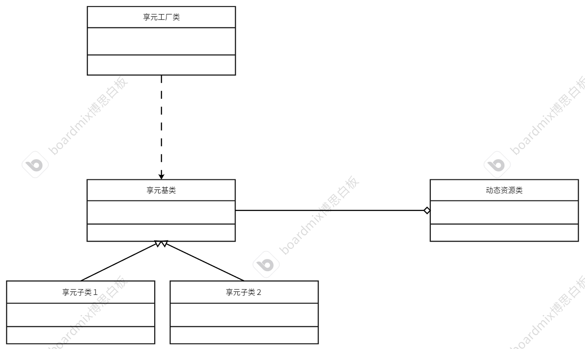

# 享元模式
## 特点
多个对象共享同一个数据，动态资源与静态资源分离，封装不同的类。</br>
<b>享元模式就是摒弃了在每个对象中能保存所有的数据的这种方式，通过数据共享（缓存）让有限的内存可以加载到更多的对象。</b></br>
对象的常量数据称为内在状态，只能读取不可更改，而对象的其他状态常常能被其他对象通过一系列方式改变，因此被称为外在状态。日常中资源复用的例子：线程池、连接池、内存池

## 使用享元模式
使用享元模式一般先将对象的内在状态和外在状态分离，将内在状态单独放在一个类中，这个类就成为享元类。
 ## 例子
 设计一个游戏：有一门大炮，它可以发射很多炸弹。假设炸弹可以无限存放，加载大量的炸弹，这样会消耗大量的计算机资源。炸弹的四种属性：炸弹的坐标、炸弹的速度、炸弹的颜色、炸弹的贴图切换。</br>
 分析：可以设计成享元模式，将炸弹的四种属性可以分成内在属性和外在属性。炸弹的发射坐标和炸弹的速度是动态的，而炸弹的颜色资源和贴图切换是静态的。
 ## 代码设计
 * 炸弹的单体享元类基类：静态数据
 * 不同的炸弹类型：独有的炸弹、共享的炸弹
 * 炸弹的动态资源类
 * 享元对象的工厂类：管理共享的内存,不同的型号的内存不一样，要利用享元工厂类进行维护多种不同的共享资源内存
 ## 代码框架
 * 享元基类
 ```cpp
#ifndef FLYWEIGHTBODY_H
#define FLYWEIGHTBODY_H
#include <iostream>
#include <string>
using namespace std;
// 定义享元类基类
class FlyWeightBody
{
private:
    /* data */
protected:
    string m_color; // 存放颜色
    string m_spirt; // 存放精灵贴图
    string m_name;  // 享元内存的型号
public:
    FlyWeightBody(string spirt, string name) : m_spirt(spirt), m_name(name) {};
    // 纯虚函数
    virtual void move(int x, int y, int speed) = 0; // 炸弹的轨迹
    virtual void draw(int x, int y) = 0;            // 重绘炸弹的弹体
    virtual ~FlyWeightBody() {};
};
#endif
 ```
* 派生类：独享子类——普通炸弹
```cpp
#ifndef SHAREBOOMBODY_H
#define SHAREBOOMBODY_H
#include "FlyWeightBody.h"

// 享元类的子类——炮弹
class SharedBoomBody : public FlyWeightBody
{
private:
    /* data */
public:
    using FlyWeightBody::FlyWeightBody; // 继承父类的构造函数
    // 重写
    void move(int x, int y, int speed) override; // 炸弹的轨迹
    void draw(int x, int y) override;            // 重绘炸弹的弹体
};
#endif

#include "SharedBoomBody.h"
void SharedBoomBody::move(int x, int y, int speed)
{
    cout << "The Boom is " << speed << "km/h to (" << x << "," << y << ")" << endl;
}

void SharedBoomBody::draw(int x, int y)
{
    cout << "At (" << x << "," << y << ") draw." << endl;
}
```
* 派生类：享元子类——彩蛋
```cpp
#ifndef UNIQUEBOOMBODY_H
#define UNIQUEBOOMBODY_H
#include "FlyWeightBody.h"

// 享元类的子类——独享内存的彩蛋
class UniqueBoomBody : public FlyWeightBody
{
private:
    /* data */
public:
    using FlyWeightBody::FlyWeightBody;
    // 重写
    void move(int x, int y, int speed) override; // 炸弹的轨迹
    void draw(int x, int y) override;            // 重绘炸弹的弹体
};
#endif

#include "UniqueBoomBody.h"
void UniqueBoomBody::move(int x, int y, int speed)
{
    // 省略x,y,speed处理
    cout << "Wow,you have suprise!" << endl;
}

void UniqueBoomBody::draw(int x, int y)
{
    cout << "At (" << x << "," << y << ") draw unique boom." << endl;
}
```
* 动态资源类——存放炸弹的动态数据
```cpp
#ifndef LUNCHBOOM_H
#define LUNCHBOOM_H
#include "FlyWeightBody.h"

// 动态资源的类——发射炮弹
class LunchBoom
{
private:
    /* data */
    FlyWeightBody *m_FlyWeightBody; // 存储享元对象——静态的属性
    // 动态属性
    int m_speed = 100; // 速度
    int m_x = 0;       // 坐标轴x
    int m_y = 0;       // 坐标轴y
public:
    LunchBoom(FlyWeightBody *flyWeightBody) : m_FlyWeightBody(flyWeightBody) {}; // 制造弹体（享元）
    void setSeep(int speed);
    // 移动
    void move(int x, int y);
    // 重绘
    void draw();
    
};
#endif

#include "LunchBoom.h"
void LunchBoom::setSeep(int speed)
{
    m_speed = speed;
}

void LunchBoom::move(int x, int y)
{
    m_x = x;
    m_y = y;
    // 弹体移动
    m_FlyWeightBody->move(m_x, m_y, m_speed);
    // 每次移动后就重绘
    draw();
}

void LunchBoom::draw()
{
    // 重绘炮弹
    m_FlyWeightBody->draw(m_x, m_y);
}

```
* 享元炸弹工厂——管理享元内存
```cpp
#ifndef BOOMBODYFACTORY_H
#define BOOMBODYFACTORY_H
#include "SharedBoomBody.h"
#include "UniqueBoomBody.h"
#include <map>

// 享元类工厂
class BoomBodyFactory
{
private:
    /* data */
    map<string, FlyWeightBody *> m_sharedDataMap;

public:
    FlyWeightBody *getSharedData(string name, string spirt); // 传入型号，寻找该享元内存
    ~BoomBodyFactory();
};
#endif

#include "BoomBodyFactory.h"
FlyWeightBody *BoomBodyFactory::getSharedData(string name, string spirt)
{
    FlyWeightBody *data = nullptr;
    // 遍历容器
    for (auto &item : m_sharedDataMap)
    {
        if (item.first == name)
        {
            // 找到该享元内存
            data = item.second; // 获取该内存
            cout << name << "Is using....." << endl;
            break;
        }
    }
    if (data == nullptr) // 说明没有开启该型号的享元内存
    {
        // 开辟该内存
        data = new SharedBoomBody(name, spirt);
        cout << "Don`t have.......creating.........." << name << "OK" << endl;
        // 保存到map中
        m_sharedDataMap.insert(make_pair(name, data));
    }

    return data;
}

BoomBodyFactory::~BoomBodyFactory()
{
    // 析构map
    for (auto &item : m_sharedDataMap)
    {
        delete item.second;
    }
}
```
* 测试代码
```cpp
#include "BoomBodyFactory.h" // 静态数据
#include "LunchBoom.h"       // 动态数据
#include <vector>
int main()
{
    BoomBodyFactory *factory = new BoomBodyFactory;
    // 炮弹容器，放若干个炮弹
    vector<LunchBoom *> boomList;
    // 型号与数量
    vector<string> nameList = {"S1", "S1", "S2", "S2", "X1", "X1", "X1"};
    for (auto name : nameList) // 遍历型号容器，创建动态炮弹
    {
        int x = 0;
        int y = 0;
        // 工厂获取共享弹体后创建动态炮弹
        LunchBoom *boom = new LunchBoom(factory->getSharedData(name, "beautiful boom"));
        // 随机坐标
        for (int i = 0; i < 3; i++)
        {
            x += rand() % 100;
            y += rand() % 75;
            boom->move(x, y);
        }
        boomList.push_back(boom);
    }

    // 彩蛋静态资源
    UniqueBoomBody *caidan = new UniqueBoomBody("Big suprise", "caidan");
    // 创建动态资源
    LunchBoom *boom = new LunchBoom(caidan);
    int x = 0;
    int y = 0;
    // 随机坐标
    for (int i = 0; i < 3; i++)
    {
        x += rand() % 100;
        y += rand() % 75;
        boom->move(x, y);
    }
    boomList.push_back(boom); // 存入boomlist列表

    // 释放内存
    for (auto &item : boomList)
    {
        delete item;
    }
    delete caidan;
    delete factory;

    return 0;
}
```
## UML类图

