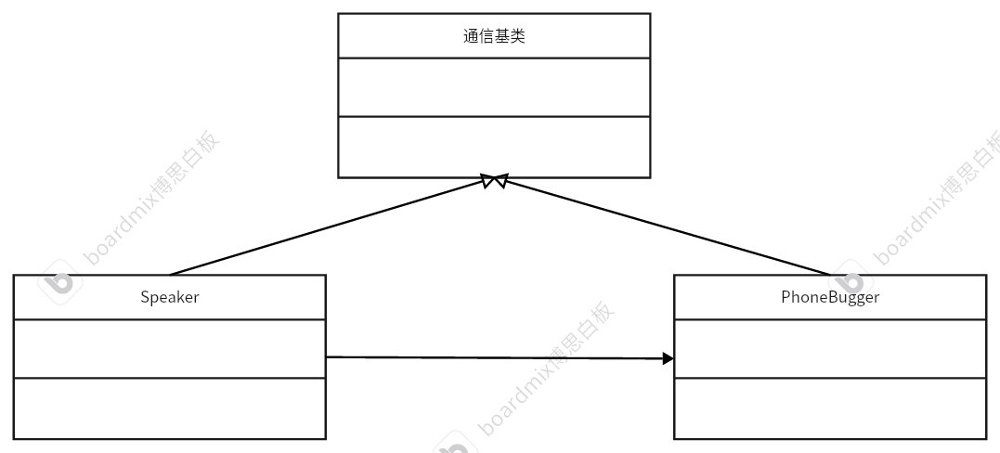

# 代理模式
## 定义
为其他的对象提供一个代理，控制这个对象的访问。
## 例子
有一种宠物，叫做电话虫，可以进行远程通信。电话虫可以代理主人的通信行为，传输主人的语言、语气及表情。现在写一段代码来模拟这种情况。使用代理模式框架。
* 分析：可以先编写一个基础的通信类作为基类，编写一个虚方法实现个人直接交流或者通过电话虫进行交流。个人类和电话虫继承通信基类，个人类关联电话虫类。
## 代码框架
* 通信基类
```cpp
#ifndef COMMUNICATION_H
#define COMMUNICATION_H
#include <iostream>
#include <string>
using namespace std;
// 通信基类
class Communication
{
private:
    virtual void communicate() = 0; // 用于通信的方法
public:
    virtual ~Communication() {};
};

#endif
```
* 子类——个人类
```cpp
#ifndef SPEAKER_H
#define SPEAKER_H
#include "Communication.h"
// 子类——主人
class Speaker:public Communication
{
private:
    /* data */

public:
    void communicate() override;
    
};

#endif

#include "Speaker.h"

void Speaker::communicate()
{
    cout << "The speaker is talking something and changing his face..." << endl;
}
```
* 子类——电话虫类
```cpp
#ifndef PHONEBUGGER_H
#define PHONEBUGGER_H
#include "Speaker.h"
class Phonebugger : public Communication
{
private:
    /* data */
    bool m_IsStart = false; // 用于记录是否打开代理
    Speaker* m_speaker = nullptr; // 用于记录自己的主人
public:
    bool isStart();
    void setStart(bool flag);
    void communicate() override;
    Phonebugger();
    ~Phonebugger(/* args */);
    
};
#endif

#include "Phonebugger.h"

bool Phonebugger::isStart()
{
    return m_IsStart;
}

void Phonebugger::setStart(bool flag)
{
    m_IsStart = flag;
}

void Phonebugger::communicate()
{
    // 判断是否打开代理模式
    if (m_IsStart)
    {
        cout << "The Phonebugger is connecting with speaker....." << endl;
        m_speaker->communicate();
    }
}

Phonebugger::~Phonebugger()
{
    // 释放资源
    if (m_speaker != nullptr)
    {
        delete m_speaker;
    }
}

Phonebugger::Phonebugger()
{
    m_IsStart = true;        // 开启代理
    m_speaker = new Speaker; // 新开辟主人空间
}

```
* 代码测试
```cpp
#include "Phonebugger.h"
#include "Speaker.h"
int main()
{
    // 直接交流
    Speaker *speaker = new Speaker;
    speaker->communicate();
    delete speaker;

    cout << "--------------------------" << endl;

    // 电话虫交流
    Phonebugger *phonebugger = new Phonebugger();
    // 打开权限
    phonebugger->setStart(true);
    // 开始交流
    phonebugger->communicate();
    // 释放资源
    delete phonebugger;

    return 0;
}
```

## UML类图
