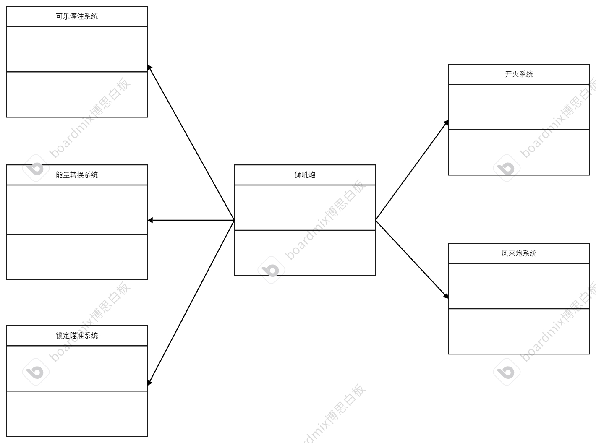

# 外观模式
## 特点
对于一系列复杂问题，集成简单的操作。复杂的事情简单化。</br>
给很多复杂的子系统提供上层接口，各个子系统协调工作，构建一个完整的系统。
## 例子
在海贼王中有一门武器叫做狮吼炮，其中狮吼炮的内部工作原理非常复杂。首先需要进行可乐灌入，转换成能量。然后自动进行索敌，瞄准索敌后进行蓄能，最后再调用凤来炮同时发射来稳定船身。</br>
由此可见，狮吼炮可以拆分多个子系统，可乐灌入系统、能量转换系统、锁定瞄准系统、凤来炮系统、开炮系统。</br>
对于操作者来讲，我们只需要关心如何瞄准和开火，所以内部系统需要进行集成后向上层提供瞄准和开火的接口。
## 代码框架
### 各个子系统
* 可乐灌入系统
```cpp
#ifndef COKESYSTEM_H
#define COKESYSTEM_H
#include<iostream>
#include<string>
using namespace std;
class CokeSystem
{
private:
    /* data */
public:
    void imitCoke();
};

#endif

#include "CokeSystem.h"

void CokeSystem::imitCoke()
{
    cout<<"..........................Imiting.........................."<<endl;
    cout<<"OK,Coke has been imited."<<endl;
}
```
* 转换能量系统
```cpp
#ifndef CONVERTSYSTEM_H
#define CONVERTSYSTEM_H
#include<iostream>
#include<string>
using namespace std;

class CovertSystem
{
private:
    /* data */
public:
    void convertCokeToEnergy();

};

#endif

#include "CovertSystem.h"

void CovertSystem::convertCokeToEnergy()
{
    cout<<"..........................Coverting.........................."<<endl;
    cout<<"OK,The coke has converted!"<<endl;

}
```
* 瞄准锁定系统
```cpp
#ifndef AIMLOCKSYSTEM_H
#define AIMLOCKSYSTEM_H
#include<iostream>
#include<string>
using namespace std;

class AimLockSystem
{
private:
    /* data */
public:
    void AimLock();
};
#endif

#include "AimLockSystem.h"

void AimLockSystem::AimLock()
{
    cout<<"..........................Aiming.........................."<<endl;
    cout<<"OK,The emermy has been locked,you can shoot them at everytime."<<endl;
    
}
```
* 开火系统
```cpp
#ifndef CANNONSHOOTSYSTEM_H
#define CANNONSHOOTSYSTEM_H
#include<iostream>
#include<string>
using namespace std;

class CannonShootSystem
{
private:
    /* data */
public:
    void cannonFire();
};
#endif

#include "CannonShootSystem.h"

void CannonShootSystem::cannonFire()
{
    cout<<"..........................Firing.........................."<<endl;
    cout<<"OK,Fire!!!!!"<<endl;

    
}
```
* 风来炮系统
```cpp
#ifndef WINDCANNONSYSTEM_H
#define WINDCANNONSYSTEM_H
#include<iostream>
#include<string>
using namespace std;

class WindCannonSystem
{
private:
    /* data */
public:
    void windcannonFire();
};
#endif

#include "WindCannonSystem.h"

void WindCannonSystem::windcannonFire()
{
    cout<<"..........................WindFiring.........................."<<endl;
    cout<<"OK,the ship is balance."<<endl;

}
```
### 集成后的总系统，向上提供接口
```cpp
#ifndef LIONCANNON_H
#define LIONCANNON_H
#include "AimLockSystem.h"
#include "CannonShootSystem.h"
#include "CokeSystem.h"
#include "CovertSystem.h"
#include "WindCannonSystem.h"
// 集成子系统，向上提供接口
class LionCannon
{
private:
    /* data */
    AimLockSystem *m_aimLockSystem = nullptr;
    CannonShootSystem *m_cannonShootSystem = nullptr;
    CokeSystem *m_cokeSystem = nullptr;
    CovertSystem *m_covertSystem = nullptr;
    WindCannonSystem *m_windCannonSystem = nullptr;

public:
    LionCannon(/* args */);
    ~LionCannon();
    // 向上提供接口
    void lockAndaim();
    void fire();
};
#endif

#include "LionCannon.h"

LionCannon::LionCannon()
{
    // 给子系统开辟内存
    m_aimLockSystem = new AimLockSystem;
    m_cannonShootSystem = new CannonShootSystem;
    m_cokeSystem = new CokeSystem;
    m_covertSystem = new CovertSystem;
    m_windCannonSystem = new WindCannonSystem;
}

LionCannon::~LionCannon()
{
    // 释放内存
    delete m_aimLockSystem;
    delete m_cannonShootSystem;
    delete m_cokeSystem;
    delete m_covertSystem;
    delete m_windCannonSystem;
}

void LionCannon::lockAndaim()
{
    // 调用子系统
    m_cokeSystem->imitCoke();
    m_covertSystem->convertCokeToEnergy();
    m_aimLockSystem->AimLock();
}

void LionCannon::fire()
{
    // 开火
    m_cannonShootSystem->cannonFire();
    m_windCannonSystem->windcannonFire();
}

```
### 测试代码
```cpp
#include "LionCannon.h"
int main()
{
    // 构建狮吼炮
    LionCannon* lionCannon = new LionCannon;

    // 先瞄准
    lionCannon->lockAndaim();
    // 开火
    lionCannon->fire();

    delete lionCannon;

    return 0;
}
```
## UML
