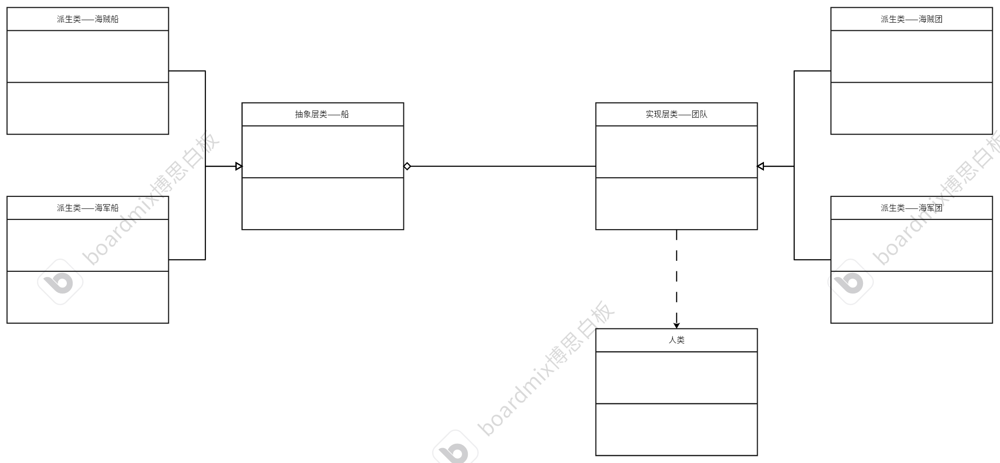

# 桥接模式
## 什么是桥接模式？
桥接模式原则是指把抽象层和实现层分离出来，使他们可以独立变化。抽象层和实现层属于聚合关系。
* 抽象层：被动的执行某些操作，被动的去显示一些数据，被动的存储一些东西。这些都属于抽象层。
* 实现层：是一套对应的逻辑驱动抽象层。

例如：手机品牌（抽象层）和手机软件（实现层）

## 例子
用一套代码同时管理海盗军队和海军军队。军队包括船和团队（人），可以理解成船是抽象层，不同的团队可以变成不同的使用情况，说明船是被动的执行某些操作，而团队属于实现层。

## 代码框架
1.抽象层类
* 抽象层基类——船
```cpp
#ifndef SHIP_H
#define SHIP_H
#include <iostream>
#include <string>
#include "AbstructTeam.h"
using namespace std;
// 定义抽象部分——船
class AbstructShip
{
private:
    /* data */
protected:
    AbstructTeam *m_abstructTeam; // 用于记录当前的船是哪个团队在使用
public:
    AbstructShip(AbstructTeam *abstructTeam) : m_abstructTeam(abstructTeam) {};
    void show();                  // 简单输出一些团队的信息
    virtual string getName() = 0; // 获取船的名字
    virtual void feature() = 0;   // 输出船的特征

    virtual ~AbstructShip(){};
};
#endif
```
```cpp
#include "AbstructShip.h"

void AbstructShip::show()
{
    m_abstructTeam->showTeam();
    m_abstructTeam->teamGoal();
}
```
* 抽象层子类
```cpp
#ifndef HANINKSHIP_H
#define HANINKSHIP_H
#include "AbstructShip.h"
class HaninkShip : public AbstructShip
{
private:
    /* data */
public:
    using AbstructShip::AbstructShip; // 继承父类的带参构造函数
    string getName() override;        // 获取船的名字
    void feature() override;          // 输出船的特征
};

#endif
```
```cpp
#include "HaninkShip.h"

string HaninkShip::getName()
{
    return "Hanink ship";
}

void HaninkShip::feature()
{
    cout << getName() << ": has a big ship body and has many pirates." << endl;
}
```
```cpp
#ifndef HANJUNSHIP_H
#define HANJUNSHIP_H
#include "AbstructShip.h"
class HaijunShip : public AbstructShip
{
private:
    /* data */
public:
    using AbstructShip::AbstructShip; // 继承父类的带参构造函数
    string getName() override;        // 获取船的名字
    void feature() override;          // 输出船的特征
};
#endif
```
```cpp
#include "HaijunShip.h"

string HaijunShip::getName()
{
    return "The Haijun ship";
}

void HaijunShip::feature()
{
    cout << getName() << ": has many policemen and has many guns." << endl;
}
```

2.实现层类
* 实现层基类——团队
```cpp
#ifndef ABSTRUCTTEAM_H
#define ABSTRUCTTEAM_H
#include <iostream>
#include <string>
#include <map>
using namespace std;
// 定义团队里的成员变量——人
struct Person
{
    string name;    // 人名
    string age;     // 年龄
    string ability; // 职责
    string job;     // 职业

    Person(string p_name, string p_age, string p_ability, string p_jop)
    {
        this->name = p_name;
        this->age = p_age;
        this->ability = p_ability;
        this->job = p_jop;
    }
};
// 定义实现层——团队
class AbstructTeam
{
private:
    /* data */
protected:
    map<string, Person *> m_teamMap; // 用于存储团队里面的人
    string m_name;                   // 用于记录团队的名字
public:
    AbstructTeam(string name) : m_name(name) {};
    string getName();
    void addPerson(Person *person); // 把人添加到团队中
    void showTeam();                // 把团队的信息展示出来
    virtual void teamGoal() = 0;    // 明确该团队的目标
    virtual ~AbstructTeam();
};
#endif
```
```cpp
#include "AbstructTeam.h"
string AbstructTeam::getName()
{
    return m_name;
}

void AbstructTeam::addPerson(Person *person)
{
    // 将人添加到map容器中
    m_teamMap.insert(make_pair(person->name, person));
}

void AbstructTeam::showTeam()
{
    // 遍历容器展示
    cout << "Our team name is:" << m_name << endl;
    cout << "These are our persons." << endl;
    for (const auto &p : m_teamMap)
    {
        cout << "name:" << p.second->name << " "
             << "age:" << p.second->age << " "
             << "ability:" << p.second->ability << " "
             << "job:" << p.second->job << endl;
    }
}

AbstructTeam::~AbstructTeam()
{
    // 将存储的person清除
    for (const auto &p : m_teamMap)
    {
        delete p.second;
    }
}

```
* 实现层子类
```cpp
#ifndef CAOMAOTEAM_H
#define CAOMAOTEAM_H
#include "AbstructTeam.h"
class CaoMaoTeam : public AbstructTeam
{
private:
    /* data */
public:
    using AbstructTeam::AbstructTeam;
    void teamGoal() override; // 重写父类目标函数
};
#endif
```
```cpp
#include "CaoMaoTeam.h"

void CaoMaoTeam::teamGoal()
{
    cout << m_name << ": We are must be the king of the sea." << endl;
}
```
```cpp
#ifndef SMOKERTEAM_H
#define SMOKERTEAM_H
#include "AbstructTeam.h"
class SmokerTeam : public AbstructTeam
{
private:
    /* data */
public:
    using AbstructTeam::AbstructTeam;
    void teamGoal() override;
};
#endif
```
```cpp
#include "SmokerTeam.h"

void SmokerTeam::teamGoal()
{
    cout<<m_name<<": We need to put off these bad people."<<endl;
}
```

3.测试代码
```cpp
#include "CaoMaoTeam.h"
#include "SmokerTeam.h"
#include "HaninkShip.h"
#include "HaijunShip.h"
int main()
{
    // 草帽团海贼
    CaoMaoTeam *caomaoTeam = new CaoMaoTeam("CaoMaoTeam");
    // 人
    Person *xiaojiao = new Person("XiaoJiao", "22", "doctor", "pirate");
    Person *Jone = new Person("Jone", "25", "leader", "pirate");
    Person *Fanzi = new Person("Fanzi", "54", "cooker", "pirate");
    Person *Aiannel = new Person("Aiannel", "25", "fighter", "pirate");
    // 添加团队
    caomaoTeam->addPerson(xiaojiao);
    caomaoTeam->addPerson(Jone);
    caomaoTeam->addPerson(Fanzi);
    caomaoTeam->addPerson(Aiannel);
    // 船
    HaninkShip *haninkShip = new HaninkShip(caomaoTeam);
    haninkShip->show();
    haninkShip->feature();
    cout << "----------------------------------" << endl;
    // 海军
    SmokerTeam *smokerTeam = new SmokerTeam("SmokerTeam");
    // 人
    Person *Kim = new Person("Kim", "30", "leader", "policeman");
    Person *Naxi = new Person("Nanxi", "28", "cook", "policeman");
    Person *Nandi = new Person("Nandi", "45", "doctor", "policeman");
    Person *Ubanten = new Person("Ubanten", "29", "fighter", "policeman");
    // 添加团队
    smokerTeam->addPerson(Kim);
    smokerTeam->addPerson(Naxi);
    smokerTeam->addPerson(Nandi);
    smokerTeam->addPerson(Ubanten);
    // 船
    HaijunShip *haijunShip = new HaijunShip(smokerTeam);
    haijunShip->show();
    haijunShip->feature();

    // 释放内存(团队里的人内存会随着团队内存释放而释放)
    // 草帽团
    delete caomaoTeam;
    delete haninkShip;
    // 海军
    delete smokerTeam;
    delete haijunShip;
    return 0;
}
```
## UML类图

## 使用场景
业务场景比较复杂。把复杂的类分成抽象层和实现层。实现层主动去操控抽象层，最后通过聚合，将抽象层和实现层协同工作。