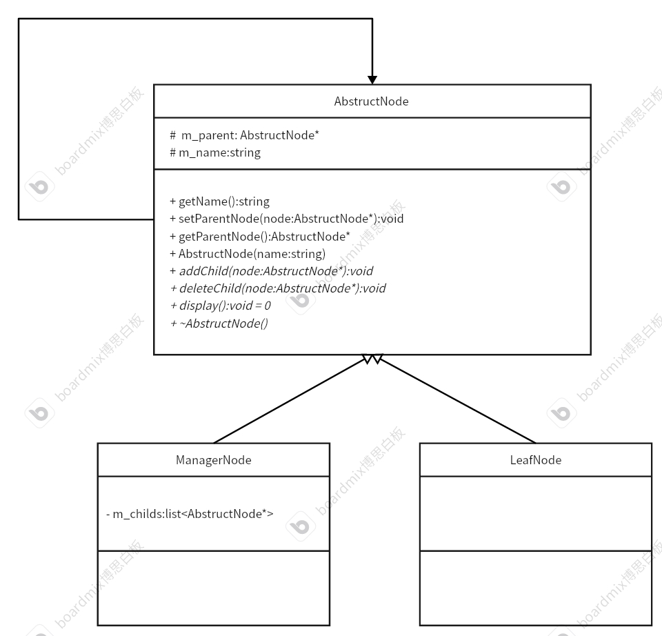

# 组合模式
编写一个类，包含父节点、中间节点、根节点等存储一些数据。各个节点访问方式相同。</br>
然后将这些节点组合起来，根据一定的关系组合到一起。
## 例子：
新华小学设立很多部门，分别是团委处、教导处、政教处、教学组、研讨组、后勤处、保卫处。其中，团委处管理教导处和政教处。其次，教导处管理教学组和研讨组，政教处管理后勤组和保卫处。编写一段代码用于团委处管理全部的部门。
## 代码框架：
* 节点基类
节点可以有根节点、普通节点和叶子节点。叶子节点没有子节点，根节点没有父节点。</br>
该基类可以派生出两种节点：管理节点和叶子节点
```cpp
#ifndef ABSTRUCTTEAM_H
#define ABSTRUCTTEAM_H
#include <iostream>
#include <string>
using namespace std;
class AbstructTeam
{
private:
    /* data */
protected:
    string m_name;
    AbstructTeam *m_parent = nullptr; // 记录父节点地址
public:
    string getName();
    void setParentNode(AbstructTeam *node); // 设置父节点
    AbstructTeam *getParentNode();          // 获取父节点
    AbstructTeam(string name);
    // 虚函数
    virtual bool hasChild(); // 用于判断是否存在子节点 管理者节点重写即可
    // 不能设置成纯虚函数，因为叶子节点不需要重写这两个方法
    virtual void addChild(AbstructTeam *node) {};    // 用于添加子节点
    virtual void deleteChild(AbstructTeam *node) {}; // 用于删除子节点
    virtual void display() = 0;                      // 展示
    virtual ~AbstructTeam() {};
};
#endif
```
```cpp
#include "AbstructTeam.h"

string AbstructTeam::getName()
{
    return m_name;
}

void AbstructTeam::setParentNode(AbstructTeam *node)
{
    m_parent=node;
}

AbstructTeam::AbstructTeam(string name)
{
    m_name=name;
}

bool AbstructTeam::hasChild()
{
    return false;
}

AbstructTeam *AbstructTeam::getParentNode()
{
    return m_parent;
}


```
* 管理者节点
```cpp
#ifndef MANAGERTEAM_H
#define MANAGERTEAM_H
#include "AbstructTeam.h"
#include <list>
class ManagerTeam : public AbstructTeam
{
private:
    /* data */
    // 存储子节点
    list<AbstructTeam *> m_childs;

public:
    using AbstructTeam::AbstructTeam;
    void display() override;
    bool hasChild() override;
    list<AbstructTeam*> getChilds();
    void addChild(AbstructTeam *node) override;
    void deleteChild(AbstructTeam *node) override;
    ~ManagerTeam() override;
};
#endif
```
```cpp
#include "ManagerTeam.h"

void ManagerTeam::display()
{
    // 遍历所有的子节点，输出信息
    string info = "I am " + m_name + " and I have ";
    for (const auto &item : m_childs)
    {
        if (item == m_childs.back()) // 判断是不是最后一个子节点
        {
            info += item->getName();
        }
        else
        {
            info += item->getName() + ",";
        }
    }
    cout << info << endl;
}

bool ManagerTeam::hasChild()
{
    return true;
}

list<AbstructTeam *> ManagerTeam::getChilds()
{
    return m_childs;
}

void ManagerTeam::addChild(AbstructTeam *node)
{
    // 设置子节点的父亲
    node->setParentNode(this);
    // 放入容器中
    m_childs.push_back(node);
}

void ManagerTeam::deleteChild(AbstructTeam *node)
{
    // 将该子节点的父亲清空
    node->setParentNode(nullptr);
    // 移除容器
    m_childs.remove(node);
}

ManagerTeam::~ManagerTeam()
{
    cout<<m_name<<" is broken!"<<endl;
}

```
* 叶子节点
```cpp
#ifndef LEAFTEAM_H
#define LEAFTEAM_H
#include "AbstructTeam.h"
class LeafTeam:public AbstructTeam
{
private:
    /* data */
public:
    using AbstructTeam::AbstructTeam; // 继承父类的构造函数
    // 重写父类虚函数
    void display() override;
    ~LeafTeam() override;
};

#endif
```
```cpp
#include "LeafTeam.h"
void LeafTeam::display()
{
    cout << "This is " << this->m_name << " , my boss is " << m_parent->getName() << endl;
}

LeafTeam::~LeafTeam()
{
    cout<<m_name<<" is broken!"<<endl;
}
```
* 测试代码
```cpp
#include "ManagerTeam.h"
#include"LeafTeam.h"
#include<vector>
void clear(AbstructTeam* root)
{
    if(root == nullptr) // 递归停止操作
        return;
    if(root && root->hasChild()) // root不为空，且有孩子节点
    {
        // dynamic_cast可用于转换类型，主要用于继承关系之间的转换
        ManagerTeam* team = dynamic_cast<ManagerTeam*>(root);
        // 获取孩子节点
        list<AbstructTeam*> temp_list = team->getChilds();
        for(const auto& item : temp_list)
        {
            // 执行递归操作
            clear(item);
        }
    }
    delete root;
}
int main()
{
    // 创建根节点
    ManagerTeam* root = new ManagerTeam("XinHuaXiaoXue_TuanWei");
    ManagerTeam* jiaodao = new ManagerTeam("JiaoDaoChu");
    ManagerTeam* zhengjiao = new ManagerTeam("ZhengJiaoChu");
    // 创建子节点
    LeafTeam* jiaoxuezu = new LeafTeam("JiaoXueZu");
    LeafTeam* yantaozu = new LeafTeam("YanTaoZu");
    LeafTeam* houqingzu = new LeafTeam("HouQingZu");
    LeafTeam* baoweichu = new LeafTeam("BaoWeiChu");

    // 建立关联
    root->addChild(jiaodao);
    root->addChild(zhengjiao);
    jiaodao->addChild(jiaoxuezu);
    jiaodao->addChild(yantaozu);
    zhengjiao->addChild(houqingzu);
    zhengjiao->addChild(baoweichu);

    root->display();
    jiaodao->display();
    zhengjiao->display();

    // 从根节点开始递归释放内存
    clear(root);
}
```
## 组合模式UML类图
