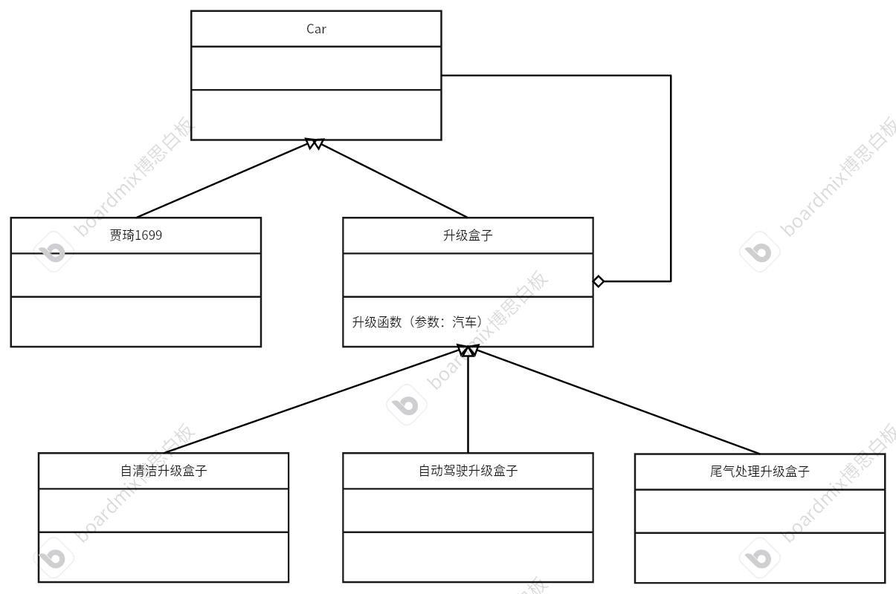

# 装饰模式（封装模式）
## 特点
* 在原有的形态上进行升级，叠加。</bt>
例如一个项目，需求在后续不断的进行增加，需要给原有的类基础上进行功能的拓展。或者定义新的类继承原有的类，这样就可以保留以前的属性，也可以创建新的属性。
* 如何使用？</br>
在创建不断定义新的子类时，往往用新的子类“装饰”前一个子类。装饰的同时要保持原来的属性

## 例子
火丁车厂根据市场调研，他们需要在原本的一款车型贾琦1699进行升级，叠加新的功能。其中科技人员已经研发出升级盒子就可以在车的核心芯片中添加功能。例如现在需要添加汽车自清洁、汽车自动驾驶、汽车尾气转换等功能。现在编写一段代码来模拟这种升级情况。

* 分析：以上描述就是要对贾琦1699进行装饰，它的本质就是一辆车，基类可以是车。汽车是升级盒子的载体。

## 代码框架
* 汽车的基类
```cpp
#ifndef CAR_H
#define CAR_H
#include <iostream>
#include <string>
using namespace std;
// 汽车基类
class Car
{
public:
    Car(){}
    Car(string name) : m_name(name) {}
    string getName();
    virtual void function() = 0; // 区分不同的发展方向
    virtual ~Car() {}

protected:
    string m_name = string(); // 不能使用string m_name = nullptr; 这是错误的表达!

private:
};
#endif


#include "Car.h"
string Car::getName()
{
    return m_name;
}
```
* 派生类：贾琦车
```cpp
#ifndef JiaQi1699_H
#define JiaQi1699_H
#include "Car.h"
// 定义汽车某款车型
class JIaQi1699 : public Car
{
private:
    /* data */
public:
    using Car::Car;
    void function() override;
};
#endif


#include "JIaQi1699.h"
void JIaQi1699::function()
{
    cout << "The car :" << m_name << "." << endl;
    cout << "The update function:" << endl;
}
```
* 派生类：汽车功能升级包，继承汽车类，汽车类作为升级包的载体
```cpp
#ifndef UPDATEBOX_H
#define UPDATEBOX_H
#include "Car.h"
class UpdateBox : public Car
{
private:
    /* data */
protected:
    Car *m_car = nullptr;
public:
    
    void updateToCar(Car *car); // 为升级盒子指定载体
};
#endif


#include "UpdateBox.h"
void UpdateBox::updateToCar(Car *car)
{
    m_car = car;             // 保存汽车型号
    m_name = car->getName(); // 保存汽车的名字
}
```
* 派生类：各个升级包，继承升级包基类
```cpp
#ifndef CLEARUPDATEBOX_H
#define CLEARUPDATEBOX_H
#include "UpdateBox.h"
class ClearUpdateBox : public UpdateBox
{
private:
    /* data */
public:
    void function() override;
};
#endif


#include "ClearUpdateBox.h"
void ClearUpdateBox::function()
{
    m_car->function(); // 输出基础的功能
    cout << "The new function: auto clearing!" << endl;
}
```
```cpp
#ifndef DRIVINGUPDATEBOX_H
#define DRIVINGUPDATEBOX_H
#include "UpdateBox.h"
class DrivingUpdateBox : public UpdateBox
{
private:
    /* data */
public:
    void function() override;
};
#endif


#include "DrivingUpdateBox.h"
void DrivingUpdateBox::function()
{
    m_car->function(); // 输出基础的功能
    cout << "The new function: auto driving!" << endl;
}
```
```cpp
#ifndef EXHAUSTUPDATEBOX_H
#define EXHAUSTUPDATEBOX_H
#include "UpdateBox.h"
class ExhaustUpdateBox : public UpdateBox
{
private:
    /* data */
public:
    void function() override;
};
#endif


#include "ExhaustUpdateBox.h"
void ExhaustUpdateBox::function()
{
    m_car->function(); // 输出基础的功能
    cout << "The new function: auto Exhaust!" << endl; // 输出新加的功能
}
```
* 测试代码
```cpp
#include "ClearUpdateBox.h"
#include "DrivingUpdateBox.h"
#include "ExhaustUpdateBox.h"
#include "JIaQi1699.h"
int main()
{
    Car *car_JIaQi1699 = new JIaQi1699("JiaQi1699");
    // 升级盒子
    UpdateBox *clearBox = new ClearUpdateBox;
    UpdateBox *driveBox = new DrivingUpdateBox;
    UpdateBox *exhaustBox = new ExhaustUpdateBox;

    // 层层装饰
    // 一层升级，clearBox是最新的汽车。所以第二次升级时要在最新的车上进行升级，即把clearbox当成参数
    clearBox->updateToCar(car_JIaQi1699);
    driveBox->updateToCar(clearBox);
    exhaustBox->updateToCar(driveBox);

    // 查看功能
    exhaustBox->function();

    // 析构
    delete car_JIaQi1699;
    delete clearBox;
    delete driveBox;
    delete exhaustBox;
    
    return 0;
}
```

## 总结
装饰模式适用于拓展基本类的一些功能、属性等。需要拓展的基类可以派生出两类物体，一类是具体的事物，一类是抽象的事物，他们是依赖于具体事物而存在的。抽象的事物类也可以作为基类，派生出更多的抽象事物对具体事物进行扩展。