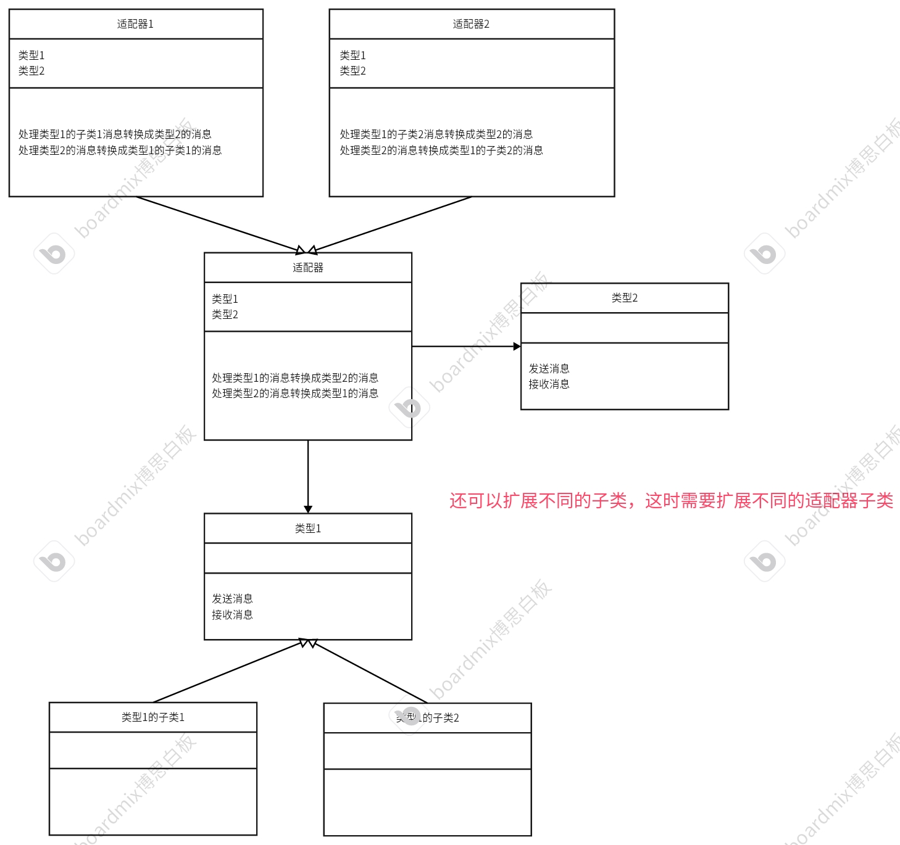

# 适配器模式
适配器的本质含义就是转换不同的结构，形象的理解就是翻译官，翻译两个国家之间的语言。</br>
例如：美国和中国进行外交。
* 美国进行发言。
* 翻译官接收美国的消息，将内容翻译成中文，然后转述给中国。
* 中国接收翻译好的消息，发送自己的内容给翻译官。
* 翻译官处理中国的消息，翻译成英文发送给美国。
* 美国接收消息后进行处理，发送自己的内容给翻译官，以此反复...
## 抽象成uml类图

## 代码框架
* 基类适配器
```cpp
// 抽象适配器类
#ifndef ABSTRUCTADEPTER_H
#define ABSTRUCTADEPTER_H
#include "Foreigner.h"
#include "Chinese.h"
class AbstructAdepter
{
private:
    /* data */
protected: // 子类适配器可以继承父类，存储对应的对象实例
    Foreigner *m_foreigner;
    Chinese *m_Chinese;

public:
    AbstructAdepter(Foreigner *foreigner) : m_foreigner(foreigner) {};
    virtual void translateToChinese() = 0;
    virtual void transloateToForeign() = 0;
    virtual ~AbstructAdepter(){};
};
#endif
```
* 美国适配器（子类）
```cpp
#ifndef AMERICANADEPTER_H
#define AMERICANADEPTER_H
#include"AbstructAdepter.h"
class AmericanAdepter:public AbstructAdepter
{
private:
    /* data */
public:
    using AbstructAdepter::AbstructAdepter; // 继承父类定义的所有构造函数
    ~AmericanAdepter(){};
    void translateToChinese();
    void transloateToForeign();
};
#endif
```
```cpp
#include "AmericanAdepter.h"

void AmericanAdepter::translateToChinese()
{
    // 将语言翻译成中文
    // 1.先获取外国人的信息
    string msg = m_foreigner->sendMessage();
    // 2.经过一系列处理，发送给中国
    m_Chinese->recvMessage("American says:"+ msg);

}

void AmericanAdepter::transloateToForeign()
{
    // 将语言转换成英文
    // 1.获取中国人发送的信息
    string msg = m_Chinese->sendMessage();
    // 经过一些列处理发送给美国
    m_foreigner->recvMessage("Chinese says:"+msg);
}
```
* 英国适配器（子类）
```cpp
#ifndef ENGLISHADEPTER_H
#define ENGLISHADEPTER_H
#include"AbstructAdepter.h"
class EnglishAdepter:public AbstructAdepter
{
private:
    /* data */
public:
    using AbstructAdepter::AbstructAdepter; // 继承父类定义的所有构造函数
    ~EnglishAdepter(){};
    void translateToChinese();
    void transloateToForeign();
};
#endif
```
```cpp
#include "EnglishAdepter.h"

void EnglishAdepter::translateToChinese()
{
    // 将语言翻译成中文
    // 1.先获取外国人的信息
    string msg = m_foreigner->sendMessage();
    // 2.经过一系列处理，发送给中国
    m_Chinese->recvMessage("English says:"+msg);
}

void EnglishAdepter::transloateToForeign()
{
    // 将语言转换成英文
    // 1.获取中国人发送的信息
    string msg = m_Chinese->sendMessage();
    // 经过一些列处理发送给英国
    m_foreigner->recvMessage("Chinese says:"+msg);
}
```
* 外国人基类
```cpp
#ifndef FOREIGNER_H
#define FOREIGNER_H
#include<iostream>
#include<string>
using namespace std;
class Foreigner
{
private:
    /* data */
public:
    virtual ~Foreigner(){};
    virtual string sendMessage() = 0;
    virtual void recvMessage(string text) = 0 ;
};
#endif
```
* 美国人类（子类）
```cpp
#ifndef AMERICAN_H
#define AMERICAN_H
#include "Foreigner.h"
class American : public Foreigner
{
private:
    /* data */
public:
    ~American() {};
    void recvMessage(string text) override;
    string sendMessage() override;
};

#endif
```
```cpp
#include "American.h"

void American::recvMessage(string text)
{
    cout << text << endl;
}

string American::sendMessage()
{
    string msg = "Hello,I am American.";
    return msg;
}
```
* 英国人类（子类）
```cpp
#ifndef ENGLISH_H
#define ENGLISH_H
#include"Foreigner.h"
class English:public Foreigner
{
private:
    /* data */
public:
    void recvMessage(string text) override;
    string sendMessage() override;
    ~English(){};
};
#endif
```
```cpp
#include "English.h"

void English::recvMessage(string text)
{
    cout << text << endl;
}

string English::sendMessage()
{
    string msg = "Hello,I am English.";
    return msg;
}
```
* 中国人类
```cpp
#ifndef CHINESE_H
#define CHINESE_H
#include<iostream>
#include<string>
using namespace std;
class Chinese
{
private:
    /* data */
public:
    ~Chinese(){};
    void recvMessage(string text);
    string sendMessage();
};
#endif
```
```cpp
#include "Chinese.h"

void Chinese::recvMessage(string text)
{
    cout<<text<<endl;
}

string Chinese::sendMessage()
{
    string msg = "Hello,I am Chinese.";
    return msg;
}
```
* 测试代码
```cpp
#include"AbstructAdepter.h"
#include"EnglishAdepter.h"
#include"AmericanAdepter.h"
#include"Foreigner.h"
#include"English.h"
#include"American.h"
int main()
{
    Foreigner* foreigner = new American;
    AbstructAdepter* adepter = new AmericanAdepter(foreigner);
    adepter->translateToChinese();
    adepter->transloateToForeign();
    delete foreigner;
    delete adepter;
    cout<<"----------------------------------"<<endl;
    foreigner =new English;
    adepter=new EnglishAdepter(foreigner);
    adepter->translateToChinese();
    adepter->transloateToForeign();
    delete foreigner;
    delete adepter;

    return 0;
}
```
对于该结构，也可以把基类适配器继承中国人类，这样的话可以不用成员变量存储中国人类实例。直接调用中国人类的方法即可。但是此情况只适<b>用于没有子类的情况，如果涉及多个子类进行适配，就只能使用关联关系。</b>