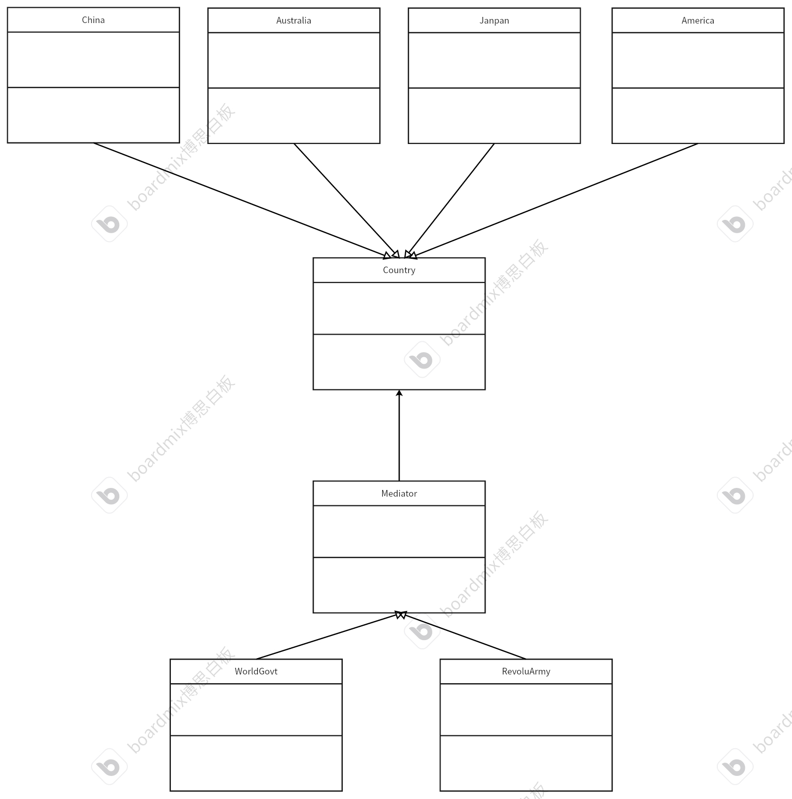

# 中介模式
## 特点
通过引入一个中介者对象来封装多个对象之间复杂的交互关系，使对象之间不必相互引用，从而减少对象间的耦合。中介者类提供服务，其他对象之间的耦合度会降低，并且中介者可以为不同的类提供更多的服务。</br>
在日常生活中，联合国、房屋中介、汽车中介等。他们的工作就是为双方提供服务，这样双方就可以通过一个地方就行交流，降低复杂的关系程度。
## 例子
多个国家需要交往交流，需要联合国这个中介进行管理各个国家的声明，协调各个国家。国家可以加入国家组织中。
## 代码
* 国家基类
```cpp
#ifndef COUNTRY_H
#define COUNTRY_H
#include <iostream>
#include <string>
#include "Mediator.h"
using namespace std;
// 定义国家的基类
class Country
{
private:
    /* data */
protected:
    Mediator *m_org = nullptr;

public:
    Country(Mediator *org) : m_org(org) {};
    virtual void declare(string msg, string country) = 0; // 对其他国家进行宣言
    virtual void setMessage(string msg) = 0;              // 接收其他国家的消息
    virtual string getName() = 0;                         // 获取该国家的名字
    virtual ~Country() {};
};
#endif
```
* 国家子类——中国
```cpp
#ifndef CHINESE_H
#define CHINESE_H
#include"Country.h"
class Chinese:public Country
{
private:
    /* data */
public:
    using Country::Country;
    void declare(string msg, string country)override; // 对其他国家进行宣言
    void setMessage(string msg)override;              // 接收其他国家的消息
    string getName()override;

};


#endif
```
```cpp
#include "Chinese.h"

void Chinese::declare(string msg, string country)
{
    cout << "Chinese is declaring...." << endl;
    // 通过中介者发布消息
    m_org->declare(msg, this, country);
}

void Chinese::setMessage(string msg)
{
    cout << "Chinese recv msg: " << msg << endl;
}

string Chinese::getName()
{
    return "Chinese";
}
```
其他国家代码类似，这里就不展示了
* 中介基类
```cpp
#ifndef MEDIATOR_H
#define MEDIATOR_H
#include <string>
#include <map>
using namespace std;
class Country;
// 定义中介者基类
class Mediator
{
private:
    /* data */
public:
    void addCountry(Country *country);                                   // 添加国家到中介者类中
    virtual void declare(string msg, Country *country, string name) = 0; // 为国家宣言
    virtual ~Mediator() {};

protected:
    map<string, Country *> m_countryMap; // 存储国家信息
};
#endif
```
```cpp
#include "Mediator.h"
#include "Country.h"
void Mediator::addCountry(Country *country)
{
    m_countryMap.insert(make_pair(country->getName(), country));
}
```
* 中介子类——世界组织
```cpp
#ifndef WORLDGOVT
#define WORLDGOVT
#include"Mediator.h"
// 中介者子类——世界组织
class WorldGovt:public Mediator
{
private:
    /* data */
public:
    void declare(string msg,Country* country,string name)override;
};
#endif
```
```cpp
#include "WorldGovt.h"
#include "Country.h"
void WorldGovt::declare(string msg, Country *country, string name)
{
    // 被宣称的国家是否在组织内
    if (m_countryMap.find(name) != m_countryMap.end())
    {
        string str = msg + " (from " + country->getName() + " ).";
        m_countryMap[name]->setMessage(str); // 被宣称的国家接收消息
    }
}
```
* 中介子类——革命组织
```cpp
#ifndef REVOLUAMY_H
#define REVOLUAMY_H
#include"Mediator.h"
class RevoluAmy:public Mediator
{
private:
    /* data */
public:
    void declare(string msg,Country* country,string name)override;
};
#endif
```
```cpp
#include "RevoluAmy.h"
#include "Country.h"
void RevoluAmy::declare(string msg, Country *country, string name)
{
    string str = msg + " (from " + country->getName() + " ).";
    // 发给每一个组织内的国家，除自己
    for (const auto it : m_countryMap)
    {
        if (it.second == country)
        {
            continue;
        }
        it.second->setMessage(str);
    }
}
```
* 测试代码
```cpp
#include "Chinese.h"
#include "America.h"
#include "Janpan.h"
#include "Australia.h"
#include "WorldGovt.h"
#include "RevoluAmy.h"
int main()
{
    // 中介
    WorldGovt *worldGovt = new WorldGovt;
    RevoluAmy *army = new RevoluAmy;
    // 国家
    Chinese *China = new Chinese(worldGovt);
    Australia *_Australia = new Australia(worldGovt);
    Janpan *_Janpan = new Janpan(army);
    America *_America = new America(army);
    // 添加
    worldGovt->addCountry(China);
    worldGovt->addCountry(_Australia);
    army->addCountry(_Janpan);
    army->addCountry(_America);

    China->declare("Hello, I am Chinese.Can you give me some money?", _Australia->getName());
    _Australia->declare("Hello, I am Australian.Can you give me some hotdog?", China->getName());
    _Janpan->declare("emmmmm,I want to use your plane.", _America->getName());
    _America->declare("Yes,can I fuck you?", _Janpan->getName());

    // 释放资源
    delete worldGovt;
    delete army;
    delete China;
    delete _Australia;
    delete _Janpan;
    delete _America;
    return 0;
}
```
## UML
