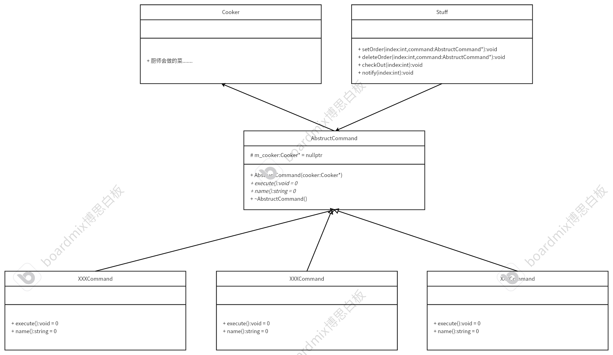

# 命令模式
## 特点
怎么做可以使程序更高效、精简和可扩展性。重点在细化任务，然后逐个击破。将请求转换成一个包含与请求相关的所有信息的独立对象，通过这个转换能够让使用者根据不同的请求使客户参数化、延迟请求执行放入队列中或者记录日志，且能实现可撤销操作（未执行的）。
## 例子
小明是一个餐厅的服务员，在饭店里给顾客点菜，上菜。这里可以把顾客的点的菜抽象成每个命令，小明需要记录这些命令，然后下单给厨师（对命令进行调用），然后厨师开始炒菜（执行命令）。如果顾客想撤销某个菜，可以告诉服务员，服务员告诉厨师不要炒（撤销操作）。
## UML

* 命令模式最大的好处就是松耦合设计 
（1）可以很容易地设计出一个命令队列。（服务员下单） 
（2）可以很容易的将命令记录到日志中。（服务员结算账单） 
（3）允许接收请求的一方决定是否要求否定请求。（厨师可以不做自己不会的菜） 
（4）可以很容易的实现对请求的撤销和重置。（服务员撤单） 
