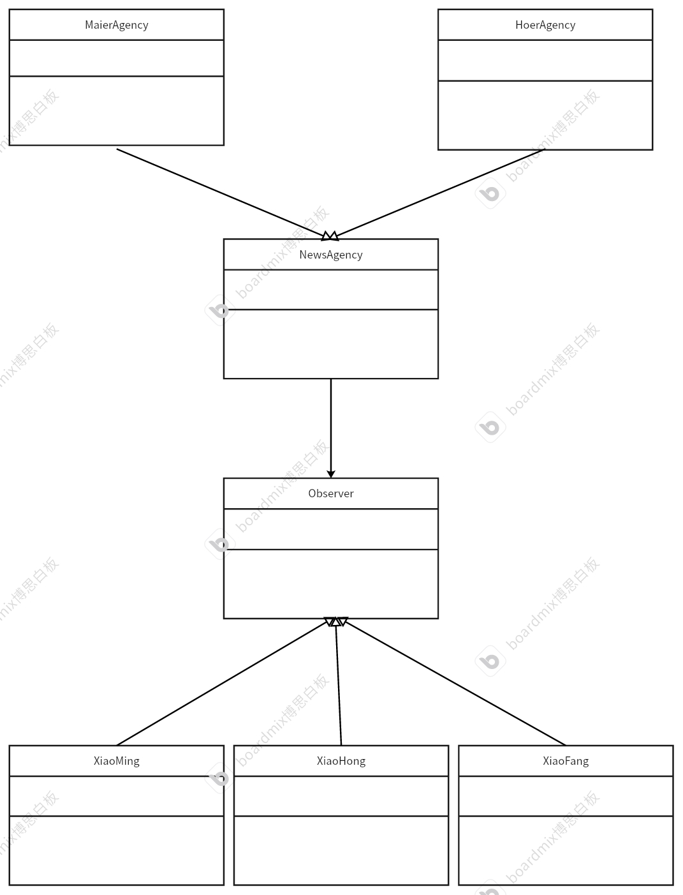

# 观察者模式
## 特点
一个发布消息，一个被动的观看。是一种订阅消息机制。能够自动获取发布者发布的消息，不用主动去获取消息。也称为“发布——订阅模式”。日常生活中，菜鸟驿站就是一种观察者模式，用户被动地接收包裹到站的消息。
## 例子
有两家报社，分别是霍尔德报社和梅尔森金报社，他们各自发布不同的新闻。霍尔德报社分享世界实事，梅尔森金报社分享娱乐圈相关的新闻。用户可以选择订阅不同的报社，利用观察者模式模拟报社主动发消息，用户被动接收。
## 代码框架
* 发布者基类
```cpp
#ifndef NEWSAGENCY_H
#define NEWSAGENCY_H
#include <iostream>
#include <string>
#include <list>
using namespace std;
// 声明订阅者
class Observer;
// 定义报社（发布者）基类
class NewsAgency
{
private:
    /* data */
protected:
    list<Observer *> m_observer; // list相当于一个链表，频繁读取数据效率高。vector相当是动态数组，对于删除增加时效率没有list高

public:
    // 添加订阅者
    void attach(Observer *observer);
    // 删除订阅者
    void detach(Observer *Observer);
    // 发布消息
    virtual void notify(string msg) = 0;
    virtual ~NewsAgency() {}
};
#endif
```
```cpp
#include "NewsAgency.h"

void NewsAgency::attach(Observer *observer)
{
    m_observer.push_back(observer);
}

void NewsAgency::detach(Observer *Observer)
{
    m_observer.remove(Observer);
}
```
* 发布者子类1
```cpp
#ifndef HOERAGENCY_H
#define HOERAGENCY_H
#include "NewsAgency.h"
// 霍尔德报社
class HoerAgency : public NewsAgency
{
private:
    /* data */
public:
    // 发布消息
    void notify(string msg) override;
};

#endif
```
```cpp
#include "HoerAgency.h"
#include "Observer.h"
void HoerAgency::notify(string msg)
{
    cout << "Subscribing Hoerder Agency persons are :" << m_observer.size() << endl;
    for (const auto &it : m_observer)
    {
        // 通过观察者更新数据
        it->update(msg);
    }
}
```
* 发布者子类2
```cpp
#ifndef MAIERAGENCY_H
#define MAIERAGENCY_H
#include "NewsAgency.h"
class MaierAgency : public NewsAgency
{
private:
    /* data */
public:
    // 发布消息
    void notify(string msg) override;
};
#endif
```
```cpp
#include "MaierAgency.h"
#include "Observer.h"
void MaierAgency::notify(string msg)
{
    cout << "Subscribing Maiersenqin Agency persons are :" << m_observer.size() << endl;
    for (const auto &it : m_observer)
    {
        // 通过观察者更新数据
        it->update(msg);
    }
}
```
* 订阅者基类
```cpp
#ifndef OBSERVER_H
#define OBSERVER_H
#include <iostream>
#include <string>
#include "NewsAgency.h"
using namespace std;
class Observer
{
private:
    /* data */
protected:
    NewsAgency *m_agency = nullptr;
    string m_name;

public:
    // 和报社关联
    Observer(NewsAgency *agency, string name) : m_agency(agency), m_name(name)
    {
        // 调用报社进行关联
        m_agency->attach(this);
    };
    // 和报社解除关联
    void unsubscribe();
    // 更新消息
    virtual void update(string msg) = 0;
    virtual ~Observer() {}
};

#endif
```
```cpp
#include "Observer.h"

void Observer::unsubscribe()
{
    m_agency->detach(this);
}
```
* 观察者子类就不写了，就是重写update方法即可，在update里面实现业务逻辑
## UML
