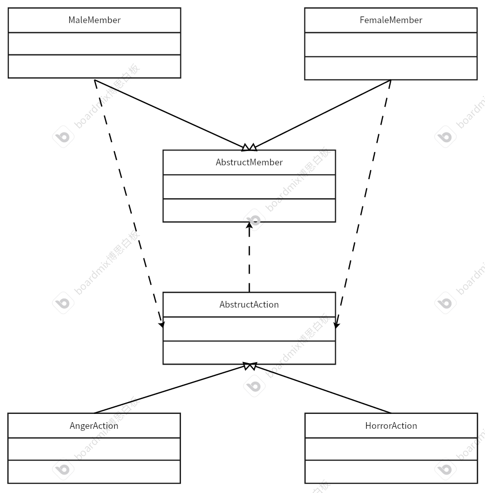

# 访问者模式
## 定义
能够实现访问者模式满足2分原则：分类（大类）和分离（解耦合）——主体与主体有关的行为。通过主体去访问对应的行为。</br>
注意：要分类的大类型要稳定，不会发生变化。
## 例子
有九个人对大boss对战。一部分人想寻求帮助（恐惧），一部分人想直接挑战（生气）。
## UML类图

## 代码框架
* 主体基类
```cpp
#ifndef ABSTRUCTMEMBER_H
#define ABSTRUCTMEMBER_H
// 成员类基类
#include <iostream>
#include <string>
#include "AbstructAction.h"
using namespace std;
class AbstructMember
{
private:
    /* data */
protected:
    string m_name;

public:
    AbstructMember(string name) : m_name(name) {}
    string getName();
    virtual ~AbstructMember() {}
    virtual void accept(AbstructAction *action) = 0; // 访问行为的接口
};
#endif
```
```cpp
#include "AbstructMember.h"

string AbstructMember::getName()
{
    return m_name;
}
```
### 进行分类——两个大类：男人和女人
* 主体子类——男人类型
```cpp
#ifndef MALEMEMBER_H
#define MALEMEMBER_H
#include "AbstructMember.h"
// 进行分类——男性子类
class MaleMember : public AbstructMember
{
private:
    /* data */
public:
    using AbstructMember::AbstructMember;
    void accept(AbstructAction *action) override;
};
#endif
```
```cpp
#include "MaleMember.h"
void MaleMember::accept(AbstructAction *action)
{
    action->maleDoing(this);
}
```
* 主体子类——女人类型
```cpp
#ifndef FEMALEMEMBER_H
#define FEMALEMEMBER_H
#include "AbstructMember.h"
class FemaleMember : public AbstructMember
{
private:
    /* data */
public:
    using AbstructMember::AbstructMember;
    void accept(AbstructAction *action) override;
};
#endif
```
```cpp
#include "FemaleMember.h"
void FemaleMember::accept(AbstructAction *action)
{
    action->femaleDoing(this);
}

```
### 分离行为，并且不同的行为进行解耦合
* 行为基类
```cpp
#ifndef ABSTRUCTACTION_H
#define ABSTRUCTACTION_H
class MaleMember;
class FemaleMember;
class AbstructAction
{
private:
    /* data */
public:
    // 被男人访问
    virtual void maleDoing(MaleMember *male) = 0;
    // 被女人访问
    virtual void femaleDoing(FemaleMember *female) = 0;
    virtual ~AbstructAction() {}
};

#endif
```
* 行为子类——生气时的行为
```cpp
#ifndef ANGERACTION_H
#define ANGERACTION_H
#include "AbstructAction.h"
// 生气的行为
class AngerAction : public AbstructAction
{
private:
    /* data */
public:
    // 被男人访问
    void maleDoing(MaleMember *male) override;
    // 被女人访问
    void femaleDoing(FemaleMember *female) override;
    void fight();
    void warn();
};
#endif
```
```cpp
#include "AngerAction.h"
#include "MaleMember.h"
#include "FemaleMember.h"
void AngerAction::maleDoing(MaleMember *male)
{
    cout << "I am " << male->getName() << endl;
    fight();
}

void AngerAction::femaleDoing(FemaleMember *female)
{
    cout << "I am " << female->getName() << endl;
    warn();
}

void AngerAction::fight()
{
    cout << "I must fight long day until this guy death!!" << endl;
}

void AngerAction::warn()
{
    cout << "Everbody please runs quickly! Don't touch me!" << endl;
}

```
* 行为子类——恐惧时的行为
```cpp
#ifndef HORROR_H
#define HORROR_H
#include "AbstructAction.h"
// 恐惧的行为
class HorrorAction : public AbstructAction
{
private:
    /* data */
public:
    // 被男人访问
    void maleDoing(MaleMember *male) override;
    // 被女人访问
    void femaleDoing(FemaleMember *female) override;
    void help();
    void thinking();
};

#endif
```
```cpp
#include "HorrorAction.h"
#include "MaleMember.h"
#include "FemaleMember.h"
void HorrorAction::maleDoing(MaleMember *male)
{
    cout << "I am " << male->getName() << endl;
    thinking();
}

void HorrorAction::femaleDoing(FemaleMember *female)
{
    cout << "I am " << female->getName() << endl;
    help();
}

void HorrorAction::help()
{
    cout << "We should find help." << endl;
}

void HorrorAction::thinking()
{
    cout << "we should fight this guy together.I can't fight it." << endl;
}

```
### 测试类
```cpp
#ifndef CAOMAOTEAM_H
#define CAOMAOTEAM_H
#include<list>
#include<vector>
#include"AbstructMember.h"
class CaoMaoTeam
{
private:
    /* data */
    list<AbstructMember*>m_members;
    vector<AbstructAction*>m_actions; // 存储行为
public:
    CaoMaoTeam();
    ~CaoMaoTeam();
    // 添加草帽海贼团成员
    void addTeam(AbstructMember* member);
    // 删除
    void remove(AbstructMember* member);
    // 遍历函数
    void display();

};

#endif
```
```cpp
#include "CaoMaoTeam.h"
#include "AngerAction.h"
#include "HorrorAction.h"
CaoMaoTeam::CaoMaoTeam()
{
    m_actions.push_back(new AngerAction);
    m_actions.push_back(new HorrorAction);
}

CaoMaoTeam::~CaoMaoTeam()
{
    for (const auto &item : m_actions)
    {
        delete item;
    }
    for (const auto &item : m_members)
    {
        delete item;
    }
}

void CaoMaoTeam::addTeam(AbstructMember *member)
{
    m_members.push_back(member);
}

void CaoMaoTeam::remove(AbstructMember *member)
{
    m_members.remove(member);
}

void CaoMaoTeam::display()
{
    for (const auto &item : m_members)
    {
        int index = rand() % 2; // 随机获取行为
        item->accept(m_actions.at(index));
    }
}
```
* 测试代码
```cpp
#include "CaoMaoTeam.h"
#include "MaleMember.h"
#include "FemaleMember.h"
int main()
{
    // 时间随机数种子
    srand(time(NULL));
    vector<string> names{
        "Luff", "Geory", "Sam", "Joe", "Faker", "Bin", "Diusde"};
    CaoMaoTeam *team = new CaoMaoTeam;
    for (const auto &item : names)
    {
        team->addTeam(new MaleMember(item));
    }

    team->addTeam(new FemaleMember("Sally"));
    team->addTeam(new FemaleMember("Coke"));

    team->display();

    delete team;

    return 0;
}
```