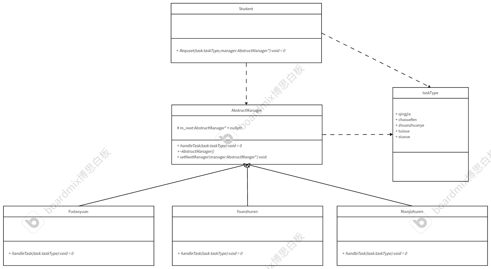

# 责任链模式
## 特点
将一系列对象连接成一条链，并沿着这条链进行传递请求，直到该链上有能处理的对象为止。
## 例子
在大学里面，学生申请处理事物需要向辅导员申请，辅导员会判断该事物需不需要向上级传递，若需要则向上级年纪主任反馈。同理，年级主任向院主任反馈。高层领导进行决策。
## UML

## 代码框架
* 管理者基类
```cpp
#ifndef ABSTRUCTMANAGER_H
#define ABSTRUCTMANAGER_H
#include <iostream>
using namespace std;
enum struct taskType : char
{
    qiangjia,
    chaxuefen,
    zhuanzhuanye,
    tuixue,
    xiuxue
};

class AbstructManager
{
private:
    /* data */
protected:
    AbstructManager *m_next = nullptr;

public:
    virtual void handleTask(taskType task) = 0;
    void setNextManager(AbstructManager *manager);
    virtual ~AbstructManager(){};
};
#endif

#include "AbstructManager.h"
void AbstructManager::setNextManager(AbstructManager *manager)
{
    m_next = manager;
}
```
* 辅导员子类
```cpp
#ifndef FUDAOYUAN_H
#define FUDAOYUAN_H
#include"AbstructManager.h"
class Fudaoyuan:public AbstructManager
{
private:
    /* data */
public:
    void handleTask(taskType task) override;
    
};
#endif


#include "Fudaoyuan.h"

void Fudaoyuan::handleTask(taskType task)
{
    // 处理事物
    switch (task)
    {
    case taskType::chaxuefen:
        cout << "Agree your chaxuefen request................" << endl;
        cout << "Your goal is 55." << endl;
        break;
    case taskType::qiangjia:
        cout << "Agree your qingjia request................" << endl;
        break;
    case taskType::zhuanzhuanye:
        cout << "I can't agree your request, I submit your request to nianjizhuren.........." << endl;
        m_next->handleTask(task);
        break;
    case taskType::xiuxue:
        cout << "I can't agree your request, I submit your request to nianjizhuren.........." << endl;
        m_next->handleTask(task);
    case taskType::tuixue:
        cout << "I can't agree your request, I submit your request to nianjizhuren.........." << endl;
        m_next->handleTask(task);
    default:
        break;
    }
}
```
* 年级主任子类
```cpp
#ifndef NIANJIZHUREN_H
#define NIANJIZHUREN_H
#include "AbstructManager.h"
class Nianjizhuren : public AbstructManager
{
private:
    /* data */
public:
    void handleTask(taskType task) override;
};
#endif

#include "Nianjizhuren.h"

void Nianjizhuren::handleTask(taskType task)
{
    switch (task)
    {
    case taskType::chaxuefen:
        cout << "You should find your Fudaoyuan................" << endl;
        cout << "Your goal is 55." << endl;
        break;
    case taskType::qiangjia:
        cout << "The next time You should find your Fudaoyuan.Agree your qingjia request................" << endl;
        break;
    case taskType::zhuanzhuanye:
        cout << "OK,you can submit your zhuanzhuanye request.........." << endl;
        break;
    case taskType::xiuxue:
        cout << "I can't agree your request, I submit your request to Yuanzhuren.........." << endl;
        m_next->handleTask(task);
    case taskType::tuixue:
        cout << "I can't agree your request, I submit your request to Yuanzhuren.........." << endl;
        m_next->handleTask(task);
    default:
        break;
    }
}
```
* 院主任子类
```cpp
#ifndef YUANZHUREN_H
#define YUANZHUREN_H
#include "AbstructManager.h"
class Yuanzhuren:public AbstructManager
{
private:
    /* data */
public:
    void handleTask(taskType task) override;
};
#endif

#include "Yuanzhuren.h"

void Yuanzhuren::handleTask(taskType task)
{
    switch (task)
    {
    case taskType::chaxuefen:
        cout << "You should find your Fudaoyuan................" << endl;
        cout << "Your goal is 55." << endl;
        break;
    case taskType::qiangjia:
        cout << "The next time You should find your Fudaoyuan.Agree your qingjia request................" << endl;
        break;
    case taskType::zhuanzhuanye:
        cout << "You should find your Nianjizhuren................" << endl;
        cout << "you can submit your zhuanzhuanye request.........." << endl;
        break;
    case taskType::xiuxue:
        cout << "Agree your xiuxue request..........I call your parents." << endl;
    case taskType::tuixue:
        cout << "Don't agree your tuixue request..........I call your parents." << endl;
    default:
        break;
    }
}
```
* 学生类（请求类）
```cpp
#ifndef STUDENT_H
#define STUDENT_H
#include"AbstructManager.h"
class Student
{
private:
    /* data */
public:
    void Request(taskType task,AbstructManager* manager);
};
#endif 

#include "Student.h"
void Student::Request(taskType task, AbstructManager *manager)
{
    manager->handleTask(task);
}
```
* 测试main
```cpp
#include "Fudaoyuan.h"
#include "Nianjizhuren.h"
#include "Yuanzhuren.h"
#include "Student.h"
int main()
{
    // 创建三个管理者
    AbstructManager *fudaoyuan = new Fudaoyuan;
    AbstructManager *nianjizhuren = new Nianjizhuren;
    AbstructManager *yuanzhuren = new Yuanzhuren;

    // 学生
    Student *student = new Student;

    // 绑定上级
    fudaoyuan->setNextManager(nianjizhuren);
    nianjizhuren->setNextManager(yuanzhuren);

    // 测试每个请求任务
    student->Request(taskType::chaxuefen, fudaoyuan);
    student->Request(taskType::qiangjia, fudaoyuan);
    student->Request(taskType::zhuanzhuanye, fudaoyuan);
    student->Request(taskType::xiuxue, fudaoyuan);
    student->Request(taskType::tuixue, fudaoyuan);

    student->Request(taskType::chaxuefen, nianjizhuren);
    student->Request(taskType::qiangjia, nianjizhuren);
    student->Request(taskType::zhuanzhuanye, nianjizhuren);
    student->Request(taskType::xiuxue, nianjizhuren);
    student->Request(taskType::tuixue, nianjizhuren);

    student->Request(taskType::chaxuefen, yuanzhuren);
    student->Request(taskType::qiangjia, yuanzhuren);
    student->Request(taskType::zhuanzhuanye, yuanzhuren);
    student->Request(taskType::xiuxue, yuanzhuren);
    student->Request(taskType::tuixue, yuanzhuren);

    // 释放资源
    delete fudaoyuan;
    delete nianjizhuren;
    delete yuanzhuren;
    delete student;

    return 0;
}
```