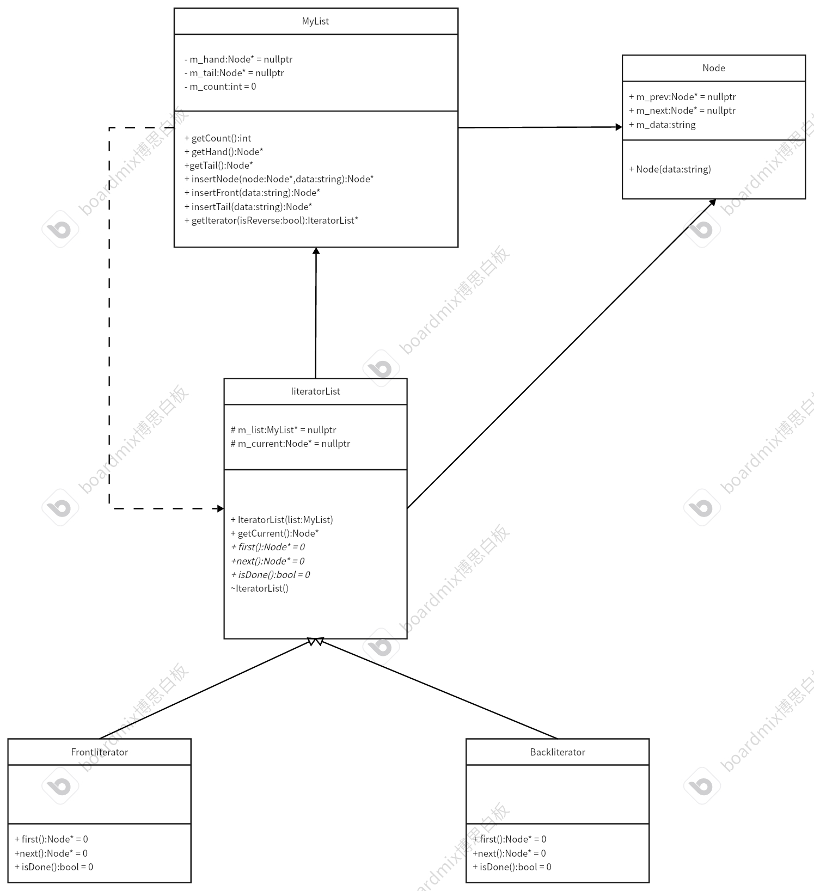

# 迭代器模式
遍历数据，选择使用迭代器模式。提供一种解决方式按顺序访问集合内的各个元素
## 例子
利用最原始的c++存储数据模式，创建链表来管理数据
## 代码框架
首先需要创建一个链表类，定义最小组成部分——节点类，以及迭代器基类，可以派生出不同的迭代器子类进行遍历链表。
* 链表类以及节点结构体
```cpp
#ifndef MYLIST_H
#define MYLIST_H
#include <iostream>
#include <string>
using namespace std;
// 类声明
class IteratorList; // 这样避免出现头文件嵌套包含定义，只是使用到该类型，不使用内部的成员变量和方法
// 链表最小存储单位——节点
struct Node
{
    /* data */
    Node(string data) : m_data(data) {}; // 初始化节点，顺便存储数据
    Node *m_prev = nullptr;              // 指向前驱节点
    Node *m_next = nullptr;              // 指向后继节点
    string m_data = string();            // 存储数据
};

// 存储数据的链表——双向列表
class MyList
{
private:
    /* data */
    Node *m_hand = nullptr; // 头节点
    Node *m_tail = nullptr; // 尾结点
    int m_count = 0;        // 获取节点数量
public:
    // 获取节点数量——内联函数，以空间换时间，快速执行代码
    inline int getCount()
    {
        return m_count;
    }
    // 获取头节点
    inline Node *getHand()
    {
        return m_hand;
    }
    // 获取尾节点
    inline Node *getTail()
    {
        return m_tail;
    }

    // 插入数据
    Node *insertNode(Node *node, string data); // 中间插入链表
    Node *insertFront(string data);            // 头部插入数据
    Node *insertTail(string data);             // 尾部插入数据

    // 获取对应的迭代器
    IteratorList *getIterator(bool isReverse = true);

    // 释放内存
    ~MyList();
};
#endif
```
```cpp
#include "MyList.h"
#include "FrontIterator.h"
#include "BackIterator.h"
Node *MyList::insertNode(Node *node, string data)
{
    Node *item = nullptr;
    if (node == m_hand) // 判断要插入的地方是否为头节点
    {
        item = insertFront(data);
    }
    else // 在中间插入
    {
        item = new Node(data);
        // 1.将item链接到链表中
        item->m_next = node;
        item->m_prev = node->m_prev;
        // 断开node的连接
        node->m_prev->m_next = item;
        node->m_prev = item;
        // 数量加1
        m_count++;
    }
    return item;
}

Node *MyList::insertFront(string data)
{
    Node *node = new Node(data); // 创建新节点
    // 先判断头节点是否为空——空链表
    if (m_hand == nullptr)
    {
        m_hand = node;
        m_tail = node;
    }
    else
    {
        node->m_next = m_hand; // 新节点node后继是旧的头节点
        m_hand->m_prev = node; // 更新旧的头节点前驱
        m_hand = node;         // 更新头节点
    }
    m_count++;
    return node;
}

Node *MyList::insertTail(string data)
{
    Node *node = new Node(data); // 创建新节点
    if (m_hand == nullptr)
    {
        m_hand = node;
        m_tail = node;
    }
    else
    {
        m_tail->m_next = node;
        node->m_prev = m_tail;
        m_tail = node;
    }
    m_count++;
    return node;
}

IteratorList *MyList::getIterator(bool isReverse)
{
    IteratorList *it = nullptr;
    // 根据当前是否需要逆向遍历来创建对应的迭代器
    if (isReverse == true)
    {
        it = new BackIterator(this);
    }
    else
    {
        it = new FrontIterator(this);
    }
    return it;
}

MyList::~MyList()
{
    Node *t_ptr = nullptr;
    if (m_hand != nullptr)
    {
        t_ptr = m_hand;
        while (t_ptr != nullptr)
        {
            Node *qtr = t_ptr;
            t_ptr = t_ptr->m_next;
            delete qtr;
        }
    }
    delete t_ptr;
}

```
* 迭代器基类
```cpp
#ifndef ITERATORLIST_H
#define ITERATORLIST_H
#include"MyList.h"
// 迭代器基类，可以派生不同的方式遍历链表
class IteratorList
{
private:
    /* data */
protected:
    MyList* m_list = nullptr; // 记录需要遍历的链表
    Node* m_current = nullptr; // 记录当前的节点
public:
    IteratorList(MyList* list):m_list(list){};
    Node* getCurrent();
    virtual Node* first() = 0 ; // 访问当前链表的头节点
    virtual Node* next() = 0; // 遍历
    virtual bool isDone()=0; // 判断链表是否遍历完
    virtual ~IteratorList(){};
};
#endif
```
```cpp
#include "IteratorList.h"

Node *IteratorList::getCurrent()
{
    return m_current;
}
```
* 迭代器派生类——正向遍历迭代器
```cpp
#ifndef FRONTITERATOR_H
#define FRONTITERATOR_H
#include "IteratorList.h"
// 正向遍历迭代器
class FrontIterator : public IteratorList
{
private:
    /* data */
public:
    using IteratorList::IteratorList; // 继承父类构造函数
    Node *first() override;           // 访问当前链表的头节点
    Node *next() override;            // 遍历
    bool isDone() override;           // 判断链表是否遍历完
};
#endif
```
```cpp
#include "FrontIterator.h"

Node *FrontIterator::first()
{
    // 获取头部节点
    m_current = m_list->getHand();
    return m_current;
}

Node *FrontIterator::next()
{
    // 节点向后走
    m_current = m_current->m_next;
    return m_current;
}

bool FrontIterator::isDone()
{
    // 判断是否遍历结束
    if (m_current == m_list->getTail()->m_next)
        return true;
    else
        return false;
}

```
* 迭代器子类——逆向遍历迭代器
```cpp
#ifndef BACKITERATOR_H
#define BACKITERATOR_H
#include "IteratorList.h"
// 正向遍历迭代器
class BackIterator : public IteratorList
{
private:
    /* data */
public:
    using IteratorList::IteratorList; // 继承父类构造函数
    Node *first() override;           // 访问当前链表的头节点
    Node *next() override;            // 遍历
    bool isDone() override;           // 判断链表是否遍历完
};
#endif
```
```cpp
#include "BackIterator.h"

Node *BackIterator::first()
{
    // 获取第一个几点，逆序遍历链表的第一个节点就是尾节点
    m_current = m_list->getTail();
    return m_current;
}

Node *BackIterator::next()
{
    // 节点往前移
    m_current = m_current->m_prev;
    return m_current;
}

bool BackIterator::isDone()
{
    if (m_current == m_list->getHand()->m_prev)
        return true;
    else
        return false;
}

```
* 测试代码
```cpp
#include "MyList.h"
#include "FrontIterator.h"
#include "BackIterator.h"
#include <vector>
int main()
{
    vector<string> data_list{"Jack", "Zeus", "Faker", "Jackeylove", "The shy", "Jiejie", "ON", "Zyko", "Viper"};
    MyList *ls = new MyList; // 需要new一个空间，不然ls为初始不能正常使用其成员遍历
    for (int i = 0; i < data_list.size(); i++)
    {
        // 从头部插入数据
        ls->insertFront(data_list.at(i));
    }
    // 正向遍历
    cout << "Is forward searching........" << endl;
    IteratorList *it = ls->getIterator(false); // 获取正向遍历的迭代器
    for (auto begin = it->first(); !it->isDone(); it->next())
    {
        cout << it->getCurrent()->m_data << " says:Hello!" << endl;
    }
    cout << "----------------------------------------" << endl;
    // 逆向遍历
    it = ls->getIterator(true);
    cout << "Is back searching..........." << endl;
    for (auto begin = it->first(); !it->isDone(); it->next())
    {
        cout << it->getCurrent()->m_data << " says:Hello!" << endl;
    }
    delete it;
    delete ls;
    return 0;
}
```
## UML
