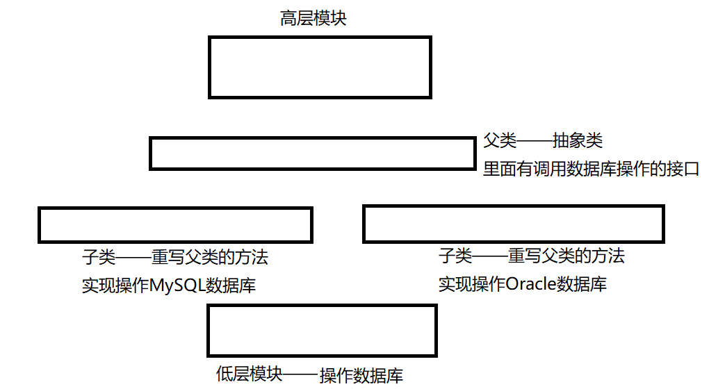

# 设计模式三原则
## 单一职责原则
对于一个类而言，承担的职责、功能尽量单一。尽量抽象出的类处理单一事物。 
所以设计类的时候，不要冗余复杂，功能尽可能单一。设计的类是一组相关的属性和功能的集合。不要出现万能类和万能函数。
## 开放封闭原则
当某个类不能处理一些其他情况时，需要进行外部扩展（添加新的类），内部进行封闭，保持单一职责。 
封装旧的类时应该预留一些接口。新的类继承旧的类，旧的类定义虚函数，新的类可以重写虚函数，处理不同的情况。（多态和继承）
## 依赖倒转原则
理解:
* 高层模块：编写的应用程序，程序的最上层（业务逻辑）
* 低层模块：一些封装好的API、动态库
* 抽象：一般都是带虚函数的父类（纯虚函数的抽象类）

原则：
* 高层模块不能依赖底层模块，两个都应该依赖抽象。 
例如：高层模块：连接数据库，低层模块：数据库API等
应该在两者之间添加一个抽象类（实现接口）操作低层的处理模块。
