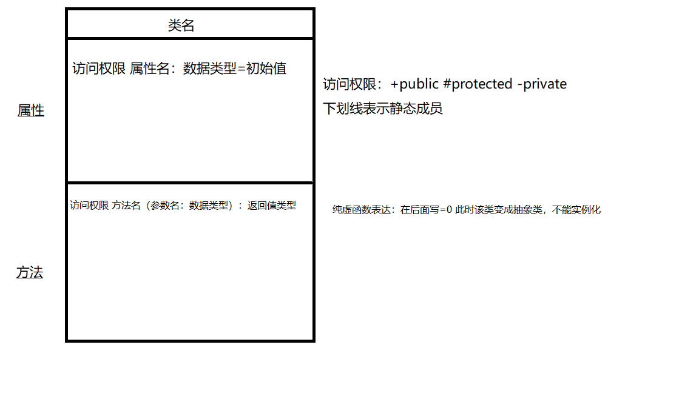

# 面向对象
## 类与对象
把具有相同特征的一类事物抽象成一个类。
对象是类的实例化，每一个对象都有类对应的特点特征。</br>
类=属性+行为

## 面向对象的三要素
* 封装</br>
<b>封装可以更好的保护好类内部的属性</b></br>
把属性和行为进行封装到一个类里面，通过实例化对象，利用对象调用封装里面的属性和对象。</br>
三种权限：</br>
public:可以在类外面访问，可修改</br>
protected: 只能在外面访问，不可修改</br>
private:不能在外面访问，更不可能修改</br>

* 继承</br>
子类可以继承父类公开(public)的成员函数、成员变量，受保护(protected)的成员变量、成员函数。
```cpp
class Person{
    public:
    void meeting();
    void getMarried();
};

class NiuLang:public Person{ //公开继承Person这个类，可以使用Person内的public方法
    public://以下的两个方法属于NiuLang的特有方法
    string getName();
    void findCow();
}
```
* 多态</br>
同名函数具有不同的状态。函数内部处理的动作不一样。</br>
<b>实现多态的四要素：</b></br>
1.子类继承父类。（要发生继承关系）</br>
2.父类需要有虚函数。</br>
3.子类在同名函数内需要重写虚函数（重新定义函数体）。</br>
4.通过父类的指针或引用指向子类对象调用重写虚函数（动态绑定）。
```cpp
class Person{
    public:
    void meeting();
    void getMarried();

    virtual string getName() = 0;
    virtual void search() = 0;
    virtual string getCaiChan() = 0;
    virtual void marry() = 0;

    protected:
    Person* m_person = NULL;//该指针可以被子类继承
};

class NiuLang:public Person{
    public://重写父类的虚函数
    void search() override{

    }
    //同理重写其他的虚函数

};
```
## UML类图
把类进行图像描述
