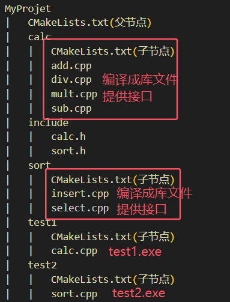

# 配置CMakeLists文件
```bash
# CMakeLists.txt常用的预定义变量:

# ${CMAKE_SOURCE_DIR} 指整个项目所在的目录，一般CMakeLists.txt文件也在这里面

# ${CMAKE_CURRENT_SOURCE_DIR} 指CMakeLists.txt所在的文件路径

# ${PROJECT_BINARY_DIR} 是CMake生成一系列文件的目录，如果是在build中cmake那就是对应的...../build

# ${PROJECT_NAME} 自定义的项目名


cmake_minimum_required(VERSION 3.10) #设置cmake版本最低号
project(Mytest) #定义项目名称


#设置c++标准
set(CMAKE_CXX_STANDARD 11)

#搜集cpp、h文件路径
# SRC_LIST是一个变量，用于存储找到的文件路径
file(GLOB_RECURSE SRC_LIST ${CMAKE_CURRENT_SOURCE_DIR}/src/*.cpp ${CMAKE_CURRENT_SOURCE_DIR}/include/*.h)

# 生成输出可执行文件的路径
set(EXECUTABLE_OUTPUT_PATH ${CMAKE_CURRENT_SOURCE_DIR}/app) 

# 将头文件放入编译器里面
include_directories(${CMAKE_CURRENT_SOURCE_DIR}/include)

#指定包含之前获得的动态库，⽬录默认只在系统库或者本地库去找，要连接其他动态库需要把它的路径添加进来
# 对于系统自带的链接库，需要使用的时候不需要再次包含路径，cmake会自己找系统下的动态库，只要把名字打上去就行了
link_directories(动态库的路径1 动态库的路径2) 

#添加可执行文件，需要把所有的.cpp和.h文件包含进去，上面已经找到路径了，所以用${SRC_LIST}表示所有文件的路径
add_executable(Mytest main.cpp ${SRC_LIST})

#链接库  一般的链接库文件:lib动态库文件名.so
target_link_libraries(Mytest 链接库文件名)
target_link_libraries(ClientApp pthread fdbus fdbus-clib) #链接fdbus和fdbus-clib两个动态库，对于libpthread.so存在于系统目录下/usr/lib/x86_64-linux-gnu/libpthread.so 所有不用在通过link_directories进行包含动态库路径
```
## 主要流程
```bash
# 1.指定最小cmake版本号
cmake_minimum_required(VERSION 版本号)
# 2.定义工程的名字
project(工程名)
# 3.定义工程生成可执行程序
add_executable(工程名 源文件名称1 源文件名称2 .....)

# 4.执行CMakeLists.txt文件 最好将生成的文件放到build目录里面
cmake CMakeLists.txt所在的文件路径
```

# cmake常用命令
1.指定项目构建目录，读取CMakeLists.txt文件生成构建文件
```bash
#需要新建一个build文件，在build文件下进行构建
cmake CMakeLists.txt所在的文件路径
```
2.对构建的文件进行编译
```bash
make -j8 # -j8给予cpu核数
```
3.安装执行文件</br>
将已经编译完成的程序文件、库文件和其他资源（如配置文件、文档等）复制到系统的适当目录中。通常，这些目录包括 /usr/local/bin
```bash
sudo make install
```
# CMake中set的用法
1.指定变量
```bash
# 对于大型项目，需要添加很多文件，会造成命令过长，可以使用set进行变量设置,变量值类型默认为字符串类型
set(变量名 变量值)
set(src_list ........)
${src_list} # 利用${变量名}使用变量值
```
2.指定c++标准
```bash
# 宏CMAKE_CXX_STANDARD是c++的版本号
set(CMAKE_CXX_STANDARD 11)
set(CMAKE_CXX_STANDARD 14)
set(CMAKE_CXX_STANDARD 17)

# 指定c++版本也可以通过cmake指令进行
cmake .. -DCMAKE_CXX_STANDARD=11
```

3.指定输出路径
```bash
set(path /home/robin/linux/sort)
set(EXECUTABLE_OUT_PATH ${path}/bin) # 可执行文件的路径设置到/home/robin/linux/sort/bin (若这个路径不存在，cmake会自动生成)
```

# CMake 搜索源文件
1.aux_source_directory
```bash
# 使用aux_source_directory进行查找某个路径下的所有源文件
aux_source_directory(搜索路径 变量)
# 搜索完之后通过添加可执行程序将源文件添加进来
```
2.file
```bash
#参数GLOB对当前文件进行搜素、参数GLOB_RECURSE对当前文件进行递归搜索
file(GLOB/GLOB_RECURSE 变量名 搜索文件的路径和文件类型(文件后缀：*.cpp))
file(GLOB main_head ${CMAKE_CURRENT_SOURCE_DIR}/include/*.h)
flie(GLOB main_src ${CMAKE_CURRENT_SOURCE_DIR}/include/*.cpp)
```
## 例子
根据以下的文件目录
```bash
myProject
|   CMakeLists.txt
|   build
|   include
|   src
```
编写CMakeLists.txt
```bash
cmake_minimun_required(VERSION 3.15)
project(myProject)
# 搜索源文件
file(GLOB main_head ${CMAKE_CURRENT_SOURCE_DIR}/include/*.h)
# 也可以指定头文件，在后面就不用添加到可执行程序里,只需指定路径
# include_directories(${PROJECT/SOURCE_DIR}/include)
file(GLOB main_src ${CMAKE_CURRENT_SOURCE_DIR}/src/*.cpp)
#设置输出可执行文件的路径
set(EXECUTABLE_OUTPUT_PATH ${CMAKE_CURRENT_SOURCE_DIR}/build/out)
#生成可执行程序
add_executable(myProject ${main_head} ${main_src})
```

# CMake编译库文件
如下文件目录，编译成库文件
```bash
src
|   add.cpp
|   div.cpp
|   main.cpp（已删除或移除）
|   mult.cpp
|   sub.cpp
```
一般编译库文件，不需要main.cpp，这个文件只是起到测试作用
```bash
#制作静态库 lib+库名称+.lib
#制作动态库 lib+库名称+.so
add_library(库名称 STATICS/SHARED 源文件1 源文件2 .....)
```
CMakeLists.txt
```bash
cmake_minimun_required(VERSION 3.15)
project(myProject)
# 搜索源文件
file(GLOB main_src ${CMAKE_CURRENT_SOURCE_DIR}/src/*.cpp)
# 指定头文件，在后面就不用添加到可执行程序里,只需指定路径
include_directories(${PROJECT/SOURCE_DIR}/include)
# 指定库文件的路径
set(LIBRARY_OUTPUT_PATH ${CMAKE_CURRENT_SOURCE_DIR}/lib)
# 生成库文件
add_library(calc SHARED ${main_src})
```

# CMake链接静态库
当我们制作好库文件的时候，进行发布库文件，需要发送两部分内容
* 库文件（各个源文件打包成一个二进制文件）
* 头文件（可以知道定义了哪些函数）
```bash
# 1.链接库文件
link_libraries(库文件1 库文件2 .....)
# 2.系统的库文件可以直接连接，但是对于自定义的库文件，先指定静态库文件的路径（动态库也适用）
link_director(库文件路径1 库文件路径2 .....)

```
```bash
myProject
|   include
|   lib
|   |   libcalc.lib
|   main.cpp
|   CMakeLists.txt
```
```bash
cmake_minimum_required(VERSION 3.15)
project(myProject)
# 搜索源文件，现在仅有main.cpp
file(GLOB SRC ${CMAKE_CURRENT_SOURCE_DIR}/main.cpp)
# 指定头文件
include_directories(${CMAKE_CURRENT_SOURCE_DIR}/include)
# 链接库文件
link_libraries(libcalc.lib)
# 指定库文件路径
link_directories(${CMAKE_CURRENT_SOURCE_DIR}/lib)
# 生成可执行文件
add_executable(myProject ${SRC})
```

# CMake链接动态库

```bash
# 在生成可执行文件之后链接动态库
target_link_libraries(target参数 权限PRIVATE/PUBLIC/INTERFACE 动态库1 权限PRIVATE/PUBLIC/INTERFACE 动态库2 .....)
```
target可以有多个目标:
* 一个源文件
* 一个动态库文件
* 一个可执行文件

权限：
* public</br>
默认为公开权限的动态库，并且库文件传递的时候可以一直传递，也就是可以link到最前面的target，也能知道里面的符号
* private</br>
拥有此权限的target只能link到前一个target
* interface</br>
在后面的target不会被链接到前面的target，只会导出符号

## 例子
```bash
myProject
|   include
|   lib
|   |   libcalc.lib
|   |   libadd.so
|   main.cpp
|   CMakeLists.txt

# CMakeLists.txt
cmake_minimum_required(VERSION 3.15)
project(myProject)
# 搜索源文件，现在仅有main.cpp
file(GLOB SRC ${CMAKE_CURRENT_SOURCE_DIR}/main.cpp)
# 指定头文件
include_directories(${CMAKE_CURRENT_SOURCE_DIR}/include)

# 指定库文件路径
link_directories(${CMAKE_CURRENT_SOURCE_DIR}/lib)

# 生成可执行文件
add_executable(myProject ${SRC})

# 链接动态库
target_link_libraries(myProject add)
```

# CMake日志调试
输出消息
```bash
message(level "消息")
```
级别level:
* 无 重要消息
* STATUS 一般消息
* WARNING 警告（会继续执行）
* AUTHOR_WARNING 警告(dev)（会继续执行）
* SEND_ERROR 错误（会继续执行，但是会跳过生成步骤）
* FATAL_ERROR 错误（终止所有处理过程）

# CMake变量操作
* set进行字符串拼接
```bash
set(变量名 ${变量1} ${变量2} ....)
```
* list字符串追加
```bash
list(APPEND <list>变量名 ${变量1} ${变量2} ....)
```
* 字符串移除
```bash
list(REMOVE_ITEM <list>变量名 变量1)
```
* 获取list的长度，获取存储了几个子字符串
```bash
# 变量名1用来存储子字符串数量
list(LENTH <list>变量名 变量名1)
```
* 读取列表指定索引的元素，可以指定多个索引
```bash
# 变量名1用来存储子字符串
list(GET <list>变量名 索引1 索引2 ... 变量名1)
```
* 将列表中的元素用连接符（字符串）连接起来组成一个字符串
```bash
# 变量名1用来存储新的字符串
list(JOIN <list>变量名 链接字符串 变量名1)
```
* 查找列表中的元素
```bash
# 变量名1用来返回查找到字符串的索引，若没找到返回-1
list(FIND <list>变量名 搜素字符串 变量名1)
```
* 在列表中插入
```bash
list(INSERT <list>变量名 索引位置 插入变量名1 插入变量名2 ....)
```

# CMake宏定义
可以使用一些宏定义检测代码是否生效
```bash
# 方法一：使用g++进行定义
g++ test.cpp -DDEBUG -o myproject
# 方法二：使用CMake
add_definitions(-D宏名称1 -D宏名称2 ...)
```

# CMake的嵌套
如下图文件路径
```bash
MyProjet
|   CMakeLists.txt(父节点)
|   calc
|   |   CMakeLists.txt(子节点)
|   |   add.cpp
|   |   div.cpp
|   |   mult.cpp
|   |   sub.cpp
|   include
|   |   calc.h
|   |   sort.h
|   sort
|   |   CMakeLists.txt(子节点)
|   |   insert.cpp
|   |   select.cpp
|   test1
|   |   CMakeLists.txt(子节点)
|   |   calc.cpp
|   test2
|   |   CMakeLists.txt(子节点)
|   |   sort.cpp
|   lib
|   bin
```
可以认为子节点继承父节点，可以使用父节点中的变量
```bash
# 添加子目录
add_subdirectory(子目录路径)
```
分析各个CMakeLists.txt的用途

* 根节点CMakeLists.txt
```bash
cmake_minimum_required(VERSION 3.15)
project(myproject)
# 定义变量
# 1.静态库的生成路径
set(libpath ${PROJECT_SOURCE_DIR}/lib)
# 2.可执行程序的存储目录
set(exepath ${PROJECT_SOURCE_DIR}/bin)
# 3.访问头文件的路径
set(headpath ${PROJECT_SOURCE_DIR}/include)
# 4.库文件的名字
set(CALCLIB calc)
set(SORTLIB sort)
# 5.可执行文件的名字
set(EXE1 test1)
set(EXE2 test2)

#添加子目录
add_subdirectory(${PROJECT_SOURCE_DIR}/calc)
add_subdirectory(${PROJECT_SOURCE_DIR}/sort)
add_subdirectory(${PROJECT_SOURCE_DIR}/test1)
add_subdirectory(${PROJECT_SOURCE_DIR}/test2)
```
* calc的CMakeLists.txt
```bash
make_minimum_required(VERSION 3.15)
project(calc)
# 搜素全部源文件
aux_source_directory(./ SRC)
# 包含头节点
include_directories(${headpath})
# 指定库文件输出路径
set(LIBRARY_OUTPUT_PATH ${libpath})
# 生成库文件
add_library(${CALCLIB} STATIC ${SRC})
```

* sort的CMakeLists.txt
```bash
make_minimum_required(VERSION 3.15)
project(sort)
# 搜素全部源文件
aux_source_directory(./ SRC)
# 包含头节点
include_directories(${headpath})
# 指定库文件输出路径
set(LIBRARY_OUTPUT_PATH ${libpath})
# 生成库文件
add_library(${SORTLIB} STATIC ${SRC})
```

* test1的CMakeLists.txt
```bash
make_minimum_required(VERSION 3.15)
project(calc)
# 搜素全部源文件
aux_source_directory(./ SRC)
# 包含头节点
include_directories(${headpath})
# 指定静态库文件路径
link_directories(${libpath})
#链接静态库
link_libraries(${CALCLIB})
# 指定生成可执行文件路径
set(EXECUTABLE_OUTPUT_PATH ${exepath})
# 生成可执行文件
add_executable(${EXE1} ${SRC})
```
* test2的CMakeLists.txt
```bash
make_minimum_required(VERSION 3.15)
project(sort)
# 搜素全部源文件
aux_source_directory(./ SRC)
# 包含头节点
include_directories(${headpath})
# 指定静态库文件路径
link_directories(${libpath})
#链接静态库
link_libraries(${SORTLIB})
# 指定生成可执行文件路径
set(EXECUTABLE_OUTPUT_PATH ${exepath})
# 生成可执行文件
add_executable(${EXE2} ${SRC})
```
* 当完成各个CMakeLists.txt文件后，在父节点CMakeLists.txt执行

# CMake中静态库链接动态库
例子如上，sort里的sort.cpp调用calc.h,也就是说sort.cpp使用calc静态库。
* sort的CMakeLists.txt
```bash
make_minimum_required(VERSION 3.15)
project(sort)
# 搜素全部源文件
aux_source_directory(./ SRC)
# 包含头节点
include_directories(${headpath})
# 指定库文件输出路径
set(LIBRARY_OUTPUT_PATH ${libpath})


# 链接calc静态库
link_libraries(${CALCLIB})
# 指定静态库路径
link_directories(${libpath})

# 生成库文件
add_library(${SORTLIB} STATIC ${SRC})
```