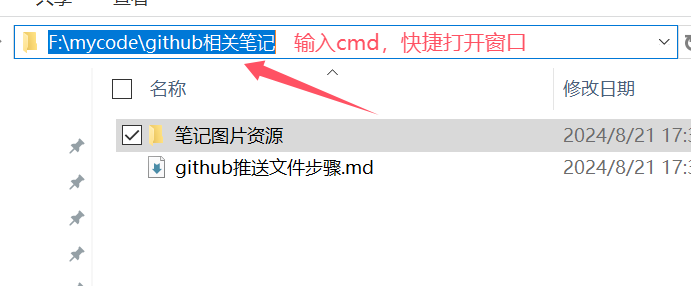
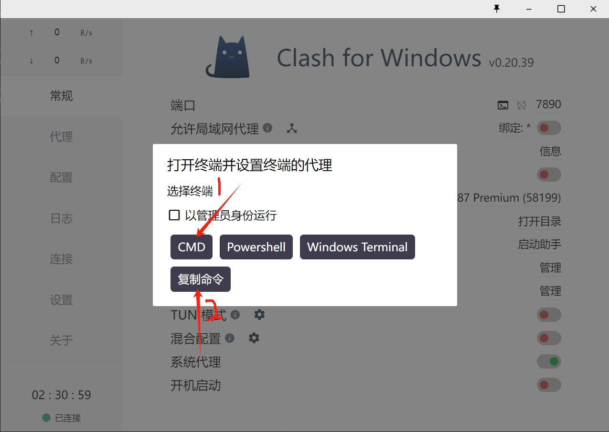
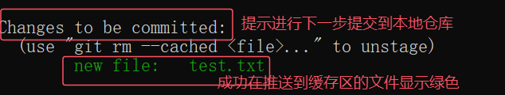
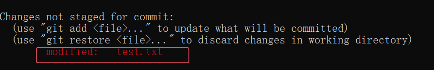
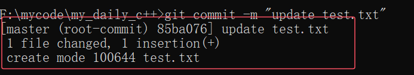

## 将文件推送到远程GitHub网站的步骤
### 1.在对应的文件夹下打开cmd窗口

### 2.把梯子的代理命令粘贴到cmd窗口中，不然上传或下载文件会失败


### 3.现在所需推送文件的根目录下初始化.git文件，若已经有了就不用
```cpp
// 使用如下git命令
git init // 进行初始化.git文件
```
### 4.将需要推送文件到缓存区
```cpp
git add . // 推送全部文件
git add 文件名字.文件后缀 // 推送指定文件
git add ./ *.....* // ./代表的是当前目录，可以利用通配符进行匹配文件进行推送
```
推送至缓存区成功后会出现如下显示：


若出现红色文件，则说明文件被修改过，需要在推送一次到缓存区。


除此之外，也可以用命令进行查看缓存区已推送的文件
```cpp
git status // 查看缓存区的文件
```
### 5.提交到本地仓库
```cpp
// 将文件提交至本地仓库
git commit -m "输入描述（可以是中文，但一定要有！）"
```
提交成功后的提示：

### 6.创建分支，用于对接远程仓库
```cpp
git branch -M 分支名字 // 可以创建自己命名的分支，并且进行切换到该分支，这里属于强行覆盖已有分支

// 一些常见的增加分支的命令
git branch 新分支名 // 增加一个分支，但是不会切换
git 
```

