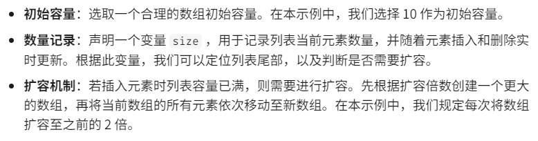

# 3.1列表
## 3.1.1列表的定义
列表是一个抽象的数据结构概念，表示元素的有序集合，支持元素访问、修改、添加、删除和遍历操作，无需考虑容量限制的问题。列表可以基于数组和链表实现。
* 链表就是天然的列表
* 数组要实现成列表，需要使用动态数组
## 3.1.2初始化列表
```cpp
/* 初始化列表 */
// 需注意，C++ 中 vector 即是本文描述的 nums
// 无初始值
vector<int> nums1;
// 有初始值
vector<int> nums = { 1, 3, 2, 5, 4 };
```
## 3.1.3访问元素
列表本质上是数组，因此可以在O(1)时间内访问和更新元素，效率很高
```cpp
/* 访问元素 */
int num = nums[1];  // 访问索引 1 处的元素

/* 更新元素 */
nums[1] = 0;  // 将索引 1 处的元素更新为 0
```
## 3.1.4插入数据
```cpp
//1.用push_back方法插入在列表尾部添加
nums.push_back(1);
nums.push_back(2);

//2.在中间处插入
// begin()返回的是vector容器第一个元素的地址
// 在索引3处之前插入数据34  时间复杂度O(n)
nums.insert(nums.begin()+3,34);
```
## 3.1.5删除数据
```cpp
nums.clear(); // 清除列表的元素  时间复杂度O(n)
nums.erase(nums.begin()+3); // 删除索引3处的元素  时间复杂度O(n)
```
## 3.1.6遍历列表
```cpp
void transerve(vector<int> nums)
{
    int count = 0;
    // 通过索引进行遍历
    for(int i = 0; i<nums.size()i++)
    {
        count+=nums[i];
    }

    // 用迭代器进行直接遍历
    for(const int num:nums)
    {
        count += num;
    }
}
```
## 3.1.7拼接列表
```cpp
void bridgeList(vector<int> nums,vector<int> nums1)
{
    // 将nums1拼接到nums中
    // 参数：迭代器指定的插入位置，接入列表的起始位置，接入列表的末尾位置
    nums.insert(nums.end(),nums1.begin(),nums1.end());
}
```
## 3.1.8排序列表
```cpp
sort(nums.begin(),nums.end()); // 排序，列表元素从小到大进行排列
```
# 3.2实现一个列表

```cpp
class MyList
{
private:
    int* m_arr; // 数组
    int m_arrCapacity = 10; // 列表容量
    int arrSize = 0; // 元素数量
    int extendRatio = 2; // 每次列表扩容的倍数
public:
    // 构造函数，初始化数组
    MyList()
    {
        arr = new int[m_arrCapacity];
    }
    // 析构方法
    ~MyList()
    {
        delete[] arr;
    }
    // 获取当前列表的长度(元素的数量)
    int getSize()
    {
        return arrSize;
    }
    // 获取列表容量
    int capacity()
    {
        return m_arrCapacity;
    }

    // 访问元素
    int get(int index)
    {
        // 判断该索引是否越界
        if(index<0||index>=getSize())
        {
            throw out_of_range("超越界限");
        }
        return arr[index];
    }
    // 更新元素
    void freshElem(int index,int num)
    {
        // 判断该索引是否越界
        if(index<0||index>=getSize())
        {
            throw out_of_range("超越界限");
        }
        arr[index] = num;
    }
    // 扩容
    void extendCapacity()
    {
        int newCapacity = capacity() * extendRatio; // 扩容数量
        int* temp = arr; // 临时保存旧的元素
        arr = new int[newCapacity];
        // 将原来的数组复制到新的数组
        // 现在只有旧元素，没有新元素，所以判断条件不是列表容量，而是现在列表的元素个数
        for(int i = 0; i < getSize();i++)
        {
            arr[i] = temp[i];
        }
        delete[] temp;
        // 更新元素
        m_arrCapacity = newCapacity;
        
    }
    // 在尾部添加元素
    void add(int num)
    {
        // 先判断是否超过容量
        if(getSize()==capacity())
            // 位置已满，需要扩容
            extendCapacity();
        // 添加元素
        arr[getSize()]=num;
        // 更新列表长度
        arrSize++;
    }
    // 在中间处插入元素
    void insert(int index,int num)
    {
        // 判断该索引是否越界
        if(index<0||index>=getSize())
        {
            throw out_of_range("超越界限");
        }
        // 先判断是否超过容量
        if(getSize()==capacity())
            // 位置已满，需要扩容
            extendCapacity();
        for(int i = getSize()-1;i>=index;i--)
        {
            arr[i+1] = arr[i];
        }
        arr[index] = num;
        arrSize++;
    }
    // 删除元素
    int delete(int index)
    {
        // 判断该索引是否越界
        if(index<0||index>=getSize())
        {
            throw out_of_range("超越界限");
        }
        int num = arr[index]; // 记录要删除的元素
        // 将数组的index元素删除往前移
        for(int i = index; i<getSize()-1; i++)
        {
            arr[i] = arr[i+1]; // 元素向前移动
        }
        arrSize--;
        return num;
    }
    // 将列表转换成vector
    vector<int> toVector()
    {
        vector<int> vec(getSize()); // 创建符合目前列表元素个数的vector
        for(int i = 0;i < getSize(); i++)
        {
            vec[i] = arr[i];
        }
        return vec;
    }
}
```