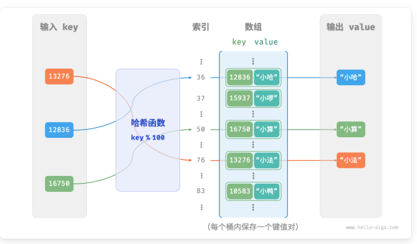
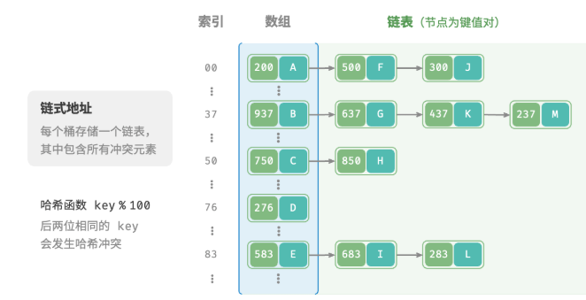
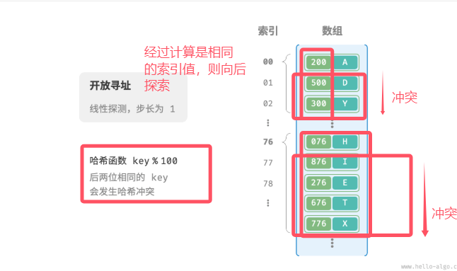

# 6.1哈希表
## 6.1.1哈希表定义
哈希表建立键key与值value之间的映射
## 6.1.2哈希表的常用操作
方法|哈希表
---|---|
查找元素|O(1)
添加元素|O(1)
删除元素|O(1)
```cpp
#include <unordered_map>
/* 初始化哈希表 */
unordered_map<int, string> map;

/* 添加操作 */
// 在哈希表中添加键值对 (key, value)
map[12836] = "小哈";
map[15937] = "小啰";
map[16750] = "小算";
map[13276] = "小法";
map[10583] = "小鸭";

/* 查询操作 */
// 向哈希表中输入键 key ，得到值 value
string name = map[15937];

/* 删除操作 */
// 在哈希表中删除键值对 (key, value)
map.erase(10583);
```
## 6.1.3基于数组简单实现哈希表
数组索引，key值和value值</br>
存在一个哈希算法hash()，可以将输入的key值转换成对应的数组索引，从而获得数组的value值</br>
index = hash(key) % capacity

```cpp
// 把键值对封装成一个类
struct Pair
{
public:
    int key; // 键值
    string value; // 具体值
    Pair(int key,string value)
    {
        this->key = key;
        this->value = value;
    }
};
// 基于数组实现哈希表
class ArrayHashMap
{
private:
    vector<Pair*>buckets; // 存储键值对
public:
    ArrayHashMap()
    {
        // 初始化数组，包含100个桶
        buckets = vector<Pair*>(100);
    }
    ~ArrayHashMap()
    {
        // 释放内存
        for(const auto& bucket:buckets)
        {
            delete bucket;
        }
        buckets.clear();
    }
    // 哈希函数
    int hashFunc(int key)
    {
        int index = key % 100; // 取余数组长度
        return index;
    }
    // 查询操作
    string find(int key)
    {
        // 将key值转换为索引
        int index = hashFunc(key);
        // 获取对应的键值对
        Pair* pair = buckets[index];
        // 先判断是否存在该键值对
        if(pair == nullptr)
        {
            return "";
        }
        return pair->value;
    }
    // 添加操作——输入键值对
    void put(int key,string value)
    {
        // 封装键值对
        Pair* pair = new Pair(key,value);
        // 获取对应的索引
        int index = hashFunc(key);
        // 存放键值对
        buckets[index] = pair;
    }
    // 删除操作
    void remove(int key)
    {
        int index = hashFunc(key);
        delete buckets[index];
        // 删除后置空
        buckets[index] = nullptr;
    }
    // 遍历获取所有键值对
    vector<Pair*> pairSet()
    {
        vector<Pair*> pairSet;
        for(Pair* pair:buckets)
        {
            if(pair!=nullptr)
            {
                pairSet.push_back(pair);
            }
        }
        return pairSet;
    }
    // 获取所有键值
    vector<int> keySet()
    {
        vector<int>keySet;
        for(Pair* pair:buckets)
        {
            if(pair!=nullptr)
            {
                keySet.push_back(pair->key);
            }
        }
        return keySet;
    }
    // 获取所有值
    vector<string> valueSet()
    {
        vector<string>valueSet;
        for(Pair* pair:buckets)
        {
            if(pair!=nullptr)
            {
                keySet.push_back(pair->value);
            }
        }
        return valueSet;
    }
    // 打印哈希表
    void print()
    {
        for(Pair* pair:pairSet())
        {
            cout<<pair->key<<" -> "<<pair->value<<endl;
        }
    }

}
```
## 6.1.4哈希冲突与扩容
### 问题
理论上，哈希表是一个key值对应一个value，往往哈希函数可能会将输入的key转换成相同的index值，造成多个输入对应一个输出的局面，称为<b>哈希冲突</b>
### 解决哈希冲突
扩容哈希表可以减少哈希冲突</br>
当需要进行哈希表扩容时，会消耗大量的算力与时间，把旧的索引重新计算，把旧的表搬到新的表。</br>
<b>所以在代码开发前要预留足够大的哈希表容量</b>

### 负载离子
负载离子 = 哈希表元素数量/桶数量(数组的容量)</br>
当负载离子大于0.75时需要将哈希表扩容至原先的两倍。
## 6.1.5优化哈希表
对于出现哈希冲突优化方法：
* 改良哈希表数据结构，使用“链式地址”或“开放寻址”进行优化，使得哈希表可以在出现哈希冲突时正常工作
* 非常严重的哈希冲突，进行扩容操作
## 6.1.5链式地址哈希表
由不同的key值换算成相同的索引值放在一起，存储在同一个链表之中。每个节点存储key和value

```cpp
// 把键值对封装成一个类
struct Pair
{
public:
    int key; // 键值
    string value; // 具体值
    Pair(int key,string value)
    {
        this->key = key;
        this->value = value;
    }
};
// 链式地址哈希表
class HashMapChaining
{
private:
    int size; // 键值对的数量
    int capacity; // 哈希表的容量
    double loadThres; // 负载因子
    int extendRatio; // 扩展倍数
    vector<vector<Pair*>> buckets; // 桶数组，包含链式地址存储(列表)
public:
/* 构造方法 */
    HashMapChaining() : size(0), capacity(4), loadThres(2.0 / 3.0), extendRatio(2) {
        buckets.resize(capacity);
    } 
    // 析构方法
    ~HashMapChaining()
    {
        for(auto &bucket:buckets)
        {
            for(Pair* pair:bucket)
            {
                delete pair;
            }
        }
    }
    // 哈希函数
    int hashFunc(int key)
    {
        return key % capacity;
    }
    // 负载因子
    double loadFactor()
    {
        return (double)size/(double)capacity;
    }
    // 查询操作
    string get(int key)
    {
        int index = hashFunc(key);
        // 在列表中寻找,一个索引对应多个键值对
        for(Pair* pair:buckets[index])
        {
            if(pair->key == key)
            {
                return pair->value;
            }
        }
        // 若没找到
        return "";
    }
    // 添加操作
    void put(int key,string value)
    {
        // 先判断是否需要扩容
        if(loadFactor()>loadThres)
        {
            extend();
        }
        int index = hashFunc(key);
        // 遍历桶，查找是否已经存在该key了,更新其值并返回
        for(Pair* pair:buckets[index])
        {
            if(pair->key==key)
            {
                pair->value = value;
                return;
            }
        }
        // 若该索引找不到任何key，直接添加
        buckets[index].push_back(new Pair(key,value));
        // 桶数量++
        size++;
    }
    // 删除操作
    void remove(int key)
    {
        int index = hashFunc(key);
        // 获取该索引的桶
        auto bucket = buckets[index];
        // 遍历桶内的列表，查找是否有要删除的key
        for(Pair* pair:bucket)
        {
            if(pair->key == key)
            {
                Pair* tmp = pair;
                bucket.erase(pair); // 清除该键值对
                delete tmp; // 释放内存
                size--;
                return;
            }
        }
    }
    // 扩容操作
    void extend()
    {
        // 暂存原来的哈希表
        vector<vector<Pair*>> bucketsTmp = buckets;
        // 初始化扩容后的哈希表
        capacity = capacity*extendRatio;
        buckets.clear();
        buckets.resize(capacity);
        size = 0;
        // 搬迁
        for(auto& bucket:bucketsTmp)
        {
            for(Pair* pair:bucket)
            {
                // 添加键值对，在put方法里面重新映射索引
                put(pair->key,pair->value);
                // 释放内存
                delete pair; 
            }
        }
    }
    // 打印哈希表
    void print()
    {
        for(auto& bucket:buckets)
        {
            cout<<"[ ";
            for(Pair* pair : bucket)
            {
                cout<<pair->key<<" -> "<<pair->value<<", ";
            }
            cout<<" ]"<<endl;
        }
    }
};
```
## 6.1.6开放寻址哈希表
开放寻址（open addressing）不引入额外的数据结构，而是通过“多次探测”来处理哈希冲突，探测方式主要包括线性探测、平方探测和多次哈希等。
### 线性探测
* 插入元素：通过哈希函数算出对应的索引值，发现已存在桶，则根据步长向后遍历，直到遇到空桶，插入该元素。
* 查找元素：根据计算出的索引值，出现冲突，则根据步长向后遍历，直至找到对应的key值，返回元素。如果遇到空桶，说明还没有该桶，则返回空。

### 线性探测缺点
* 容易出现“聚集现象”，连续被占用的位置越长，这些连续位置发生哈希冲突的可能性就越大。
* 不能直接删除元素，空桶会停止遍历，影响后续的遍历。
* 要利用懒删除机制，利用一个常量 TOMBSTONE 来标记这个桶。然而这样会加速哈希表的性能退化
### 代码实现
```cpp
// 开放寻址哈希表
/*
考虑在线性探测中记录遇到的首个 TOMBSTONE 的索
引，并将搜索到的目标元素与该 TOMBSTONE 交换位
置。这样做的好处是当每次查询或添加元素时，元素会
被移动至距离理想位置（探测起始点）更近的桶，从而
优化查询效率。
*/
class HashMapOpenAddressing
{
private:
    int size; // 键值对数量
    int capacity; // 哈希表容量
    const double loadThres = 2.0/3.0; // 负载因子
    const int extendRatio; // 扩容倍数
    vector<Pair*>buckets; // 桶数组
    Pair* TOMBSTONE = new Pair(-1,"-1"); // 删除标记
public:
    // 构造方法
    HashMapOpenAddressing() : size(0), buckets(capacity, nullptr) {
    }
    // 析构方法
    ~HashMapOpenAddressing()
    {
        for(Pair* pair:buckets)
        {
            if(pair!=null&&pair!=TOMBSTONE)
            {
                delete pair; 
            }
        }
        delete TOMBSTONE;
    }
    /* 哈希函数 */
    int hashFunc(int key) {
        return key % capacity;
    }
    /* 负载因子 */
    double loadFactor() 
    {
        return (double)size / capacity;
    }
    // 查找key对应的桶索引
    int findBucket(int key)
    {
        int index = hashFunc(key);
        int firstTombstone = -1; // 记录第一次遇到空桶的索引
        // 线性探索，遇到空桶跳出
        while(buckets[index]!=nullptr)
        {
            // 若遇到key,返回对应的索引
            if(buckets[index]->key==key)
            {
                // 若之前遇到了删除标记，把现在的键值对移动过来（更换位置）
                // 让有值的桶靠前放，放到已经遇到过的空桶处
                if(firstTombstone!=-1)
                {
                    buckets[firstTombstone]=buckets[index];
                    buckets[index] = TOMBSTONE;
                    return firstTombstone; // 返回移动后的桶索引

                }
            }
            // 记录首个遇到的删除标记
            if(firstTombstone == -1&&buckets[index]==TOMBSTONE)
            {
                firstTombstone = index;
            }
            // 计算桶索引,越过尾部则返回头部，向下移动
            index = (index+1)%capacity;
        }
        // 若key不存在(一直都没存放过该key)，返回添加点的索引
        if(firstTombstone==-1)
        {
            return index;
        }
        else
            return firstTombstone;
    }
    // 查询操作
    string get(int key)
    {
        // 查找对应的索引
        int index = findBucket(key);
        // 返回值
        if(buckets[index]!=nullptr&&buckets[index]!=TOMBSTONE)
        {
            return buckets[index]->val;
        }
        return "";
    }
    // 添加操作
    void put(int key,string value)
    {
        // 查询对应的索引
        int index = findBucket(key);
        if(buckets[index]!=nullptr&&buckets[index]!=TOMBSTONE)
        {
            buckets[index]->value = value;
            return;
        }
        buckets[index] = new Pair(key,value);
        size++;
    }
    // 添加操作
    void remove(int key)
    {
        int index = findBucket(key);
        if(buckets[index]!=nullptr&&buckets[index]!=TOMBSTONE)
        {
            delete buckets[index];
            buckets[index] = TOMBSTONE;
            size--;
        }
    }
    /* 扩容哈希表 */
    void extend() {
        // 暂存原哈希表
        vector<Pair *> bucketsTmp = buckets;
        // 初始化扩容后的新哈希表
        capacity *= extendRatio;
        buckets = vector<Pair *>(capacity, nullptr);
        size = 0;
        // 将键值对从原哈希表搬运至新哈希表
        for (Pair *pair : bucketsTmp) {
            if (pair != nullptr && pair != TOMBSTONE) {
                put(pair->key, pair->val);
                delete pair;
            }
        }
    }
    /* 打印哈希表 */
    void print() {
        for (Pair *pair : buckets) {
            if (pair == nullptr) {
                cout << "nullptr" << endl;
            } else if (pair == TOMBSTONE) {
                cout << "TOMBSTONE" << endl;
            } else {
                cout << pair->key << " -> " << pair->val << endl;
            }
        }
    }
};
```
### 平方探测
平方探测：对每次探测次数进行开方，如：1、4、9等来确定探测步长。
### 平方探测的优缺点
方面|平方探测
---|---|
聚集效应|跳过探测次数平方的距离，缓解线性探测出现的聚集效应，但是某些位置更容易被占用。
寻找空桶|更大的机会寻找到空桶，让数据分布均匀。由于步长的增加，容易探测不到其余空桶的位置，探测不完全。
### 多次哈希
存在多个哈希函数f1(x)、f2(x)、f3(x)产生哈希冲突后利用不同的哈希函数进行探测。
# 6.2哈希算法
哈希算法决定了不同的key值会在哈希表中如何分布，设计好的哈希算法可以大幅度减少发生哈希冲突的概率。
## 6.2.1设计好的哈希算法
* 确定性：相同的输出得到相同的结果
* 效率高：计算过程快
* 均匀分布：可以让键值对均匀分布，减少出现哈希冲突的概率
## 6.2.2安全性高的哈希算法
* 单向性：无法通过哈希值反推输入的key值
* 抗碰效应：应当难以找到两个不同的输入，使得他们的哈希值相同
* 雪崩效应：输入细微变化的值导致输出的值显著变化且不可预测变化
### 常用的哈希值计算方法
计算方法|符号|作用|作为哈希运算的好处
---|---|---|---|
按位异或运算|^|逐位比较两个整数的二进制，相同的为0，不同为1|无方向性：a^b=b^a</br>消除重复影响：相同字符连续出现多次时，其影响可以被抵消</br>高效性
按位与操作运算|&|将两个数的二进制形式逐位比较，只有两个位都为1时，结果位才是1|高效简单
左移运算符|<<|a<<4等价于a<<4=a*2^4=a*16</br>将a的二进制值左移4位|扩大当前哈希值的贡献范围，防止简单的冲突
右移运算符|>>|a>>4等价于a/2^4=a/16</br>将a的二进制向右移动n位|提供高位的影响
* 简单的哈希算法
```cpp
/* 加法哈希 */
int addHash(string key) {
    long long hash = 0;
    const int MODULUS = 1000000007;
    for (unsigned char c : key) {
        hash = (hash + (int)c) % MODULUS;
    }
    return (int)hash;
}

/* 乘法哈希 */
int mulHash(string key) {
    long long hash = 0;
    const int MODULUS = 1000000007;
    for (unsigned char c : key) {
        hash = (31 * hash + (int)c) % MODULUS;
    }
    return (int)hash;
}

/* 异或哈希 */
int xorHash(string key) {
    int hash = 0;
    const int MODULUS = 1000000007;
    for (unsigned char c : key) {
        hash ^= (int)c;
    }
    return hash & MODULUS;
}

/* 旋转哈希 */
int rotHash(string key) {
    long long hash = 0;
    const int MODULUS = 1000000007;
    for (unsigned char c : key) {
        hash = ((hash << 4) ^ (hash >> 28) ^ (int)c) % MODULUS;
    }
    return (int)hash;
}
```
