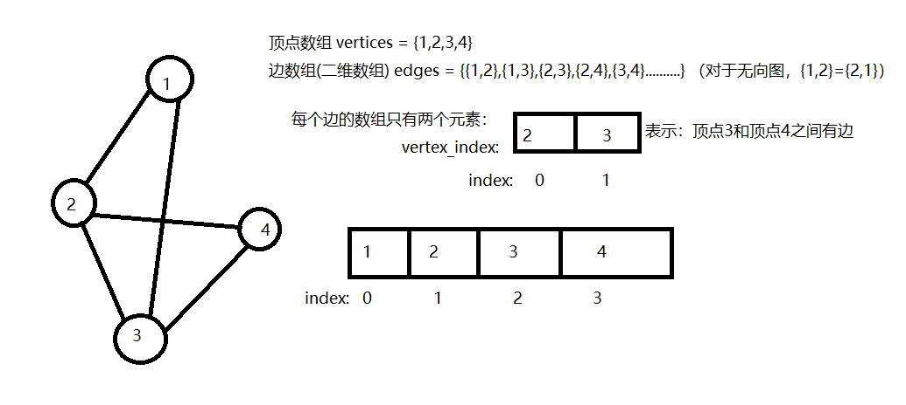

# 9.1图
## 9.1.1图的定义
图是一种非线性数据结构，由顶点和边组成。
## 9.1.2图的表示
* 邻接矩阵
* 邻接表：邻接表只存储真实存在的边，比起邻接矩阵更节省空间，但是查找边的效率比邻接矩阵慢。
## 9.1.3图的基本操作——用邻接矩阵进行实现

```cpp
// 定义无向图
class GraphAdjMat
{
    vector<int> m_vertices; // 顶点列表，元素代表“顶点值”，索引代表“顶点索引”
    vector<vector<int>> adjMat; // 邻接矩阵

public:
    // 初始化
    GraphAdjMat(const vector<int> &vertices,const vecctor<vector<int>> &edges)
    {
        // 添加顶点
        for(int val:vertices)
        {
            addVertex(val);
        }
        // 添加边
        // edges 元素代表顶点索引，即对应 vertices 元素索引
        // 获取一条条的边
        for(const vector<int> &edge:edges)
        {
            int u = edge[0] // 顶点u索引
            int v = edge[1] // 顶点v索引
            addEdge(u,v);
        }
    }
    // 获取顶点数量
    int size()
    {
        return m_vertices.size();
    }
    // 添加顶点
    void addVertex(int val)
    {
       // 添加顶点到顶点容器中
       m_vertices.push_back(val);
       // 初始化邻接矩阵
       if(adjMat.empty())
        {
            adjMat.push_back(vector<int>(1,0)); // 形成1*1的矩阵，初始化为0
        }
        else
        {
            // 已经有邻接矩阵了，进行扩展
            int n = adjMat.size(); // 获取现在邻接矩阵的大小
            adjMat.push_back(vector<int>(n,0)); // 添加新行，行的大小必须是定点数-1，不然后面添加列的时候会冲突，所以是先获取原先大小，再添加新行

            // 添加新的列
            for(auto& row:adjMat)
            {
                // 获取邻接矩阵的每一行,扩展一格，相当于添加新的一列
                row.push_back(0); // 填充成0
            }
        }
    }
    // 添加边
    // i,j对应vertices元素索引
    void addEdge(int i,int j)
    {
        // 索引越界与相等处理
        if (i < 0 || j < 0 || i >= size() || j >= size() || i == j) {
            throw out_of_range("顶点不存在");
        }
        // 无向图中邻接矩阵关于主对角线对称，即满足 (i, j) == (j, i)
        adjMat[i][j] =1;
        adjMat[j][i] =1;
    }
    // 删除点，参数为点的索引
    void removeVertex(int i)
    {
        if (index >= size()) {
            throw out_of_range("顶点不存在");
        }
        // 从顶点数组中移除
        if(!m_vertices.empty())
        {
            m_vertices.erase(m_vertices.begin()+i);

        }
        // 从邻接矩阵中删除行列
        // 先删除行
        adjMat.erase(adjMat.begin()+i);
        // 删除列
        for(const auto& row : adjMat)
        {
            row.erase(row.begin()+i);
        }
    }
    // 删除边 参数是两个顶点的索引
    void removeEdge(int i,int j)
    {
        // 索引越界与相等处理
        if (i < 0 || j < 0 || i >= size() || j >= size() || i == j) {
            throw out_of_range("顶点不存在");
        }
        // 删除边就是在邻接矩阵中将对应的元素由1变成0
        adjMat[i][j] = 0;
        adjMat[j][i] = 0;
    }
};
```
## 9.1.4图的基本操作——用邻接表进行实现
利用链表实现邻接表
```cpp
// 基于邻接表实现无向图
struct Vertex
{
    // .....
};
class GraphAdjList
{
public:
    // 用哈希表实现邻接表，key：顶点，value：该顶点的所有邻接顶点，确保图的顶点是唯一的
    unordered_map<Vertex*,vector<Vertex *>> adjList;

    // 构造
    GraphAdjList(const vector<vector<Vertex*>> &edges)
    {
        // 添加所有的边和顶点
        for(const auto& edge : edges)
        {
            addVertex(edge[0]);
            addVertex(edge[1]);
            addEdge(edge[0],edge[1]);
        }
    }
    // 添加点
    void addVertex(Vertex* vet )
    {
        if(adjList.count(vet))
            return;
        // 在哈希表中添加一个新链表，以顶点作为索引
        adjList[vet] = vector<Vertex*>();
    }
    // 删除顶点
    void removeVertex(Vertex* vet)
    {
        if(!adjList.count(vet))
            throw invalid_argument("不存在顶点");
        // 在邻接表（哈希表）中删除对应的链表（vector)
        adjList.erase(vet);
        // 遍历其他顶点的链表，删除包含vet的边
        for(auto & adj:adjList)
        {
            remove(adj.second,vet);
        }
    }
    // 在链表(vector)中删除指定节点，参数：对应的链表和要删除的节点
    void remove(vector<Vertex*>& vec,Vertex* vet)
    {
        for(auto it:vec)
        {
            if(it == vet)
            {
                vec.erase(it);
                break;
            }
        }
    }
    // 添加边
    void addEdge(Vertex* vet1, Vertex* vet2)
    {
        if (!adjList.count(vet1) || !adjList.count(vet2) || vet1 == vet2)
            throw invalid_argument("不存在顶点");
        // 添加边
        adjList[v1].push_back(v2);
        adjList[v2].push_back(v1);
    }
    // 删除边
    void removeEdge(Vertex* vet1, Vertex* vet2)
    {
        if (!adjList.count(vet1) || !adjList.count(vet2) || vet1 == vet2)
            throw invalid_argument("不存在顶点");
        remove(adjList[vet1],vet2);
        remove(adjList[vet2],vet1);
    }
    
};
```
# 9.2图的遍历
## 9.2.1图的广度优先遍历
一种由近及远的遍历方式，由某个节点出发，始终优先访问距离最近的顶点
### BFS实现思路</br>
* 从起点开始遍历，加入队列，开启循环
* 每轮循环中，弹出队首元素并记录访问情况，然后将该顶点的索引邻接点入队
* 循环布置第二步，直至所有顶点被访问完毕后结束循环</br>

<b>可以使用一个哈希集合来标记哪些节点已经访问，哈希表可以只以顶点作为key值，并且key具有唯一性。不用存储value值</b></br>
好处就是key值的增删改查只需O(1)时间复杂度

```cpp
// 广度优先遍历
// 用邻接表来表示图，以便获取顶点的所有邻接点
vector<Vertex*> graphBFS(GraphAdjList &graph, Vertex* startVertex)
{
    // 返回结果的顶点序列
    vector<Vertex*> res;
    // 哈希集合，记录已经访问过的顶点
    unordered_set<Vertex*> visited = {startVertex};
    // 队列实现BFS
    queue<Vertex*> que;
    que.push(startVertex);
    // 开启遍历
    while(!que.empty())
    {
        // 取出队首元素，弹出，记录
        Vertex* tmp = que.front();
        que.pop();
        res.push_back(tmp);
        // 遍历该顶点的所有邻接点，之后插入队列中
        for(auto adjVet:graph.adjList[tmp])
        {
            // 判断其他的点是否访问过了
            if(visited.count(adjVet)) // count是查询集合中该元素出现的次数
                continue; // 跳过已经访问过的节点。继续执行循环，不会进行下面的步骤
            que.push(adjVet); // 入队
            visited.emplace(adjVet); // 记录已经访问
        }
    }
    return res;

}
```
```cpp
// 也可以使用邻接矩阵实现广度优先遍历
// 参数：图的邻接矩阵,开始起点的索引值
vector<int> graphBFS(GraphAdjMat& graph,int start_index)
{
    vector<int> res; // 返回结果容器
    unordered_set<int> visited; // 记录点是否访问
    visited.insert(start_index);
    // 队列
    queue<int> que;
    que.push(start_index);
    // 开启遍历
    while(!que.empty())
    {
        int currentIndex = que.front();
        que.pop();
        res.push_back(graph.m_vertices[currentIndex]);
        // 遍历与当前节点的所有邻接点，没访问过的节点入队
        for(int i=0;i<graph.m_vertices.size();i++)
        {
            if(graph.adjMat[i][currentIndex]==1&&graph.adjMat[currentIndex][i]==1&&visited.count(i)!=1)
            {
                // 该节点没访问过,进行入队，记录访问
                que.push(i);
                visited.insert(i);
            }
        }
    }
    return res;
}
```
## 9.2.2图的深度优先遍历
深度优先遍历是一种优先走到底、无路可走再回头的遍历方式。</br>
### 实现思路
走到尽头之后回头思想类似于递归，所以DFS要用递归实现。与BFS一样，也需要一个哈希集合来记录已经访问过的顶点。
```cpp
// 用邻接表来表示图，深度优先遍历
// dfs遍历辅助函数
// 参数：邻接表，记录已访问顶点容器，输出结果列表，当前顶点
void dfs(GraphAdjList &graph, unordered_set<Vertex*>& visited, vector<Vertex*>&res,Vertex* vet)
{
    res.push_back(vet); // 记录访问节点
    visited.emplace(vet); // 标记已访问节点
    // 遍历该顶点的所有邻接顶点
    for(auto adjVet: graph.adjList[vet])
    {
        if(visited.count(adjVet))
            continue;
        // 递归访问邻接点
        dfs(graph,visited,res,adjVet);
    }
}

vector<Vertex*> graphDFS(GraphAdjList &graph, Vertex* startVet)
{
    // 创建结果容器
    vector<Vertex*> res;
    // 创建哈希集合
    unordered_set<Vertex*> visited;
    // 开始DFS遍历
    dfs(graph,visited,res,startVet);
    return res;
}
```
```cpp
// 用邻接矩阵表示图，深度优先遍历
// 同样先实现dfs辅助函数
void dfs(GraphAdjMat& graph,unordered_set<int>& visited,vector<int>& res,int index_vet)
{
    res.push_back(graph.m_vertices[index_vet]);
    visited.insert(index_vet);
    // 遍历该顶点的所有邻接顶点
    for(int i=0;i<graph.m_vertices.size();i++)
    {
        if(graph.adjMat[index_vet][i]==1&&visited.count(i)!=1)
            dfs(graph,visited,res,i);
    }
}

vector<int> graphDFS(GraphAdjMat& graph,int startVetIndex)
{
    // 创建结果容器
    vector<int> res;
    // 创建哈希集合
    unordered_set<int> visited;
    // 开始DFS遍历
    dfs(graph,visited,res,startVetIndex);
    return res;
}

```