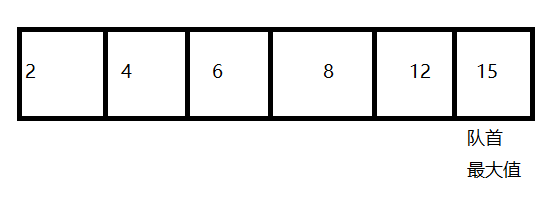

# 8.1堆
堆是一种满足特点条件的完全二叉树。
* 小顶堆：任意节点值小于等于子节点值
* 大顶堆：任意节点值大于等于子节点值
## 8.1.1堆的常用操作
堆用于实现优先队列，大堆顶相当于元素按照从大到小的顺序出队的优先队列

```cpp
// 1.初始化堆
// 初始化小顶堆
priority_queue<int,vector<int>,greater<int>> minHeap;
// 初始化大堆顶
priority_queue<int,vector<int>,less<int>> maxHeap;
// 2.输入列表建立堆
vector<int> input{1,2,3,6,4}
priority_queue<int,greater<int>,minHeap<int>>minHeap(input.begin(),input.end());

/* 3.元素入堆 */
maxHeap.push(1);
maxHeap.push(3);
maxHeap.push(2);
maxHeap.push(5);
maxHeap.push(4);

/*4.获取堆顶元素 */
int peek = maxHeap.top(); // 5

/* 5.堆顶元素出堆 */
// 出堆元素会形成一个从大到小的序列
maxHeap.pop(); // 5
maxHeap.pop(); // 4
maxHeap.pop(); // 3
maxHeap.pop(); // 2
maxHeap.pop(); // 1

/* 6.获取堆大小 */
int size = maxHeap.size();

/* 7.判断堆是否为空 */
bool isEmpty = maxHeap.empty();
```
## 8.1.2堆的实现
由于堆是一种完全二叉树，完全二叉树又适合用数组表示。所以用数组实现堆
### 节点索引映射
```cpp
// 左子节点
int left(int i)
{
    return 2*i+1;
}
// 右子节点
int right(int i)
{
    return 2*i+2;
}
// 父节点
int parent(int i)
{
    return (i-1)/2; // 向下整除
}
```
### 访问堆顶元素
```cpp
int peek()
{
    return maxHeap[0]; // 堆顶就是在数组的首元素
}
```
### 元素入堆
将元素从堆底添加的时候，会出现添加的元素val可能会大于堆中的其他元素，破坏堆的成立条件。<b>因此需要修复从插入节点到根节点的路径上的各个节点</b>，这个操作被称为堆化
```cpp
// 元素入堆
void push(int val)
{
    maxHeap.push_back(val); // maxHeap是一个vector
    siftUp(size()-1); // 从堆底开始堆化
}
// 从节点i开始，从堆底致堆顶进行堆化
void siftUp(int i)
{
    while(true)
    {
        // 获取父节点
        int p = parent(i);
        // 当越过根节点或节点无需堆化时，结束循环
        if(p<0||maxHeap[i]<=maxHeap[p])
            break;
        // 交换两个节点
        swap(maxHeap[i],maxHeap[p]);
        // 向上进行堆化
        i = p;
    }
}
```
### 元素出堆
从堆顶弹出元素，后面的索引会发生巨大的变化，所以要实现堆顶弹出，先将堆底和堆顶进行交互，再删除堆底元素，之后在从堆顶向下进行堆化，比较两个子节点的值，大的就进行交换
```cpp
void pop()
{
    // 判空处理
    if (isEmpty()) {
        throw out_of_range("堆为空");
    }
    // 1.交换
    swap(maxHeap[0],maxHeap[size()-1]);
    // 2.删除节点
    maxHeap.pop_back();
    // 3.从顶至底进行堆化
    siftDown(0);
}
// 自顶向下堆化
void siftDown(int i)
{
    while(true)
    {
        // 获取左右索引
        int le = left(i);
        int ri = right(i);
        // 记录当前最大值的索引
        int max = i;
        if(le<size()&&maxHeap[le]>maxHeap[ma])
            max = le;
        if(ri<size()&&maxHeap[ri]>maxHeap[ma])
            max = ri;
        // 若节点i最大或索引le、ri越界，则无需堆化，跳出
        if(ma==i)
            break;
        swap(maxHeap[i],maxHeap[max])
        i = max;
    }

}
```
## 8.1.3堆的常见应用
* 优先队列
* 堆排序
* 获取最大的k个元素

# 8.2建堆操作
## 8.2.1 入堆操作实现
步骤：
* 创建空堆
* 遍历列表，依次加入堆中
* 该元素进行从底进行堆化操作
```cpp
// 创建空堆
void init(vector<int> vec)
{
    for(int i=0; i<vec.size();i++)
    {
        maxHeap.push_back(vec[i]);
        siftUp(i);
    }
}
```
## 8.2.2通过遍历堆化实现
步骤：
* 将列表的所有元素添加到堆中
* 倒序遍历堆，依次对每个非叶子节点进行从顶到底的堆化
```cpp
void init(vector<int> vec)
{
    maxHeap = vec;
    // 堆化除叶子节点以外的其他所有节点
    for(int i = parent(size()-1);i>=0;i--)
    {
        siftDown(i);
    }
}
```
# 8.3 Top-k问题
给定一个长度为n的无序数组nums，并且返回数组中最大的k个元素
步骤：
* 先初始化一个小顶堆，堆顶的元素最小
* 将数组的前k个元素依次入堆
* 从第k+1个元素开始，若当前元素大于堆顶元素，则堆顶弹出，当前元素入堆
* 遍历结束后，堆中保存就是最大的k个元素
```cpp
priority_queue<int,vector<int>,greater<int>> topKHeap(vector<int> &nums,int k)
{
    // 初始化小顶堆
    priority_queue<int,vector<int>,greater<int>> minHeap;
    // 将数组的前k个元素入堆
    for(int i = 0;i<k;i++)
    {
        minHeap.push(nums[i]);
    }
    // 从第k+1个元素开始判断大小
    for(int i = k;i<nums.size();i++)
    {
        // 判断当前元素和堆顶元素大小
        if(nums[i]>minHeap.top())
        {
            minHeap.pop();
            minHeap.push(nums[i]);// push内部的方法会执行堆化操作
        }
    }
    return minHeap;
    
}
```
