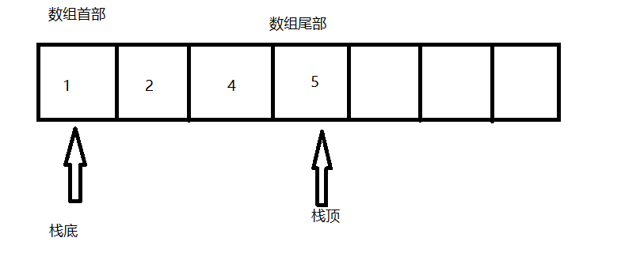
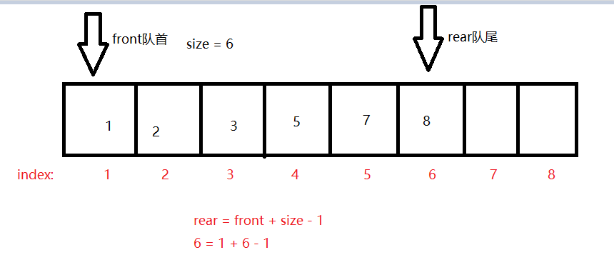

# 5.1栈
## 5.1.1栈的特点
是一种遵循<b>先入后出</b>逻辑的线性数据结构
## 5.1.2栈的常用操作
方法|描述|时间复杂度
---|---|---|
push()|元素入栈（添加至栈顶）|O(1)
pop()|栈顶元素出栈|O(1)
peek()|访问栈顶元素|O(1)
* 利用编程语言内部的栈
```cpp
/* 初始化栈 */
#include<stack>
stack<int> stack;

/* 元素入栈 */
stack.push(1);
stack.push(3);
stack.push(2);
stack.push(5);
stack.push(4);

/* 访问栈顶元素 */
int top = stack.top();

/* 元素出栈 */
stack.pop(); // 无返回值

/* 获取栈的长度 */
int size = stack.size();

/* 判断是否为空 */
bool empty = stack.empty();
```
## 5.1.3基于链表实现栈
屏蔽链表的一些操作，让其对外表现是栈的特点
```cpp
struct Node
{
    int value; // 存储数据
    Node* next; // 链接下一节点的地址
};
class LinkStack
{
private:
    int m_size; // 栈的长度
    Node* topNode; // 头节点作为栈顶
public:
    // 构造函数初始化
    LinkStack()
    {
        topNode = nullptr;
        m_size = 0;
    }
    // 析构释放内存
    ~LinkStack()
    {
        clearStack(topNode);
    }
    // 清空栈区
    void clearStack(Node*topNode)
    {
        while(topNode!=nullptr)
        {
            Node* p = topNode->next; // 保存下一个节点
            delete topNode;
            topNode = p;
        }   
    }
    // 获取栈的长度
    int getSize()
    {
        return m_size;
    }
    // 判断栈是否为空
    bool isEmpty()
    {
        if(m_size == 0)
            return 1;
        return -1;
    }
    // 入栈操作
    void push(int num)
    {
        // 创建新节点
        Node* p = new Node;
        // 保存数据
        p->value = num;
        // 入栈操作
        p->next = topNode;
        // 更新栈顶
        topNode = p;
        // 更新长度
        m_size++;
    }
    // 出栈操作
    int pop()
    {
        // 先获取栈顶元素
        int num = top();
        // 记录当前节点
        Node* p = topNode;
        // 栈顶向下移动
        topNode = p->next;
        // 删除出栈节点
        delete p;
        // 更新长度
        m_size--;
        // 返回出栈元素
        return num;
    }
    // 获取栈顶元素
    int top()
    {
        if(isEmpty())
            throw out_of_range("The stack is empty");
        return topNode->vaule;
    }
    // 将链表转换为vector
    vector<int> toVector()
    {
        Node* p = topNode;
        // 创建合适的容器
        vector<int> vec(getSize());
        // 要反序放入数组中
        for(int i = getSize()-1;i>0;i--)
        {
            vec[i]=p->value;
            p=p->next;
        }
        return vec;
    }
};
```
## 5.1.4基于数组实现栈
对于数组，可以把数组首元素为栈底，末尾处为栈顶。入栈：在数组尾部添加数据。出栈：在数组尾部删除数据

### 补充vector的操作
常用方法|操作
---|---|
元素访问|vector.at(index) 安全访问，越界会抛出异常</br>vector[index] 快速访问，不会检查越界</br>vector.front() 访问第一个元素（vector[0]）</br>vector.back() 访问最后一个元素
插入元素|vector.push_back(num) 在尾部追加元素</br>vector.emplace_back(num) 在尾部就地构造元素</br>vector.insert(index,num) 在指定位置插入元素
删除元素|vector.pop_bakc() 删除最后一个元素</br>vector.erase(index) 删除指定位置的元素</br>vector.erase(index1,index2)删除区间的全部元素</br>vector.clear() 清空容器
查询方法|vector.size() 当前元素数量</br>vector.capacity() 获取容量大小</br>vector.resize(num) 重新调整num大小的容器 vector.resize(num,val) 调整大小，填充新元素为val</br>vector.empty() 判断是否为空
排序和反转|sort(vector.begin(),vector.end()) 升序排序</br>reverse(vector.begin(),vector.end())降序排列
查找|find(vector.begin(),vector.end(),n)查找元素num
动态扩展和收缩|vector.reserve(n)提前分配空间以避免多次扩展</br>shrink_to_fit()收缩到实际大小
```cpp
// 动态数组实现——用vector实现
class ArryStack
{
private:
    vector<int> stack;
public:
    // 获取栈的长度
    int getSize()
    {
        return stack.size();
    }
    // 判断栈是否为空
    bool isEmpty()
    {
        if(0 == getSize())
            return 1;
        return -1;
    }
    // 入栈
    void push(int num)
    {
        stack.push_back(num);
    }
    // 出栈
    int pop()
    {
        int num = top();
        stack.pop_back(); // 删除末尾元素
        return num;
    }
    // 访问栈顶元素
    int top()
    {
        if(isEmpty())
            throw out_of_range("The stack is empty");
        return stack.back(); // 访问末尾元素
    }
    // 返回vector
    vector<int> toVector()
    {
        return stack;
    }
};
```
# 5.2队列
## 5.2.1队列的特点
是一种遵循<b>先入先出</b>规则的线性数据结构
## 5.2.2队列的常用操作
方法名|描述|时间复杂度
---|---|---|
push()|元素入队，将元素添加到队尾|O(1)
pop()|队首元素出队|O(1)
peek()|访问队首元素|O(1)
```cpp
/* 初始化队列 */
#include<quene>
queue<int> queue;

/* 元素入队 */
queue.push(1);
queue.push(3);
queue.push(2);
queue.push(5);
queue.push(4);

/* 访问队首元素 */
int front = queue.front();

/* 元素出队 */
queue.pop();

/* 获取队列的长度 */
int size = queue.size();

/* 判断队列是否为空 */
bool empty = queue.empty();
```
## 5.2.3基于链表实现队列
一端添加元素，另外一端删除元素。规定队尾仅可添加节点，队首仅可删除节点。
```cpp
// 定义节点
struct Node
{
    int value;
    Node* next;
};
class LinkQuene
{
private:
    int m_size; // 队列长度
    Node* headNode; // 头节点
    Node* tailNode; // 尾节点
public:
    // 初始化
    LinkQuene()
    {
        headNode = nullptr;
        tailNode = nullptr;
        m_size = 0;
    }
    // 析构
    ~LinkQuene()
    {
        deleteLinkQuene(headNode);
    }
    // 清空队列
    deleteLinkQuene(Node* headNode)
    {
        while(headNode!=nullptr)
        {
            Node* p = headNode->next;
            delete headNode;
            headNode = p;
        }
    }
    // 获取队列长度
    int getSize()
    {
        return m_size;
    }
    // 判断队列是否为空
    bool isEmpty()
    {
        if(0==m_size)
            return 1;
        return -1;
    }
    // 入队操作——尾节点加入元素
    void push(int num)
    {
        // 创建新节点
        Node* node = new Node;
        // 存入数据
        node->value = num;
        // 判断队列是否为空
        if(tailNode==nullptr)
        {
            headNode = node;
            tailNode = node;
        }
        else
        {
            tailNode->next = node;
            tailNode = node;
        }
        m_size++;
    }
    // 出队操作——头节点删除元素
    int pop()
    {
        int num = peek();
        // 记录节点
        Node* p = headNode;
        // 更新头节点
        headNode = headNode->next;
        // 删除
        delete p;
        m_size--;
        return num;
        
        
    }
    // 访问队首元素
    int peek()
    {
        if (size() == 0)
            throw out_of_range("The quene is empty");
        return headNode->value;
    }
    // 将链表转换为vector
    vector<int> toVector()
    {
        Node* p = headNode;
        vector<int>vec(getSize());
        for(int i = 0;i<getSize();i++)
        {
            vec[i] = p->value;
            p=p->next;
        }
        return vec;
    }
};
```
## 5.2.4基于数组实现队列
定义两个变量front和rear分别记录队首元素的索引和队尾元素的索引，用size表达之间的关系。rear = front + size - 1

* 入队操作：先把rear索引加1，然后进行赋值，size加1
* 出队操作：front索引加1，size减1
* 解决入队出队达到界限，可以使用环形数组
```cpp
class ArrayQuene
{
private:
    int* array; //用于存储队列元素的数组
    int front; //记录队首索引
    int rear; // 记录队尾索引
    int m_size; // 记录长度
    int m_capacity; //记录容量
public:
    ArrayQuene(int capacity)
    {
        // 初始化数组
        array = new int[capacity];
        m_capacity = capacity;
        front = 0;
        rear = 0;
        m_size = 0;
    }
    ~ArrayQuene()
    {
        delete[] array;
    }
    // 获取队列容量
    int getCapacity()
    {
        return m_capacity;
    }
    // 获取队列长度
    int getSize()
    {
        return m_size;
    }
    // 判断队列是否为空
    bool isEmpty()
    {
        if(getSize()==0)
            return 1;
        return -1;
    }
    // 入队操作——在队尾进行入队
    void push(int num)
    {
        // 先判断队列是否满了
        if (m_size == m_capacity) {
            cout << "The quene is full!" << endl;
            return;
        }
        // 利用取余操作防止超越界限
        rear = (front+reat)%m_capacity;
        // 添加
        array[rear] = num;
        m_size++;
    }
    // 出队操作——在队首进行出队
    int pop()
    {
        int num = peek();
        // 队首索引向前移动一位，若超过尾部，则返回到数组头部
        front = (front + 1) % m_capacity;
        m_size--;
        return num;
    }
    // 访问队首元素
    int peek()
    {
        if(isEmpty())
            throw out_of_range("The quene is empty");
        return array[front];
    }
    // 转换成vector
    vector<int> toVector()
    {
        vector<int> vec(getSize());
        for(int i=0,j=front;i<getSize();i++,j++)
        {
            vec[i] = array[front % m_capacity];
        }
        return vec;
    }
};

```
# 5.3双向队列
## 5.3.1双向队列的特点
双向队列可以在首尾指向添加和删除操作
方法名|描述|时间复杂度
---|---|---|
push_first()|将元素添加至队首|O(1)
push_last()|将元素添加至队尾|O(1)
pop_first()|删除队首元素|O(1)
pop_last()|删除队尾元素|O(1)
peek_first()|访问队首元素|O(1)
peek_last()|访问队尾元素|O(1)
```cpp
/* 初始化双向队列 */
#include<deque>
deque<int> deque;

/* 元素入队 */
deque.push_back(2);   // 添加至队尾
deque.push_back(5);
deque.push_back(4);
deque.push_front(3);  // 添加至队首
deque.push_front(1);

/* 访问元素 */
int front = deque.front(); // 队首元素
int back = deque.back();   // 队尾元素

/* 元素出队 */
deque.pop_front();  // 队首元素出队
deque.pop_back();   // 队尾元素出队

/* 获取双向队列的长度 */
int size = deque.size();

/* 判断双向队列是否为空 */
bool empty = deque.empty();
```
# 5.3.2基于链表实现双向队列
利用双向链表实现双向队列的操作
```cpp
struct Node
{
    int m_value;
    Node* next;
    NOde* prev;
    Node(int value):m_value(value),next(nullptr),prev(nullptr);
};

// 基于双向链表实现双向队列
class LinkDeque
{
private:
    Node* headNode;
    Node* tailNode;
    int m_size = 0;

public:
    LinkDeque():headNode(nullptr),tailNode(nullptr){}
    ~LinkDeque()
    {
        while(headNode!=nullptr)
        {
            Node* p = headNode->next;
            delete headNode;
            headNode = p;
        }
    }
    // 获取双向队列的长度
    int getSize()
    {
        return m_size;
    }
    // 判断双向队列是否为空
    bool isEmpty()
    {
        if(m_size == 0)
            return 1;
        return -1;
    }
    // 入队操作
    void push(int num,bool isFront)
    {
        Node* node = new Node(num);
        // 先判断链表为空
        if(isEmpty())
        {
            headNode = node;
            tailNode = node;
        }
        // 判断是否为队首入队
        if(isFront)
        {   
            // 链接
            headNode->prev = node;
            node->next = headNode;
            // 更新头节点
            headNode = node;
        }
        // 在尾部入队
        else
        {
            // 链接
            tailNode->next = node;
            node->prev = tailNode;
            // 更新尾节点
            tailNode = node;
        }
        // 更新长度
        m_size++;
    }
    // 出队操作
    int pop(bool isFront)
    {
        // 先判断队列是否为空
        if(isEmpty())
        {
            throw out_of_range("The quene is empty.");
        }
        int value;
        // 判断是否为队首出队
        if(isFront)
        {
            value = headNode->value;
            Node* node = headNode->next;
            // 清理被删除节点的指针，防止野指针问题
            if(node!=nullptr)
            {
                node->prev = nullptr; // 置空node指向要删除的节点
                headNode->next = nullptr; // 置空要删除的节点指向下一个节点
            }
            delete headNode;
            // 更新头节点
            headNode = node;
        }
        else
        {
            value = tailNode->value;
            Node* node = tailNode->prev;
            if(node!=nullptr)
            {
                node->next = nullptr;
                tailNode->prev = nullptr;
            }
            delete tailNode;
            // 更新尾节点
            tailNode = node;
        }
        m_size--;
        return value;
    }
    // 队首出队
    int pop_first()
    {
        return pop(true);
    }
    // 队尾出队
    int pop_last()
    {
        return pop(false);
    }
    // 队首入队
    void push_first(int num)
    {
        push(num,true);
    }
    // 队首入队
    void push_last(int num)
    {
        push(num,false);
    }
    // 访问队首元素
    int peek_first()
    {
        if(isEmpty())
            throw out_of_range("The deque is empty.")
        return headNode->value;
    }
    // 访问队尾元素
    int peek_last()
    {
        if(isEmpty())
            throw out_of_range("The deque is empty.")
        return tailNode->value;
    }
    // 转换成vector
    vector<int> toVector()
    {
        Node* node = headNode;
        vector<int> vec(getSize());
        for(int i=0;i<getSize();i++)
        {
            vec[i] = node->value;
            node = node->next;
        }
        return vec;
    }
};
```
## 5.3.3基于数组实现双向队列
在原有的设计基础上，加上队首入队和队尾出队功能即可
```cpp
class ArraDeque
{
private:
    vector<int> vec; //用于存储队列元素的数组
    int front; //记录队首索引
    int rear; // 记录队尾索引
    int m_size; // 记录长度
    int m_capacity; //记录容量
public:
    ArrayDeque(int capacity)
    {
        // 初始化数组
        vec.reszie(m_capacity);
        front = 0;
        rear = 0;
        m_size = 0;
    }
    // 获取队列容量
    int getCapacity()
    {
        return vec.size();
    }
    // 获取队列长度
    int getSize()
    {
        return m_size;
    }
    // 判断队列是否为空
    bool isEmpty()
    {
        if(getSize()==0)
            return 1;
        return -1;
    }
    // 入队操作——在队尾进行入队
    void pushLast(int num)
    {
        // 先判断队列是否满了
        if (m_size == m_capacity) {
            cout << "The deque is full!" << endl;
            return;
        }
        // 利用取余操作防止超越界限
        rear = index(front + m_size);
        // 添加
        vec[rear] = num;
        m_size++;
    }
    // 入队操作——在队首进行入队
    void pushFirst(int num)
    {
        if (m_size == m_capacity) {
            cout << "The deque is full!" << endl;
            return;
        }
        // front向左移动一位，然后计算对应的索引
        front = index(front-1);
        // 添加元素
        vec[front] = num;
        m_size++;
    }
    // 出队操作——在队首进行出队
    int popFirst()
    {
        int num = peekFirst();
        // 队首索引向前移动一位，若超过尾部，则返回到数组头部
        front = index(front+1);
        m_size--;
        return num;
    }
    // 出队操作——在队尾进行出队
    int popLast()
    {
        int num = peekLast();
        rear = index(rear-1);
        m_size--;
        return num;
    }
    // 访问队首元素
    int peekFirst()
    {
        if(isEmpty())
            throw out_of_range("The deque is empty");
        return vec[front];
    }
    // 访问队尾元素
    int peekLast()
    {
        if(isEmpty())
            throw out_of_range("The deque is empty");
        return vec[rear];
    }
    // 转换成vector
    vector<int> toVector()
    {
        vector<int> res(getSize());
        for(int i=0,j=front;i<getSize();i++,j++)
        {
            res[i] = vec[index(j)];
        }
        return res;
    }
    // 计算环形数组索引
    int index(int i)
    {
        // 取余操作实现数组首尾相连
        // 当 i 越过数组尾部后，回到头部
        // 当 i 越过数组头部后，回到尾部
        return(i+capacity()) % capacity();
    }
};
```