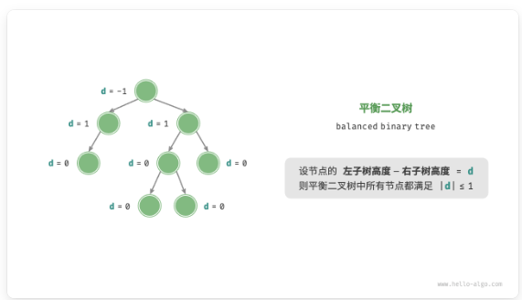

# 7.1树
## 7.1.1二叉树
* 定义：非线性的数据结构，代表“祖先”和“后代”的派生关系，体现“一份为二”的分治逻辑。
* 基本单元：节点是二叉树的基本单位，与链表类似。
* 代码定义
```cpp
struct TreeNode
{
    int value; // 存储数据
    TreeNode* right; // 右子节点
    TreeNode* left; // 左子节点
};
```
* 注意：<b>在二叉树中，除去叶子节点外，其他节点都包含子节点和非空子树</b>

## 7.1.2常见术语
* 根节点：没有父节点
* 叶节点：没有左右子树节点
* 边：指针
* 层：根节点位于第一层，往下递增
* 度：一个节点含有子节点的个数
* 高度：根节点到最远节点所经过的边的数量
* 节点深度：从根节点到该节点所经过边的数量
* 节点高度：该节点最远的叶子节点到该节点所经过边的数量
## 7.1.3二叉树的遍历
### 层序遍历
从顶部到底部逐步逐层遍历二叉树，并且在每一层按照从左到右的顺序访问节点。（广度优先遍历）
```cpp
// 使用层序遍历需要借助队列，队列的特点是“先进先出”，层序遍历也是一层层推进遍历
vector<int> levelOrder(TreeNode* root)
{
    // 初始化队列加入根节点
    quene<TreeNode*> quene;
    quene.push(root);
    // 初始化一个列表用于保存数据
    vector<int> vec;
    // 开始遍历
    while(!quene.empty())
    {
        // 获取队列队首元素
        TreeNode* node = quene.front()
        // 出队
        quene.pop();
        // 记录
        vec.push_back(node->value);
        // 从左到右遍历，尾部入队
        if(node->left!=nullptr)
            quene.push(node->left);
        if(node->right!=nullptr)
            quene.push(node->right);
    }
    return vec;
}
```
### 前序遍历
属于一种深度优先遍历，“先走到尽头，再回溯继续”的遍历方式</br>
先从根节点开始访问，顺序:根节点->左子树->右子树
```cpp
void prevOrder(TreeNode* root)
{
    // 终止条件
    if(root == nullptr)
        return;
    vec.push_back(root->value);
    // 一层层递
    prevOrder(root->left); // 先左深入
    prevOrder(root->right); // 后右深入
}

// 迭代实现
vector<int> prevOrder(TreeNode* root)
{
    vector<int> result;
    if(root == nullptr)
        return;
    stack<TreeNode*>stack;
    stack.push(root);
    while(!stack.empty())
    {
        TreeNode* node = stack.top();
        stack.pop();

        // 访问当前节点
        result.push_back(node->value);

        // 注意：先将右子树入栈，再将左子树入栈
        // 因为栈是后进先出，左子树需要先遍历
        if(node->right != nullptr)
            stack.push(node->right);
        if(node->left!=nullptr)
            stack.push(node->left);
    }
    return result;
}
```
### 中序遍历
也是一种深度优先遍历</br>
访问顺序：左子树->根节点->右子树
```cpp
void midOrder(TreeNode* root)
{
    if(root == nullptr)
        return;
    midOreder(root->left); // 一直深入左子树
    // 深入完后开始记录
    vec.push_back(root->value);
    midOrder(root->right);
}

// 利用迭代实现深度优先遍历
// 利用栈进行模拟，先把左子树节点全部入栈，后面再进行弹出。结束之后把右子树节点入栈。
vector<int> midOrder(TreeNode* root)
{
    vector<int> result;
    stack<TreeNode*>stack;
    TreeNode* curr = root;
    if(root == nullptr)
        return result;
    while(curr!=nullptr||!stack.empty())
    {
        while(curr!=nullptr)
        {
            stack.push(curr); 
            curr = curr->left; 
        }
        curr = stack.top();
        stack.pop();
        result.push_back(curr->value);

        // 转向右子树
        curr = curr->right;
    }
}

```
### 后序遍历
也是一种深度优先遍历</br>
访问顺序：左子树->右子树->根节点
```cpp
void postOrder(TreeNode* root)
{
    if(root == nullptr)
        return;
    postOrder(root->left);
    postOrder(root->right);
    vec.push_back(root->value);
}

// 迭代
vector<int> postOrder(TreeNode* root)
{
    vector<int> result;
    stack<TreeNode*>stack;
    TreeNode* curr = root;
    TreeNode* prev = nullptr; //用于记录上一个访问的节点
    if(root == nullptr)
        return result;
    while(curr!=nullptr||!stack.empty())
    {
        while(curr!=nullptr)
        {
            stack.push(curr);
            curr= curr->left;
        }
        // 获取栈顶元素
        curr = stack.top();
        // 判断是否已经访问右子树或右子树为空，则访问当前节点
        if(curr->right == nullptr||curr->right == prev)
        {
            result.push_back(curr->value);
            stack.pop(); // 访问过的元素出栈
            prev = curr; // 标记当前系节点已经访问
            curr = nullptr; // 不会再处理当前的节点
        }
        else
        {
            curr = curr->right;
        }
    }
    return result;
}
```
## 7.1.4二叉树数组表示
用数组表示完美二叉树，可以使用索引关系找到左右子节点
* 假设该节点的索引为i,左子节点的索引为2i+1,右子节点索引为2i+2
，对应的父节点索引为(i-1)/2
### 任意二叉树
对于任意二叉树，有些位置可能没有值，数组不能进行索引值一一对应。这时候把空值用null代替占位，即可恢复对应关系。
* 完全二叉树：None只出现在最后一层且靠右的位置，最后none的位置可以去掉
### 代码实现基于数组表示二叉树
```cpp
class ArrayBinaryTree
{
private:    
    vector<int> tree;
    // 用于前序、中序、后续遍历的dfs算法
    void dfs(int i,string order,vector<int> &res)
    {
        if(getVal(i)==INT_MAX)
        {
            return;
        }
        // 前序：根-左子树-右子树
        if(order == "pre")
            res.push_back(getVal(i));
        dfs(left(i),order,res);
        // 中序：左-根-右
        if(order == "mid")
            res.push_back(getVal(i));
        dfs(right(i),order,res);
        // 后续: 左-右-根
        if(order == "post")
            res.push_back(getVal(i));

    }
public:
    ArrayBinaryTree(vector<int> arr)
    {
        tree = arr;
    }
    // 获取列表容量
    int getSize()
    {
        return tree.size();
    }
    // 获取索引为i的节点值
    int getVal(int i)
    {
        if(i<0||i>=getSize())
            return INT_MAX;
        return tree[i];
    }
    // 获取索引为i的左子节点的索引
    int left(int i)
    {
        return 2*i+1;
    }
    // 获取索引为i的右子节点的索引
    int right(int i)
    {
        return 2*i+2;
    }
    // 获取索引为i的父节点索引
    int parent(int i)
    {
        return (i-1)/2;
    }
    // 层序遍历
    vector<int>levelOrder()
    {
        vector<int> vec;
        // 直接遍历数组，索引已经对应好了
        for(int i=0; i<getSize(); i++)
        {
            if(getVal(i)!=INT_MAX)
                // 说明该位置有值
                vec.push_back(getVal(i));
        }
        return vec;
    }
    // 前序
    vector<int> prepOrder()
    {
        vector<int> vec;
        dfs(0,"pre",res);
        return res;
    }
    // 中序
    vector<int> midOrder()
    {
        vector<int> vec;
        dfs(0,"mid",res);
        return res;
    }
    // 后续
    vector<int> postOrder()
    {
        vector<int> vec;
        dfs(0,"post",res);
        return res;
    }
};
```
# 7.2 二叉搜索树
## 7.2.1特点
* 1.对于一个根节点，左子树中所有的值<根节点的值<右子树中所有的值
* 2.对于任意节点，也满足第一点：左子树中所有的值<该节点的值<右子树中所有的值
## 7.2.2二叉搜索树操作
### 查找节点 
思路：</br>
给定目标节点的值num，根据二叉树搜索树的性质。</br>
令：当前节点curr，目标值大小num
* if：curr.num < num => 目标节点num在curr的右子树</br>
所以下一步：curr = curr.right
* if：curr.num > num => 目标节点num在curr的左子树</br>
所以下一步：curr = curr.left
* if：curr.num = num => 已找到该目标节点，跳出循环
```cpp
TreeNode* search(int num)
{
    TreeNode* curr = root;
    while(curr!=nullptr)
    {
        if(curr->value<num)
            curr = curr->right;
        else if(curr->value>num)
            curr = curr->left;
        else
            break;
    }
    return curr;
}
```
### 插入节点
思路：</br>
插入的节点也要符合搜索二叉树的性质
* 确定插入的位置，直至越过叶子节点（遍历至None）时跳出循环
* 初始化节点，插入至None位置上
* 注意1：插入的节点值不能重复存在
* 注意2：需要定义一个prev指针存储父节点，这样才能完成插入操作
```cpp
// 插入节点——搜索二叉树
void insert(int num)
{
    // 若树为空，直接创建新的节点
    if(root == nullptr)
    {
        root = new TreeNode(num);
        return;
    }
    TreeNode* curr = root;
    TreeNode* prev = nullptr;
    // 循环查找
    while(curr!=nullptr)
    {
        if(curr->value == num)
        // 找到相同的值，跳出循环
            return;
        // 更新prev
        prev = curr;
        if(curr->value<num)
            curr = curr -> right;
        else if(curr->value>num)
            curr = curr ->left;
    }
    // 插入节点
    TreeNode* node = new TreeNode(num);
    if(prev->value<num)
        prev->right = node;
    else
        prev->left = node;
}
```
### 删除节点
思路：</br>
节点删除后也要符合搜索二叉树的性质，出现了三种删除节点的情况:
* 当删除的节点为叶子节点时，直接删除即可
* 当删除的节点有一个度时，需要替换其子节点
* 当删除的节点有两个度时，无法直接删除，需要用一个节点替换，该节点可以是<b>左子树最大的值或右子树最小的值</b>
* 寻找右子树最小节点：待删除节点的右子树的根节点开始中序遍历，即可找到最小的右子树节点
```cpp
void remove(int num)
{
    // 若树为空，直接返回
    if(root == nullptr)
        return;
    TreeNode* curr = root; // 记录当前节点
    TreeNode* pre = nullptr; // 记录先前的节点
    // 1.寻找需要删除的节点
    while(curr!=nullptr)
    {
        // 找到该删除节点，跳出循环
        if(curr->value == num)
            break;
        // 记录
        pre = curr;
        // 寻找
        if(curr->value<num)
            curr = curr->right;
        else if(curr->value>num)
            curr = curr->left;
    }
    // 找不到该删除的节点
    if(curr == nullptr)
        return;
    // 2.开始删除，先判断节点度的数量
    // 当前节点有0或1个度时,左右子节点同时为空说明该节点度为0
    if(curr->left == nullptr||curr->right == nullptr)
    {
        if(curr->left!=nullptr)
        {
            TreeNode* child = curr->left;
        }
        else
            TreeNode* child = curr->right;
        // 删除节点
        if(curr!=root)
        {
            if(pre->left == curr)
                pre->left = child;
            else
                pre->right = child;
        }
        else
        {
            // 若删除节点为根节点，则重新指定根节点
            root = child;
        }
        // 释放内存
        delete curr;
    }
    // 当前节点有两个度
    else
    {
        // 中序遍历curr的下一个节点
        TreeNode* tmp = curr->right;
        while(tmp->left!=nullptr)
        {
            tmp = tmp->left;
        }
        int tmpVal = tmp->value;
        // 递归删除节点tmp
        remove(tmp->value);
        // 用tmp覆盖curr
        curr->value = tmpVal;
    }
}
```
### 7.2.3中序遍历有序
中序遍历搜索二叉树，得到的<b>元素序列是升序的</b>。总是会优先遍历下一个最小节点
### 7.2.4二叉搜索树应用场景
* 用于系统中的多级索引，实现高效的查找，插入、删除操作
* 作为某些搜索算法的底层数据结构
* 用于存储数据流，以保持其有序状态
# 7.3 AVL树
AVL树是一种二叉搜索树，也是一种平衡二叉树。同时满足这两类树的性质。
因此是一种平衡二叉搜索树
* 平衡二叉树：确保不要出现一边倾斜过多的情况，一边过度倾斜会将二叉树功能退化成链表

## 7.3.1定义平衡二叉树
```cpp
struct TreeNode
{
    int val; // 节点值
    int height = 0; // 节点高度
    TreeNode* left; // 左子节点
    TreeNode* right; // 右子节点
    TreeNode(int value):val(value)
    {
        left = nullptr;
        right = nullptr;
    }
};
```
### 节点高度
```cpp
// 获取节点高度
int getHeight(TreeNode* node)
{
    // 空节点高度为 -1 ，叶节点高度为 0
    if(node = nullptr)
        return -1;
    else 
        return node->height;
}
// 更新节点高度
void updateHeight(TreeNode* node)
{
    // 节点高度等于最高子树高度 + 1
    node->height = max(getHeight(node->left),getHeight(node->right))+1;
}
```
### 节点平衡因子
节点平衡因子等于左子树高度减去右子树高度，同时空节点的平衡因子为0
```cpp
// 获取平衡因子
int getBalanceFactor(TreeNode* node)
{
    if(node == nullptr)
        return 0;
    else
        return getHeight(node->left)-getHeight(node->right);
}
```
## 7.3.2 AVL树进行旋转
获取某节点的平衡因子，平衡因子绝对值大于1的称为“失衡节点”。根据节点失衡情况的不同，旋转操作分为四种：右旋、左旋、先右旋后左旋、先左旋后右旋。
### 右旋
某个节点的左子树高度为2，右子树高度为0，此时该节点的失衡因子为2，已经失衡。进行右旋，回复平衡，步骤：
* 将失衡节点标记成node,左子节点标记child
* 以child为根节点，node节点进行向右旋转，成为child节点的右子节点

* child代替以前node的位置</br>

如果child节点有右子节点，标记成grand_child，多添加一个步骤
* 将grand_child作为node节点的左子节点

```cpp
// 右旋操作
TreeNode* rightRotate(TreeNode* node)
{
    //进行前置标记
    TreeNode* child = node ->left;
    TreeNode* grandChild = child ->right;
    // 进行右旋，以child为原点进行右旋node节点
    child->right = node;
    node->left = grandChild;
    // 更新节点高度
    updateHeight(node);
    updateHeight(child);
    // 返回旋转后的子树根节点
    return child;
}
```
### 左旋
左旋出现的情况和右旋相似
```cpp
// 左旋操作
TreeNode* leftRotate(TreeNode* node)
{
    // 进行前置标记
    TreeNode* child = node->right;
    TreeNode* grandChild = child->left;
    // 进行左旋，以child为原点进行左旋node节点
    child->left = node;
    node->right = grandChild;
    // 更新节点高度
    updateHeight(node);
    updateHeight(child);
    // 返回旋转后的子树根节点
    return child;
}
```
### 先左旋后右旋、先右旋后左旋
对于旋转一次不能恢复到平衡需要进行再一次旋转
## 7.3.3 AVL树旋转的情况选择条件

### 选择条件
失衡节点的平衡因子|子节点的平衡因子|采用何种旋转方法
---|---|---|
 左偏树 >1| >=0 | 右旋
 左偏树 >1| <0 | 先左旋后右旋
 右偏树 <-1| <=0 | 左旋
 右偏树 <-1| >0 | 先右旋后左旋

```cpp
// 封装多种情况的旋转操作方法
TreeNode* rotate(TreeNode* node)
{
    // 获取该节点的平衡因子
    int balanceFactor = getBalanceFactor(node);
    // 开始判断情况
    // 左偏树
    if(balanceFactor > 1)
    {
        if(getBalanceFactor(node->left)>=0)
        {
            // 只需右旋
            return rightRotate(node);
        }
        else
        {
            // 先左旋子节点后右旋该节点
            node ->left = leftRotate(node->left);
            return rightRotate(node);
        }
    }
    // 右偏树
    if(balanceFactor<-1)
    {
        if(getBalanceFactor(node->right)<=0)
        {
            // 只需左旋
            return leftRotate(node);
        }
        else
        {
            node->right = rightRotate(node->right);
            return leftRotate(node);
        }
    }
    // 平衡树，不需要旋转，直接返回
    return node;
}
```
## 7.3.4 AVL树的常用操作
### 插入节点
插入方法与二叉搜索树类似。插入节点后可能会出现一系列失衡问题，<b>我们需要从这个节点开始，自底向上执行旋转操作，使所有失衡节点恢复平衡</b>
```cpp
// 插入节点
void insert(int val)
{
    root = insertHelper(root,val);
}
// 递归插入节点（辅助方法）
TreeNode* insertHelper(TreeNode* node ,int val)
{
    if(node == nullptr)
        return new TreeNode(val);
    // 查找插入位置，并且插入节点
    if(node->val > val)
        node->left = insertHelper(node->left,val);
    else if(node->val < val)
        node->right = insertHelper(node->right,val);
    else
        return node; // 重复节点不插入
    updateHeight(node); // 更新节点高度
    // 2.执行旋转操作
    node = rotate(node);
    return node;
}
```
### 删除节点
删除节点的操作与二叉搜索树类似。删除后也需要恢复平衡。
```cpp
// 删除节点
void remove(int val)
{
    root = removeHelper(root,val);
}
// 递归删除节点（辅助方法）
TreeNode* removeHelper(TreeNode* node,int val)
{
    if(node == nullptr)
        return node;
    // 1.查找节点并且删除
    if(node->val< val)
        node->right = removeHelper(node->right,val);
    else if(node->val< val)
        node->left = removeHelper(node->left,val);
    else // 已经找到该节点了
    {
        // 判断节点的度数进行删除,0或1个度数
        if(node->right == nullptr || node->left == nullptr)
        {
            if(node->left!=nullptr)
                TreeNode* child = node->left;
            else
                TreeNode* child = node->right;
            // 子节点数数量为0
            if(child == nullptr)
            {
                delete node;
                return nullptr;
            }
            // 子节点数为1
            else
            {
                delete node;
                node = child;
            }
        }
        // 两个度数
        else
        {
            // 子节点数量为2，则将中序遍历的下个节点删除，并用该节点替换当前节点
            TreeNode* tmp = node->right;
            // 中序遍历
            while(tmp->left!=nullptr)
            {
                tmp = tmp->left;
            }
            // 获取最小的右子树节点值
            int tmpVal = tmp ->val;
            // 递归删除右子树最小节点
            node->right = removeHelper(node->right,temp->val);
            node->val = tmpVal;
        }
        // 更新高度
        updateHeight(node); // 更新节点高度
        // 2.执行旋转操作
        node = rotate(node);
        // 返回子树的根节点
        return node;
    }
}
```
### 查找节点
与二叉搜索树类似

