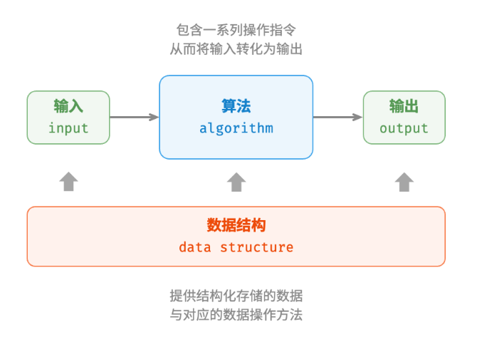

# 算法与数据结构
## 何为算法？
### 定义
* 算法是指能够在特定的时间、空间下解决特定问题的一系列指令或操作。
### 特点
* 待解决的问题是明确的，包含清晰的输入和输出。
* 具有可行性，需要在有限的时间、步骤和空间下完成。
* 每个步骤都要明确的含义，不变的运行条件和输入，输出始终相同。
## 何为数据结构？
### 定义
* 数据结构指进行组织和存储数据的某种方式。包括数据的内容，数据之间的关系、数据的操作方式
### 设计目标
* 空间占用尽量少，节省计算机的空间
* 数据操作方式（增删改查）反应尽可能快速
* 提供简洁的数据表示和逻辑信息

<b>数据结构的设计需要在时间和空间上做权衡</b>

## 数据结构和算法的关系
* 数据结构进行数据的存储和提供数据操作的方法，是算法的基石
* 数据结构仅仅只能存储数据，需要结合算法才能解决特定的问题
* 数据结构的选择会影响算法的执行效率，相辅相成

