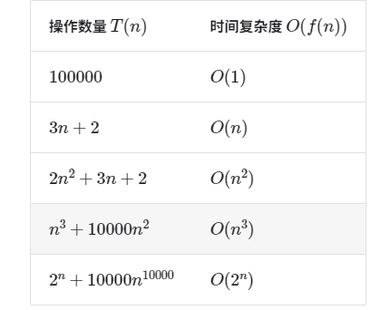
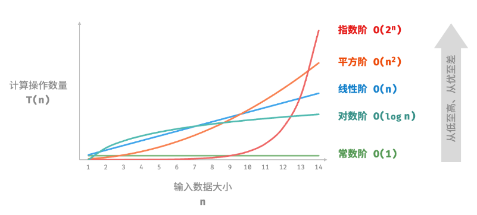

# 2.复杂度分析
## 2.1算法效率评估分析
在使用算法解决问题时，需要考虑这个算法是不是“最快最省”的。需要对多种算法进行评估和分析。</br>
两种方法进行分析：实际测试和理论估计
### 2.1.1实际测试
利用计算机直接展开测试，观察算法之间的运行时间和内存占用情况。</br>
缺点：</br>
* 难以排除测试环境的干扰因素
* 展开完整测试非常耗费资源
### 2.1.2理论估计
利用复杂度分析法分析算法所需的时间和空间(时间复杂度和空间复杂度)与输入数据之间的大小关系。<b>随着输入数据大小的增加，算法执行所需时间和空间的增长趋势</b>

## 2.2迭代
重复的完成每一项步骤
* for循环：适合在预先知道迭代次数时使用
* while循环：只需要知道停止循环条件

## 2.3递归
通过调用自身来解决问题</br>
递归代码的“三要素”：</br>
* 终止条件：什么时候把“递”（程序不断深入地调用自身，通常传入更小或更简化的参数，直到达到“终止条件”。）操作转换成“归”（触发“终止条件”后，程序从最深层的递归函数开始逐层返回，汇聚每一层的结果）操作
* 递归调用：对应“递”操作，函数调用自身，将参数进行化简
* 返回结果：对应“归”操作，将当前递归层级的结果返回至上一层
### 2.3.1普通递归
利用递归计算1+2+3+...........+n
```cpp
int count(int n)
{
    // 终止条件
    if(0==n)
    {
        return 1;
    }
    // 递归调用
    int res = count(n-1); // n-1：分解参数
    // 返回结果
    return n + res; // 向上返回结果
}
```
### 2.3.2尾递归
尾递归比普通递归更省空间，在返回前的最后一步才进行递归调用，则该函数可以被编译器或解释器优化，使其在空间效率上与迭代相当
```cpp
int tailCount(int n , int res)
{
    // 终止条件
    if(1==n)
        return res;

    return tailCount(n-1,res+n);
}
```
### 2.3.3递归树
递归树出现在处理“分治”问题（一个复杂的问题分成两个或更多的相同或相似的子问题）。例如求解斐波那契数列，求第n个数是什么。已知f(n)=f(n-1)+f(n-2)，f(1)=0,f(2)=1。
```cpp
// 可以使用递归进行求解，分别找到f(n-1)和f(n-2)的值
int fib(int n)
{
    //终止条件f(1)=0,f(2)=1
    if(n==1||n==2)
    {
        return n-1;
    }
    // 递归树调用，两个分支
    int res = fib(n-1)+fib(n-2);
    return res;
}
```
## 2.4递归与迭代的对比
<b>|迭代|递归
---|---|---|
实现方式|循环|函数调用自身
时间效率|效率高，无函数调用开销|每次函数调用会产生开销
内存使用|通常使用固定大小的内存空间|累积函数调用可能使用大量的栈帧空间
适用范围|简单循环任务|子问题分解，例如：树、图、分治、回溯等

## 2.5递归与迭代的联系
递归的函数满足“先入后出”的思想。最先调用的函数最后面返回结果时才清空该栈帧内存</br>
* 递：当函数被调用时，系统会在“调用栈”上为该函数分配新的栈帧，用于存储函数的局部变量、参数、返回地址等数据。</br>
* 归：当函数完成执行并返回时，对应的栈帧会被从“调用栈”上移除，恢复之前函数的执行环境。</br>
每一步调用函数和每一步返回结果就是迭代。</br>
```cpp
// 用显示栈迭代模拟递归操作
#include<stack>
int forLoopRecur(int n)
{
    stack<int> stack; // 用显示的栈模拟递归函数放入到调用栈中
    int res = 0;
    // 递归调用
    for(int i = n; i>0;i--)
    {
        stack.push(i); // 入栈操作模拟“递”
    }
    // 返回结果
    while(!stack.empty())
    {
        // 出栈操作模拟“归”
        res += stack.top(); // res = 1+2+3...+n
        stack.pop(); // 出栈
    }
    return res;
}

```
## 2.6 时间复杂度
### 2.6.1时间复杂度分析统计
误区：统计算法的运行时间</br>
<b>正确的是统计算法运行时间随着数据量变大时的增长趋势</b>

* 例子:统计算法的运行时间趋势
```cpp
// 算法 A 的时间复杂度：常数阶
/*
    原因：随着n的变大，算法内部只是运行一次cout语句。
    与n的大小没有关系，所以时间复杂度称为常数阶。
*/
void algorithm_A(int n) {
    cout << 0 << endl;
}

// 算法 B 的时间复杂度：线性阶
/*
    原因：算法内部是根据n的大小进行for循环，运行时间是
    与n的大小有关。运行时间随着n的变化而变化，呈线性关
    系。所以时间复杂度称为线性阶。
*/
void algorithm_B(int n) {
    for (int i = 0; i < n; i++) {
        cout << 0 << endl;
    }
}
// 算法 C 的时间复杂度：常数阶
/*
    原因：算法内部也是进行for循环，但是for循环的运行时
    间和n的大小无关。for循环执行1000000次这个时间是固
    定的，所以时间复杂度仍然是常数阶。
*/
void algorithm_C(int n) {
    for (int i = 0; i < 1000000; i++) {
        cout << 0 << endl;
    }
}
```
### 2.6.2时间复杂度分析的特点
* 可以有效的评估算法效率
* 时间复杂度的堆算方法简单
* 存在一定的局限性，在某些情况下难以判断算法效率的高低
### 2.6.3计算时间复杂度
* 函数渐近上界</br>
时间复杂度的本质就是计算“操作数量T(n)”的渐近上界
```cpp
// 给定一个输入数大小为n的函数：
void algorithm(int n) {
    int a = 1;  // +1
    a = a + 1;  // +1
    a = a * 2;  // +1
    // 循环 n 次
    for (int i = 0; i < n; i++) { // +1（每轮都执行 i ++）
        cout << 0 << endl;    // +1
    }
}

/*
    设算法的操作数量是一个关于输入数据大小n的函数，记为T(n) :
    T(n)=3+2n
    T(n)是一次函数，说明该算法的时间复杂度是线性阶的

*/
```

### 2.6.4如何计算时间复杂度O(f(n))
要计算时间复杂度，首先要确定渐近函数f(n)，步骤如下：
* 计算操作数量T(n)
1.忽略T(n)中的常数项</br>
2.省略所有系数：循环2n次、5n+1次等，都可以简化记为n次</br>
3.循环嵌套时使用乘法：总操作数量等于外层循环和内层循环操作数量之积</br>
```cpp
void algorithm(int n) {
    int a = 1;  // +0（技巧 1:+1被忽略，因为是常数项）
    a = a + n;  // +0（技巧 1:+1被忽略，因为是常数项）
    // +n（技巧 2：忽略系数5）
    for (int i = 0; i < 5 * n + 1; i++) {
        cout << 0 << endl;
    }
    // +n*n（技巧 3：嵌套循环进行乘积计算）
    for (int i = 0; i < 2 * n; i++) {
        for (int j = 0; j < n + 1; j++) {
            cout << 0 << endl;
        }
    }
    // 所以T(n)=n+n²
}
```
* 确定渐近上界</br>
<b>渐近上界由T(n)最高阶确定的</b>，这是因为在n趋于无穷大时，最高阶的项将发挥主导作用，其他项的影响都可以忽略。


### 2.6.5常见类型的时间复杂度

* 常数阶O(1)
```cpp
/*  
    常数阶
    时间复杂度与输入的n大小无关系，只与size大小有关
    所以现在的运行时间是固定的，时间复杂度为常数阶
 */
int constant(int n) {
    int count = 0;
    int size = 100000;
    for (int i = 0; i < size; i++)
        count++;
    return count;
}
```
* 线性阶O(n)
```cpp
/* 
    线性阶
    操作次数与n的大小有关，所以T(n)=n
    即时间复杂度为O(n)
 */
int linear(int n) {
    int count = 0;
    for (int i = 0; i < n; i++)
        count++;
    return count;
}
```
* 平方阶O(n²)
```cpp
/*
    平方阶（冒泡排序）
    假设该vector容器包含的元素数量为n
    第一层循环次数为：n-1
    第二层的循环次数分别为：n-1、n-2.....1次，所以平均次数为2/n
    所以T(n)=(n-1)*n/2
    即时间复杂度为O(n²)
*/
int bubbleSort(vector<int> &nums) {
    int count = 0; // 计数器
    // 外循环：未排序区间为 [0, i]
    for (int i = nums.size() - 1; i > 0; i--) {
        // 内循环：将未排序区间 [0, i] 中的最大元素交换至该区间的最右端
        for (int j = 0; j < i; j++) {
            if (nums[j] > nums[j + 1]) {
                // 交换 nums[j] 与 nums[j + 1]
                int tmp = nums[j];
                nums[j] = nums[j + 1];
                nums[j + 1] = tmp;
                count += 3; // 元素交换包含 3 个单元操作
            }
        }
    }
    return count; // 返回总的单元操作次数
}

```
* 指数阶
```cpp
// 细胞分裂计算总数（指数阶）
int exponential(int n)
{
    // 细胞每轮一分为二，形成数列 1, 2, 4, 8, ..., 2^(n-1)
    int count = 0; //计算总数
    int base = 1; // 基数
    for(int i = 0; i<n; i++)
    {
        for(int j = 0;j<base;j++)
            count++; // 累加
        base *= 2; // 进行需要分类的个数：1,2,4,8....
    }
}
```
* 对数阶O(logn)
```cpp
/*      
    对数阶（循环实现）
    对数阶常出现于基于分治策略的算法中，
    体现了“一分为多”和“化繁为简”的算法思想。
    它增长缓慢，是仅次于常数阶的理想的时间复杂度。
*/
int logarithmic(int n) {
    int count = 0;
    while (n > 1) {
        n = n / 2;
        count++;
    }
    return count;
}
// 递归树
int logRecur(int n)
{
    if(n<=1)
        return 0;
    return logRecur(n/2)+1;
    // 递 8 4 2 1 
}
```
* 线性对数阶O(nlogn)
```cpp
int linearLogRecur(int n) {
    if (n <= 1)
        return 1;
    // 一个有log2（n）+1层
    int count = linearLogRecur(n / 2) + linearLogRecur(n / 2);
    for (int i = 0; i < n; i++) {
        count++; 
    }
    return count;
}
```
* 阶乘阶O(n!)
```cpp
/*
    利用节点数模拟操作数量
    输入数量为n，一共有n个节点
    进行分裂：每个节点分裂出n-1个节点，此时一共有n(n-1)个节点
    ....
    直至分裂到每个节点只有1个子节点，此时节点数量为 n*(n-1)*(n-2)*....*1 = n!
    此时时间复杂度为O(n!)  
*/
// 这个递归计算阶乘的时间复杂度为O(n!)
int factorialRecur2(int n) {
    if (n == 0)
        return 1;
    int count = 0;
    // 从 1 个分裂出 n 个
    for (int i = 0; i < n; i++) {
        count += factorialRecur(n - 1);
    }
    return count;
}
// 这个递归计算阶乘的时间复杂度为O(n)
int factorialRecur2(int n)
{
    if(n == 1)
        return 1;
    return n*factorialRecur(n-1);
} 
```
### 2.6.6最差、最佳、平均时间复杂度
* 最差时间复杂度：对应函数渐近上界，用O表示
* 最佳时间复杂度：对应函数渐近下界，用Ω表示
* 最差时间复杂度：在随机输入数据下的运行效率，用Θ表示

## 2.7空间复杂度
衡量算法占用空间随着数据量变大时的增长趋势。
### 2.7.1算法相关空间分类
* 输入空间：用于存储算法的输入数据
* 暂存空间：用于存储算法在运行过程中的变量、对象、函数上下文数据等
* 输出空间：用于存储算法的输出数据
空间复杂度 = 暂存空间+输出空间 </br>
暂存空间 = 暂存数据 + 栈帧空间 + 指令空间
* 暂存数据：保存变量、常量、对象等
* 栈帧空间：保存调用函数的上下文数据。每次调用函数就会进行入栈操作
* 指令空间：保存编译后的程序指令（可忽略不计）
### 2.7.2常见的空间复杂度
1、常数阶：常量、变量、对象</br>
2、线性阶：数组、链表、栈、队列</br>
3、平方阶：矩阵、图</br>
4、指数阶：二叉树（满二叉树）</br>
5、对数阶：分治算法</br>