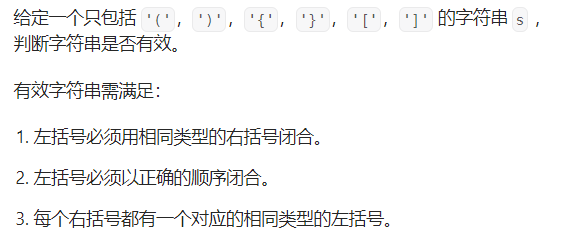
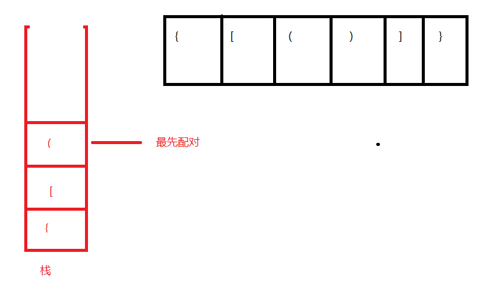
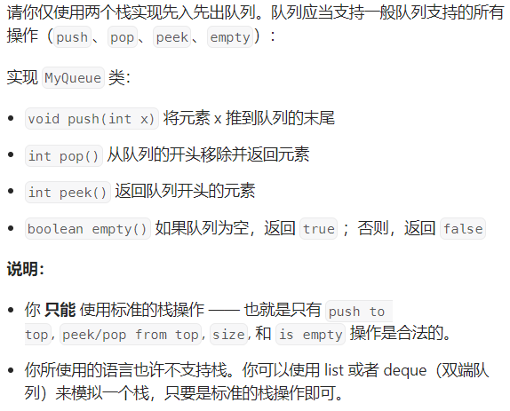
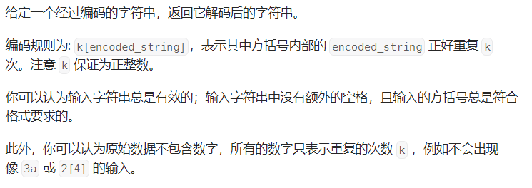

# 有效的括号判断

## 思路
必须是左括号开始，右括号结束。遍历一个字符串的时候。遇到左括号时，记录该左括号的类型，当遇到右括号时，查找以前遇到的左括号是否匹配。又因为是根据正确的顺序进行闭合，所以最后遇到的左括号要先匹配，否则无效。</br>
这个特点与栈的特点相似：后入先出。

```cpp
bool isValid(string s) {
        /*利用栈的特点，先把左括号压栈，当匹配到
        对应的右括号时查看栈顶元素，当对应的括号
        匹配成功后，进行栈顶元素出栈，后入的左括
        号最先匹配，所以满足栈的特点。若匹配不成
        功则就是无效字符串
        */
        // 定义一个栈
        stack<char> stack;
        for(int i=0;i<s.length();i++)
        {
            // 如果遍历到左括号，入栈
            // 遇到右括号，查看栈顶元素进行匹配
            switch(s[i])
            {
                case '(':
                    stack.push(s[i]);
                    break;
                case '[':
                    stack.push(s[i]);
                    break;
                case '{':
                    stack.push(s[i]);
                    break;
                case ')':
                    // 要先判断是否栈内存在元素，否则直接访问栈顶元素会报错
                    if(stack.empty()||stack.top()!='(')
                    {
                        return false;
                    }
                    stack.pop();
                    break;
                case ']':
                    if(stack.empty()||stack.top()!='[')
                    {
                        return false;
                    }
                    stack.pop();
                    break;
                case '}':
                    if(stack.empty()||stack.top()!='{')
                    {
                        return false;
                    }
                    stack.pop();
                    break;
                default:
                    break;
            }
                
        }
        return stack.empty();
    }

```
# 最小栈的实现
设计一个栈，栈的基本功能都存在。设计一个新功能，要求在时间复杂度O(1)输出该栈的最小值。
## 思路
一个栈中，可以在元素入栈的时候与原先栈顶进行判断，可以创建一个变量存储判断出来的最小值。值得注意的是，栈的最小值不应该受到元素出栈的影响，若将最小值定义成栈的成员变量，当元素出栈的时候更新不了最小值。</br>
最好的做法是基于链表实现该最小栈，每个节点同时存储自己的数据、next指针以及最小值，这个最小值取值区间必定是自己到栈底的离散数据，这样设计就不会因为出栈时刚好出栈最小元素，导致栈最小值不能更新，输出错误的最小值。
* 代码实现
```cpp
struct Node
{
    int value; // 存储具体值
    int min; // 存储当前栈的最小值
    Node* next = nullptr; // 指向下一个节点
};
class MinStack {
private:
    Node* topNode;
    int m_size;
public:
    MinStack() {
        topNode = nullptr;
        m_size = 0;
    }
    void push(int val) {
        Node* node = new Node;
        node->next = topNode;
        node->value = val;
        // 入栈时判断当前的最小值为多少，进行存储
        // 当前的长度为0，则把最小值设置成当前的值
        if(0==m_size)
            node->min=node->value;
        // 长度大于0，判断当前最小值的数据大小，更新最小值
        // 每个节点的最小值取值只限于自己至栈底的元素，就算进行最小值出栈也不会影响栈最小值的输出
        else if(topNode->min>=node->value)
            node->min = node->value;
        else
            node->min = topNode ->min;
        // 更新头节点，长度
        m_size++;
        topNode = node;
    }
    
    void pop() {
        // 出栈可能会把已经是最小的节点出栈
        Node* p = topNode;
        topNode = topNode->next;
        delete p;
        m_size--;
    }
    
    int top() {
        return topNode->value;
    }
    
    int getMin() {
        return topNode->min;
    }
};
```
# 双栈实现队列功能

## 思路
队列的思想“先入先出”，用双栈模拟队列。
* 入队操作push()
队列入队是在队尾进行添加元素，在一个栈中可以直接入栈，这样相当于队首在栈底，队尾在栈顶。
* 出队pop()、访问队首元素peek()
访问队首元素和出队的操作都在队首进行，可以把第一个栈的数据一个个弹出，放入到另外一个栈中，这样队首就在栈顶，队尾就在栈底。此时第一个栈就清空了，要再次push元素时直接push即可.
* empty判断
当双栈都为空时才断定整个队列为空。
* 代码
```cpp
class MyQueue {
private:
    stack<int>stack_in; // 输入栈，用于执行队列的push操作
    stack<int>stack_out; // 输出栈，用于执行队列的pop与peek操作
public:
    MyQueue() {
        
    }
    // 将输入栈的内容清空并放入输出站
    void instack_to_outstack()
    {
        while(!stack_in.empty())
        {
            stack_out.push(stack_in.top());
            stack_in.pop();
        }
    }
    void push(int x) {
        stack_in.push(x);
    }
    
    int pop() {
        // 先判断输出栈是否为空，将输入栈内的数据弹出放入输出栈，这样队尾在栈底，队首在栈顶
        if(stack_out.empty())
        {
            instack_to_outstack();
        }
        // 不为空就直接获取栈顶元素，并弹出
        int num = stack_out.top();
        stack_out.pop();
        return num;
    }
    
    int peek() {
        // 先判断输出栈是否为空，将输入栈内的数据弹出放入输出栈，这样队尾在栈底，队首在栈顶
        if(stack_out.empty())
        {
            instack_to_outstack();
        }
        return stack_out.top();
    }
    
    bool empty() {
        return stack_in.empty()&&stack_out.empty();
    }
};
```
# 字符串解码

## 思路
一个字符串里面包含数字、字母、中括号。中括号包含字符串，数字表示重复中括号字符串的次数。因此要注意中括号的嵌套。</br>
处理字符串先处理内层中括号。先遍历到的字符组合成的字符串后处理，后面组合的字符串先处理，符合栈的特点“先入后出”。</br>
可以设计两个栈，分别存放数字和组合好的字符串。根据遍历，遇到不同的字符情况处理</br>
* 逻辑</br>
1.遇到数字，用一个num记录当前的次数，并且构造多位数以处理出现超过10次的重复需求。</br>
2.遇到普通字符，用currentString进行保存拼接。</br>
3.遇到左中括号，把之前存储的num和currentString入栈并清空。</br>
4.遇到右中括号，在数量栈中去顶元素后弹出，将当前的currentString进行次数拼接，最后取字符串栈的顶元素后弹出，拼接。</br>
以上步骤一直反复执行。
* 代码
```cpp
class Solution {
private:
    stack<string> strStack; // 记录字符串
    stack<int> numStack; // 记录数字
    string currentString = string(); // 记录解析的字符串
    int num = 0; // 记录重复次数
public:
    string decodeString(string s) {
        // 字符串只包含数字、中括号、字母
        // 数字代表重复次数，字母代表重复的字符，中括号代表区分字母和数字
        // isdigit可以判断字符是否为数字
        // 创建一个队列进行保存需要输出的结果
        for(int i=0;i<s.length();i++)
        {
            // 遍历字符串，分情况执行
            if(isdigit(s[i]))
            {
                num = num*10+(s[i]-'0'); // 用于构造多位数据，处理出现超过10次以上的重复次数
            }
            else if(s[i]=='[')
            {
                // 将数字和字符串放入栈中
                numStack.push(num);
                strStack.push(currentString);
                // 重置
                num = 0;
                currentString ="";
            }
            else if(s[i]==']')
            {
                // 获取需要重复的次数
                int reaptCount = numStack.top();
                // 获取当前的字符串
                string temp = currentString;
                // 出栈次数，防止影响后面的字符串拼接
                numStack.pop();
                // 开始拼接
                for(int i=1;i<reaptCount;i++)
                    currentString += temp;
                // 与上层的字符串进行拼接
                currentString = strStack.top()+currentString;
                strStack.pop();
            }
            else
            {
                // 普通的字符就直接相加构成字符串
                currentString += s[i];
            }
        }
        return currentString;
    }
};
```