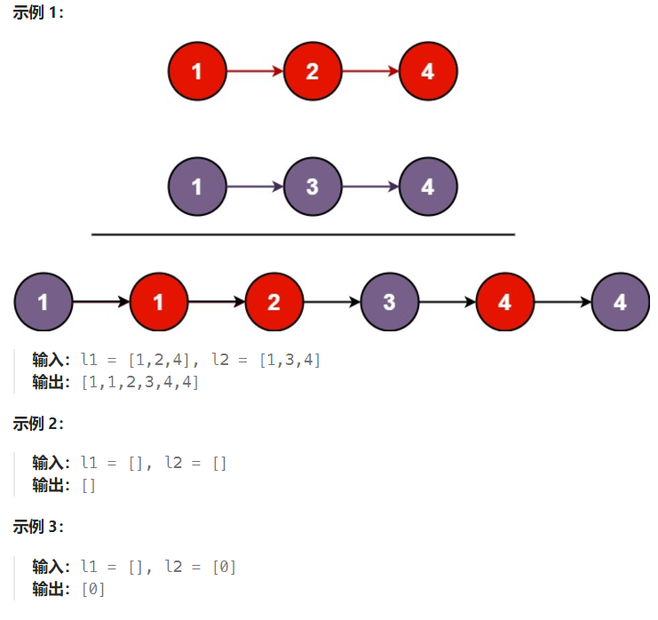
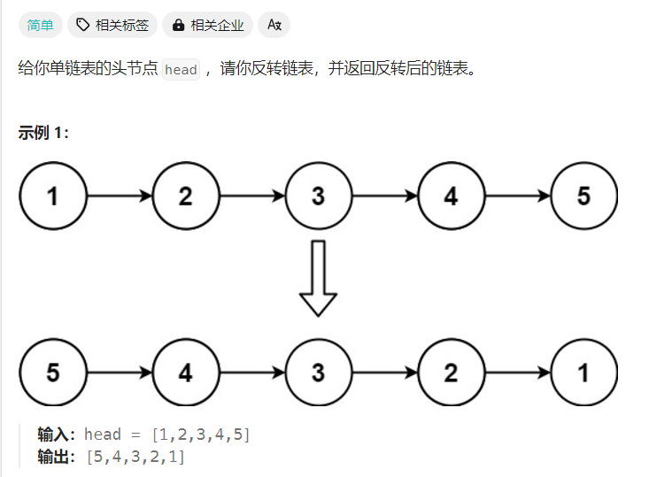
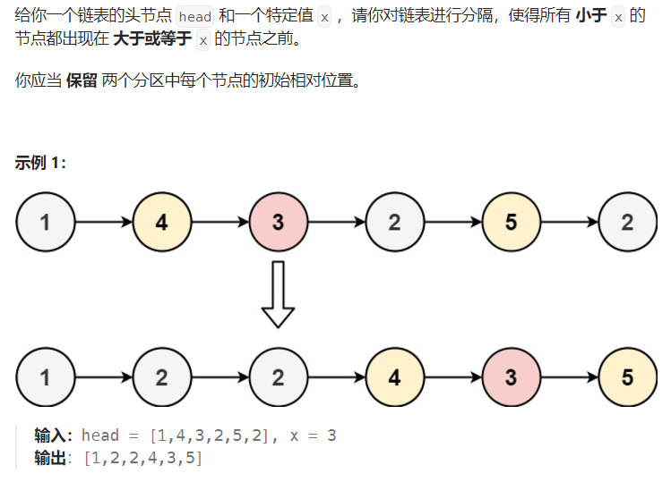
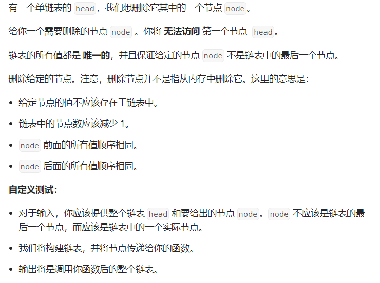

# 合并两个有序链表
将两个升序链表合并为一个新的 升序 链表并返回。新链表是通过拼接给定的两个链表的所有节点组成的。 

## 思路
可以创建一个新的链表，根据两个链表逐个节点比较，将小的节点先链接，后面再链接大的节点，这样逐步往下比较。最后把剩下的链表连接上即可（剩下的链表已经有序）。
* 方法一：创建新的一个链表，会消耗大量内存
```cpp
/**
 * Definition for singly-linked list.
 * struct ListNode {
 *     int val;
 *     ListNode *next;
 *     ListNode() : val(0), next(nullptr) {}
 *     ListNode(int x) : val(x), next(nullptr) {}
 *     ListNode(int x, ListNode *next) : val(x), next(next) {}
 * };
 */
class Solution {
public:
    ListNode* mergeTwoLists(ListNode* list1, ListNode* list2) {
        // 创建虚拟头节点，新的链表
        ListNode* temp_head = new ListNode(-1);
        ListNode* ptr = temp_head; // 用于遍历的指针
        // 双指针遍历
        while (list1 != nullptr && list2 != nullptr) {
            if (list1->val <= list2->val) {
                // 创建新节点
                ListNode* node = new ListNode(list1->val);
                // 进行链接
                ptr->next = node;
                // 更新位置
                list1 = list1->next;
            } else {
                // 创建新节点
                ListNode* node = new ListNode(list2->val);
                // 进行链接
                ptr->next = node;
                // 更新位置
                list2 = list2->next;
            }
            ptr = ptr->next;
        }
        // 将剩下的链表补上
        if (list1 == nullptr) {
            // 将链表2连接上
            while (list2 != nullptr) {
                ListNode* node = new ListNode(list2->val);
                ptr->next = node;
                ptr = ptr->next;
            }
        } else {
            // 将链表1连接上
            while (list1 != nullptr) {
                ListNode* node = new ListNode(list1->val);
                ptr->next = node;
                ptr = ptr->next;
            }
        }
        ListNode* resList = ptr->next;
        delete temp_head; // 删除虚拟头节点
        return resList;
    }
};
```
* 方法二：直接链接，省略一些内存
```cpp
class Solution {
public:
    ListNode* mergeTwoLists(ListNode* list1, ListNode* list2) {
        // 创建虚拟头节点，新的链表
        ListNode* temp_head = new ListNode(-1);
        ListNode* ptr = temp_head; // 用于遍历的指针
        // 双指针遍历
        while (list1 != nullptr && list2 != nullptr) {
            if (list1->val <= list2->val) {
                ptr->next = list1;
                // 更新位置
                list1 = list1->next;
            } else {
                ptr->next = list2;
                // 更新位置
                list2 = list2->next;
            }
            ptr = ptr->next;
        }
        // 将剩下的链表补上
        if (list1 == nullptr) 
        {
            ptr->next = list2;
        } 
        else
        {
            ptr->next = list1;
        }
        ListNode* resList = temp_head->next;
        delete temp_head; // 删除虚拟头节点
        return resList;
    }
};
```
* 方法三：利用递归的方法
```cpp
/*
    两个链表可以先一个个节点往下，每次返回排序好的链表头节点
    终止条件是当两个链表为空时，则返回当前的节点

*/
ListNode* mergeTwoLists(ListNode* list1, ListNode* list2)
{
    // 终止条件
    if(list1 == nullptr)
        return list1;
    if(list2 == nullptr)
        return list2;

    if(list1->val<list2->val)
    {
        // 判断哪个值小，小的先链接
        list1->next = mergeTwoLists(list1->next,list2);
        return list1; // 返回较小的节点
    }
    else
    {
        list2->next = mergeTwoLists(list1,list2->next);
        return list2;
    }
}

```
# 反转链表算法

尝试使用迭代和递归进行编写算法
## 思路1
一开始我的思路是使用栈来进行操作，先将原来的链表进行入栈，后面先访问栈顶元素，再出栈。创建新节点保存该元素，从而达到链表的反转。本质上就创建了新的链表。
* 利用栈的思想完成反转
```cpp
    ListNode* reverseList(ListNode* head) {
        ListNode* p = head;
        // 定义一个栈
        stack<int> t_stack;
        // 入栈操作
        while(p!=nullptr)
        {
            t_stack.push(p->val);
            p = p->next;
        }
        // 定义新链表的头节点
        ListNode* new_list = new ListNode;
        ListNode* new_p = new_list;
        // 出栈操作
        while(!t_stack.empty())
        {
            // 先访问栈顶元素
            int num = t_stack.top();
            // 再出栈
            t_stack.pop();
            ListNode* node = new ListNode(num);
            // 链接
            new_p->next = node;
            node->next = nullptr;
            // 更新
            new_p = node;
        }
        // 去除创建的头节点，防止影响数据输出
        ListNode* res = new_list->next;
        delete new_list;
        return res;
    }
```
## 思路2
根据之前思路1的算法，会发现占用的内存会非常大。可以在原有的链表上进行改变next指针的指向和更改头节点。利用两个指针指向完成next指针的变换更新。
* 迭代的方法直接在原有的链表上进行修改
```cpp
ListNode* reverseList(ListNode* head)
{
    ListNode* prev = nullptr; // 用于前一个节点
    ListNode* curr = head; // 用于记录现在的节点
    while(curr!=nullptr)
    {
        //创建一个节点保存当前节点的next
        ListNode* p = curr -> next;
        // 更改指向
        curr->next = prev;
        // 更新
        prev = curr;
        curr = p;
    }
    return prev; //最终 prev 指向反转后的新头节点
}
```

# 按值分割链表算法
## 思路
按值分割链表，并且保留相对位置不变。可以拆分成两个链表，小于特定值的存放在一个链表中，大于等于特定值存放到另一个链表中，最后实现拼接即可。

```cpp
ListNode* partition(ListNode* head, int x) {
        ListNode* l1 = new ListNode; // 存取比x小的节点(头节点)
        ListNode* l2 = new ListNode; // 存取比x大的节点(头节点)
        ListNode* p1 = l1;
        ListNode* p2 = l2;
        while(head!=nullptr)
        {
            if(head->val<x)
            {
                ListNode* p = new ListNode(head->val);
                p1->next = p;
                p1 = p;
                p->next = nullptr;
            }
            else
            {
                ListNode* p = new ListNode(head->val);
                p2->next = p;
                p2 = p;
                p->next = nullptr;
            }
            head = head->next;
        }
        p2->next = nullptr; // 防止形成环状链表
        // 此时链表1和2都准备好了，进行链接即可，链表1链接链表2
        p1->next = l2->next;
        ListNode* result = l1->next;
        // 删除虚拟头节点，防止影响数据输出
        delete l1;
        delete l2;
        return result;
    }
```
# 不给头节点，删除（伪删除）指定的节点

## 思路
得不到头节点，只能获得需要删除的节点。可以复制下下一个节点的值到自身。因为只知道自身的指针，只能断链下一个节点，达到伪删除的目的。节点数也减一了
```cpp
void deleteNode(ListNode* node) {
        // 因为无法访问前一个结点，所以可以把要删除的结点的后一个结点的值前移
        node->val = node->next ->val; // 获取下一个节点的值
        node->next=node->next->next; // 断开重复的节点
    }
```
或者简化
```cpp
 void deleteNode(ListNode* node) {
        // 因为无法访问前一个结点，所以可以把要删除的结点的后一个结点的值前移
        *node = *(node->next); // 使用拷贝赋值运算符 = 将node->next 节点的所有内容（包括 val 和 next 指针）拷贝到 node
        // 同时赋值了next指针和值
    }
```
# 随机链表的复制
一个普通链表，每个节点不仅仅有数据、指向下一节点的next指针，还有指向任意节点的random指针。</br>
需求：创建新的一个链表，根据传入的头节点，复制参数链表中的节点的数据。</br>
注意：next和random不要指向原来的链表
## 思路
首先需要创建一条新的链表，然后根据原来的链表进行拷贝。让新链表next指针赋值简单。重点是如何映射好random指针。random指针可以通过原先的节点调用，可以通过哈希表，建立原先节点和新节点的映射，这样就找得到对应的random指针。</br>
```cpp
Node* copyRandomList(Node* head)
{
    // 创建哈希表，建立映射关系，通过旧节点找到新节点
    // map[旧节点] = 新节点
    unordered_map<Node*,Node*> map;
    Node* p = head;
    // 遍历旧链表，创建新节点建立映射关系
    while(p!=nullptr)
    {
        map[p] = new Node(p->val);
        p = p->next;
    }
    p = head; // 将p移动回到头节点
    // 链接新链表，复制random关系
    while(p!=nullptr)
    {
        // 链接
        map[p]->next = map[p->next]; // 新节点的next指针 = 下一个新节点
        // 复制random关系
        map[p]->random = map[p->random]; // 新节点的random = 对应random指向的新节点
        p = p->next;
    }
    return map[head]; //返回新链表的头节点
}
```
